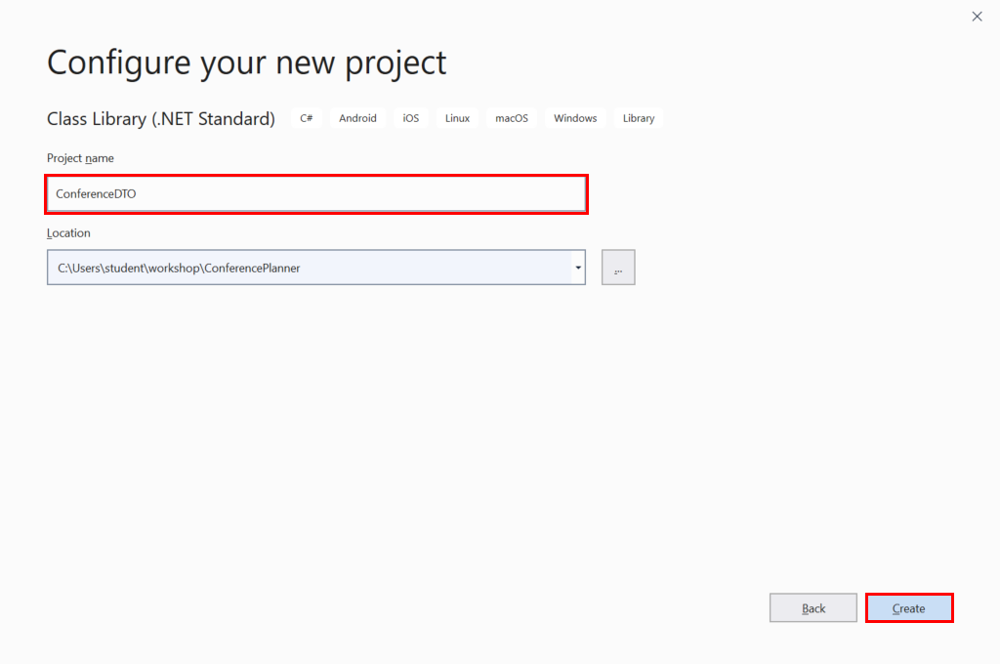

# Create the BackEnd Web API

In this session, you'll create a back-end application that exposes a web API for accessing and maintaining conference data. You'll store the conference information in a database. The application will use an Entity Framework model to retrieve and manage the data.

## Create a new project

The first task is to create a new solution and project for the back-end application.

**If you're using Visual Studio, perform the following steps:**

1. Start Visual Studio 2019, and select **Create a new project**.
    

2. On the **Create a new project** page, select the **ASP.NET Core Web Application** template, and then click **Next**.

    

3. On the **Configure your new project** page, name the project **BackEnd**, name the solution **ConferencePlanner**, and then click **Create**.

    

4. On the **Create a new ASP.NET Core web application** page, make sure you have selected the **.NET Core** and **ASP.NET Core 3.1** options, Select the **Web Application** template, leave the **Authentication** and **Advanced** settings at their default values, and then click **Create**.

    

**If you're using the .NET Core CLI, perform the following steps:**

1. Open a command prompt window, and navigate to the folder you wish to use for your solution.
2. Create a folder named **ConferencePlanner**.
3. Run the`dotnet new sln` command to create a new .NET Core solution. This command will generate a solution file named **ConferencePlanner.sln**.
4. Create sub-folder named **BackEnd**, and then move to this new folder.
5. Run the `dotnet new webapi` command to create a new ASP.NET web API project. The project will be named **BackEnd**.
6. Move back to the **ConferencePlanner** parent folder.
7. Run the command `dotnet sln add BackEnd/BackEnd.csproj` to add the **BackEnd**project to the **ConferencePlanner** solution.

## Add a model to store and retrieve speaker data

In this task, you'll create a class that models the speaker entity in the database. You'll also create and configure a class that the Entity Framework can use to connect to the database.

1. Add a new folder named **Models** to the root of the **BackEnd** application, as follows:
   - **If you're using Visual Studio 2019**:
       1. Right-click the **BackEnd** project, click **Add**, and then click **New Folder**.
       2. Change the name of the folder from **NewFolder** to **Models**

            

   - **If you're using the .NET Core CLI**:
     - Create a new folder named **Models** in the **BackEnd** folder.

2. Add a new class file named **Speaker.cs** to the **Models** folder:
    - **If you're using Visual Studio 2019**:
      1. In the **Solution Explorer** window, right-click the **Models** folder, click **Add**, and then click **Class**.
      2. In the **Add New Item - BackEnd** dialog box, select the **Class** template, in the **Name** field type **Speaker.cs**, and then click **Add**.

        

    - **If you're using the .NET Core CLI**
      - Move to the **Models** folder, and use an editor of your choice to create a file named **Speaker.cs**.

3. Add the following code to the **Models.cs** file, and then save the file:

    ```csharp
    using System;
    using System.Collections.Generic;
    using System.ComponentModel.DataAnnotations;
    using System.Linq;
    using System.Threading.Tasks;

    namespace BackEnd.Models
    {
        public class Speaker
        {
           public int Id { get; set; }

           [Required]
           [StringLength(200)]
           public string Name { get; set; }

           [StringLength(4000)]
           public string Bio { get; set; }

           [StringLength(1000)]
           public virtual string WebSite { get; set; }
        }
    }
    ```

    The file defines the structure of the **Speaker** entity. You'll use the Entity Framework to create a table named **Speaker** in the database. Each public property in the **Speaker** will become a column in the table.

4. Add a reference to the NuGet package `Microsoft.EntityFrameworkCore.SqlServer` version `3.1.1`:
    - **If you're using Visual Studio 2019**:
        1. In the **Solution Explorer** window, right-click the **BackEnd** project, and then click **Manage NuGet Packages**.
        2. In the **NuGet: Backend** window, click the **Browse** tab. In the search box, type **Microsoft.EntityFrameworkCore.SqlServer**.
        3. Select the **Microsoft.EntityFrameworkCore.SqlServer** package, set the **Version** to **Latest stable 3.1.1**, and then click **Install**.
            
        4. If the **Preview Changes** dialog box appears, click **OK**.
        5. In the **License Acceptance** dialog box, click **I Accept**.

    - **If you're are using the .NET Core CLI**:
        1. Move to the **BackEnd** folder.
        2. Run the command `dotnet add package Microsoft.EntityFrameworkCore.SqlServer --version 3.1.1`

5. Add a reference to the NuGet package `Microsoft.EntityFrameworkCore.Sqlite` version `3.1.1`. If you're running on a non-Windows platform, the application will use a SQLite database rather than SQL Server:
    - **If you're using Visual Studio 2019**:
      - In the **NuGet: BackEnd** window, on the **Browse** page, search for  **Microsoft.EntityFrameworkCore.Sqlite**, and install the package following the procedure described in the previous step.
    - **If you're using the .NET Core CLI**:
      - In the **BackEnd** folder, run the command`dotnet add package Microsoft.EntityFrameworkCore.Sqlite --version 3.1.1`

6. Create a new class file named **ApplicationDbContext.cs** in the **Models** folder. Follow the procedures described earlier in this exercise for the **Speaker** class. If you're using the .NET Core CLI, make sure you switch back to the **Models** folder before creating the class file.

7. Add the code shown below to the **ApplicationDbContext.cs** class file. If you're using Visual Studio 2019, replace the existing code with that shown below:

    ```csharp
    using Microsoft.EntityFrameworkCore;

    namespace BackEnd.Models
    {
        public class ApplicationDbContext : DbContext
        {
            public ApplicationDbContext(DbContextOptions<ApplicationDbContext> options)
                : base(options)
            {

            }

            public DbSet<Speaker> Speakers { get; set; }
        }
    }
    ```

    The Entity Framework will use this class to connect to the database. The **Speakers** property will be used to read and write **Speaker** objects. The Entity Framework will convert these objects into rows in the **Speakers** table in the database.

8. Open the **appsettings.json** file for the project, and add the connection string shown below, directly above the **Logging** configuration. This connection string directs the application to use a database named **aspnet-Backedn** in a local instance of SQL Server Express. If you're using the .NET Core CLI, the **appsettings.json** file is in the **Backend** folder:

    ```json
   {
     "ConnectionStrings": {
       "DefaultConnection": "Server=(localdb)\\mssqllocaldb;Database=aspnet-BackEnd-931E56BD-86CB-4A96-BD99-2C6A6ABB0829;Trusted_Connection=True;MultipleActiveResultSets=true"
     },
     "Logging": {
       "LogLevel": {
         "Default": "Warning",
         "Microsoft": "Warning",
         "Microsoft.Hosting.Lifetime": "Information"
       }
     },
     "AllowedHosts": "*"
   }
    ```

9. Open the **Startup.cs** file in the **BackEnd** project. If you're using the .NET Core CLI, you'll find this file in the **BackEnd** folder.

10. Add the following `using` directives to the list at the top of the file:

    ```csharp
    using BackEnd.Models;
    using System.Runtime.InteropServices;
    using Microsoft.EntityFrameworkCore;
    ```

11. Add the following code to the start of the `ConfigureServices()` method, before the `services.AddControllers();` statement:

    ```csharp
    services.AddDbContext<ApplicationDbContext>(options =>
    {
        if (RuntimeInformation.IsOSPlatform(OSPlatform.Windows))
        {
            options.UseSqlServer(Configuration.GetConnectionString("DefaultConnection"));
        }
        else
        {
            options.UseSqlite("Data Source=conferences.db");
        }
    });
    ```

    This code registers the `ApplicationDbContext` service so it can be injected into controllers. If you're not running the exercise on a Windows machine, the application will configure a connection to a local SQLite database rather than SQL Server Express.

## Perform an Entity Framework migration

You have created an Entity Framework model, but you haven't yet created the database and the **Speakers** table. You can perform these tasks with the Entity Framework migration tools. These tools can generate information about the entities in your project, and you can then use this information to create the database and generate the corresponding tables.

1. Add a reference to the NuGet package `Microsoft.EntityFrameworkCore.Tools` version `3.1.1` to the **BackEnd** project:
    - **If you're using Visual Studio 2019**:
        - Use the NuGet package manager window, as described earlier.
    - **If you're using the .NET Core CLI**:
        - Move to the **BackEnd** folder.
        - Install the package with the command `dotnet add package Microsoft.EntityFrameworkCore.Tools --version 3.1.1`

2. Run the migration tools to generate the migration data and add the necessary tables to the database:
    - **If you're using Visual Studio 2019**:
        1. On the **Tools** menu click **NuGet Package Manager**, and then click **Package Manager Console**.

            

        2. In the **Package Manager Console** window, at the **PM>** prompt, run the following commands:

            ```console
            Add-Migration Initial
            Update-Database
            ```

    - **If you're using the .NET Core CLI**:
        - Move to the **BackEnd folder, and run the following command to install the EntityFramework tool, `dotnet-ef`:

            ```console
            dotnet tool install -g dotnet-ef --version 3.1.1
            ```

        - Close the command prompt window, open a new Command Prompt window, and return to the **ConferencePlanner\BackEnd** folder. This step is necessary because the previous command makes changes to the environment which don't come into effect until to create a new command session.

        - Run the following commands:

            ```console
            dotnet build
            dotnet ef migrations add Initial
            dotnet ef database update
            ```

            If your database ever gets into a bad state and you need to reset it, you can run the command `dotnet ef database drop` followed by `dotnet ef database update` to remove your database and run all the migrations again.

            > For more information on these commands, and ASP.NET MVC scaffolding in general, see [Add a model to an ASP.NET Core MVC app](https://docs.microsoft.com/en-us/aspnet/core/tutorials/first-mvc-app/adding-model#add-initial-migration-and-update-the-database).

## Create an API Controller
SPIEL - IN THIS TASK, YOU'LL ...

**START HERE**

### Using Visual Studio
1. Right-click the `Controllers` folder and select Add/Controller. Select "API Controller with actions, using Entity Framework".
1. In the dialog, select the `Speaker` model for the Model Class, `ApplicationDbContext` for the "Data Context Class" and click the `Add` button.
   

### Using the cmd line
1. Install the "Microsoft.VisualStudio.Web.CodeGeneration.Design" package
    ```console
    dotnet add package Microsoft.VisualStudio.Web.CodeGeneration.Design --version 3.1.0
    ```

1. Install the `aspnet-codegenerator` global tool by running the following command:
    ```console
    dotnet tool install -g dotnet-aspnet-codegenerator --version 3.1.0
    ```

> Note: You will need to close and reopen the console window to be able to use this tool.
2. Run the following in the project folder at the cmd line:
    ```console
    dotnet aspnet-codegenerator controller -api -name SpeakersController -m Speaker -dc BackEnd.Models.ApplicationDbContext -outDir Controllers
    ```

## Test the API using Swashbuckle

In this section, you'll add documentation to the web API using the Swashbuckle NuGet package.

[Swashbuckle.AspNetCore](https://github.com/domaindrivendev/swashbuckle.aspnetcore) is an open source project for generating Swagger documents for Web APIs that are built with ASP.NET Core.

[Swagger](https://swagger.io) is a machine readable representation of a RESTful API that supports interactive documentation, client SDK generation, and discoverability.

Additional information on using Swashbuckle in ASP.NET Core is available at [ASP.NET Web API Help Pages using Swagger](https://docs.microsoft.com/en-us/aspnet/core/tutorials/web-api-help-pages-using-swagger)

1. Add a reference to the NuGet package `Swashbuckle.AspNetCore` version `5.0.0`.
    > This can be done from the command line using `dotnet add package Swashbuckle.AspNetCore --version 5.0.0`

1. Add the Swashbuckle services in your `ConfigureServices` method:
    ```csharp
    services.AddControllers();

    services.AddSwaggerGen(options =>
        options.SwaggerDoc("v1", new OpenApiInfo { Title = "Conference Planner API", Version = "v1" })
    );
    ```
1. Configure Swashbuckle by adding the following lines just before `UseRouting` in the `Configure` method in `Startup.cs`:
    ```csharp
    app.UseSwagger();

    app.UseSwaggerUI(options =>
        options.SwaggerEndpoint("/swagger/v1/swagger.json", "Conference Planner API v1")
    );
    ```
    > ***Note:* Due to how the middleware and pipeline are structured, you'll want to place this before the `app.UseEndpoints()` statement.**

1. Run the application (F5 in Visual Studio or `dotnet run` from console).
1. Browse to the Swagger UI at `http://localhost:<random_port>/swagger`.
    
1. First, click on the *GET* button in *WeatherForecast* section. You'll see the values that were listed in the `WeatherForecastController` earlier.
1. In the *Speakers* section, click on the *GET* button. You'll see there are not speakers returned. Let's add one!
1. In the *Speakers* section, click on the *POST* button. Referencing the example on the right, fill in a speaker request. Leave the `ID` blank, that will be filled in by the database.
    
    ```json
    {
      "name": "Tyrion Lannister",
      "bio": "Drinks and knows things",
      "webSite": "http://giphy.com/search/tyrion-lannister"
    }
    ```
1. When you click the *Execute* button, you should see a success response from the server. Now, trying out the *GET* endpoint above should show your newly added speaker.
    

**Next**: [Session #2 - Back-end](2.%20Build%20out%20BackEnd%20and%20Refactor.md)
