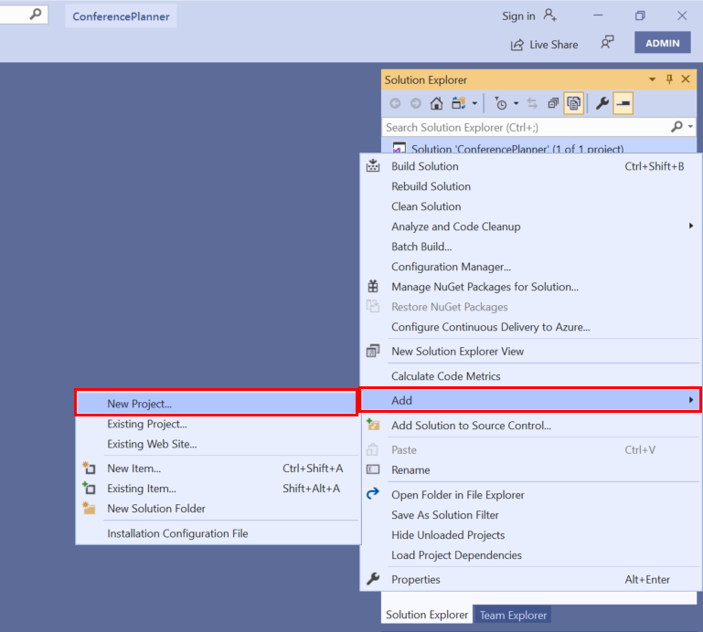
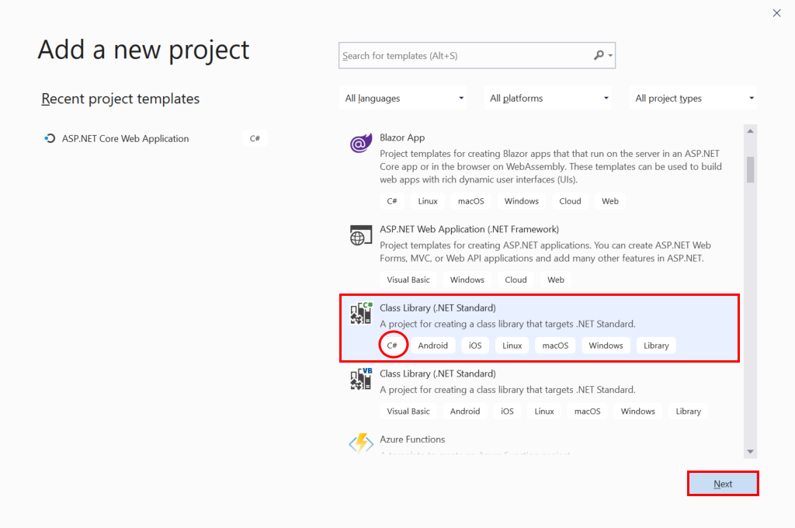
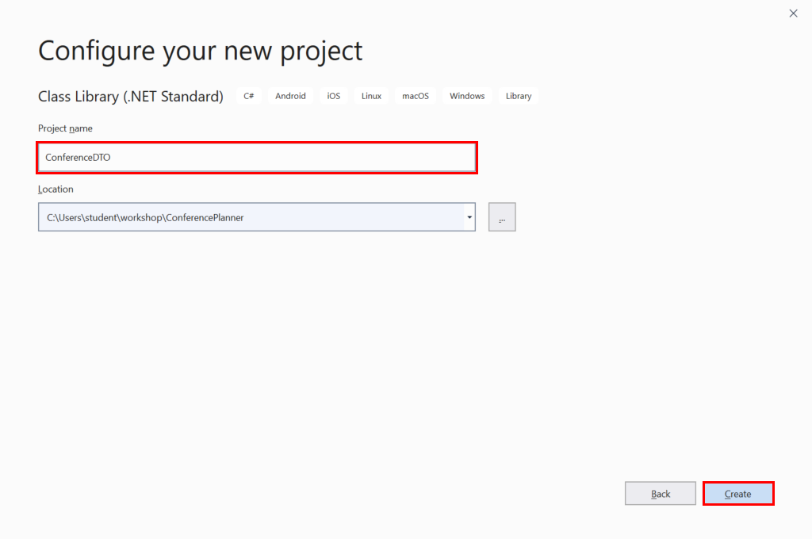
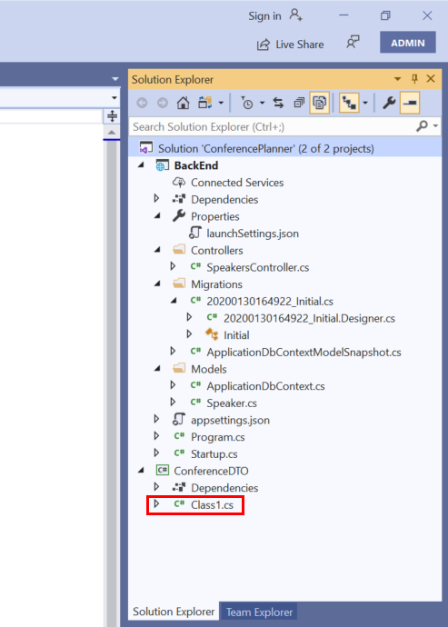
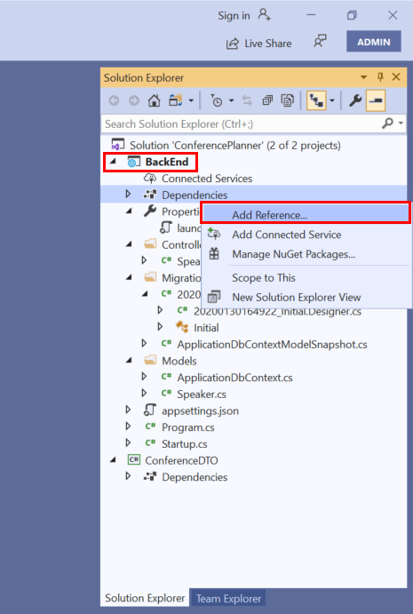
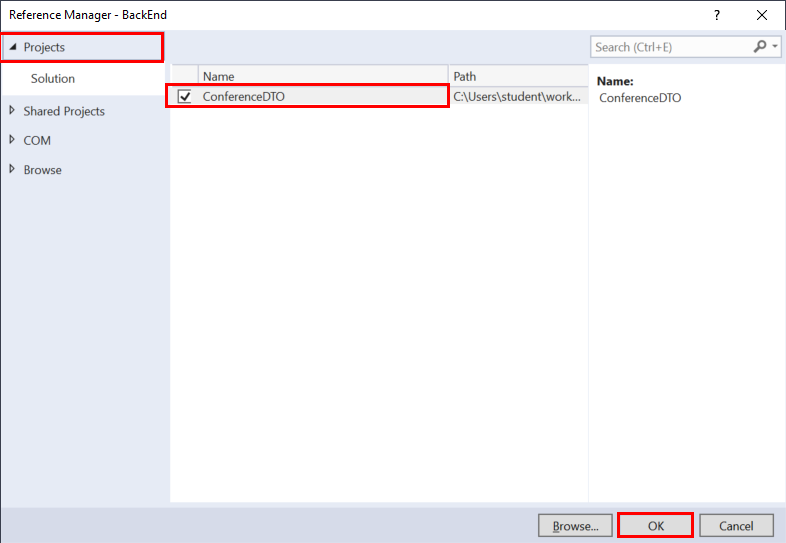
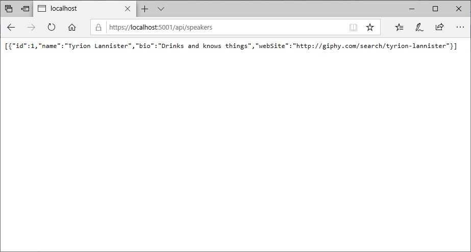

# Extend the BackEnd Web API and Add Data Transfer Objects

In this session, you'll create Data Transfer Objects to transmit and receive data in a neutral format. This level of abstraction is useful to prevent client applications requiring dependencies on the underlying Entity Framework model. You'll implement the DTOs in a shared library that can be easily incorporated into a client application. You'll add further models to represent conference attendees, sessions, and tracks, and you'll add controllers to handle them. These controllers will include additional operations that support tasks such as bulk import of conference data. You'll generate the corresponding tables in the database, and then test the application using the Swagger API.

## Create the shared library for DTOs

You'll create the shared library as a new project in the ConferencePlanner solution. You can continue with your solution from the previous exercise, or you can copy the code from the [Session 1 Savepoint folder](../save-points/1-Create-API-and-EF-Model).

**If you're using Visual Studio, perform the following steps:**

1. In the Solution Explorer window, right-click **ConferencePlanner** solution, click **Add**, and then click  **New Project**.

    

2. In the **Add a new project** dialog box, scroll down and select the **Class Library (.NET Standard)** project template. Make sure that you select the C# template rather than Visual Basic, and then click **Next**

    

3. In the **Configure you new project** dialog box, name the project **ConferenceDTO**, and then click **Create**.

    

4. In the **Solution Explorer** window, delete the generated **Class1.cs** file from the new project.

    

5. Right-click the **Dependencies** folder in the **BackEnd** project, and then click **Add Reference...**. 

    

6. In the **Reference Manager - BackEnd** dialog box, expand the **Project** tab, select the **ConferenceDTO** project, and then click **OK**.

    

**If you're using the .NET Core CLI, perform the following steps:**

1. In a command prompt window, move to the **ConferencePlanner** folder for your solution.

2. Run the following command to create a .NET Standard shared library project named **ConferenceDTO**:

   ```console
   dotnet new classlib -o ConferenceDTO -f netstandard2.0
   ```

3. Move to the **ConferenceDTO** project folder and delete the **Class1.cs** file.

4. Move to the **BackEnd** project folder under the **ConferencePlanner** solution folder.

5. Run the command shown below to add a reference to the **ConferenceDTO** project to the BackEnd project. 

   ```console
   dotnet add reference ../ConferenceDTO
   ```

6. Return to the **ConferencePlanner** folder, and then run the following command to add the **ConferenceDTO** project to the solution:

   ```console
   dotnet sln add ConferenceDTO/ConferenceDTO.csproj
   ```

## Refactor the Speaker model into the ConferenceDTO project

1. Copy the **Speaker.cs** file from the **Models** folder in the **BackEnd** project into the root folder of the **ConferenceDTO** project.
2. Edit the **Speaker.cs** file in the **ConferenceDTO** project and change the namespace to **ConferenceDTO**, as shown below.

    ```csharp
    using System;
    ...

    namespace ConferenceDTO
    {
        public class Speaker
        {
            public int Id { get; set; }
            ...
        }
    }
    ```

   > **Note:**  The data annotations references should be broken at this point because the **ConferenceDTO**project doesn't contain the NuGet appropriate package.

3. Add a reference to the NuGet package `System.ComponentModel.Annotations` version `4.7.0`:

    - **If you're using Visual Studio 2019:**

        1. In the **Solution Explorer** window, right-click the **ConferenceDTO** project, and then click **Manage NuGet Packages**.
        2. In the **NuGet: ConferenceDTO** window, click the **Browse** tab.
        3. In the search box, type **System.ComponentModel.Annotations**, set the **Version** to **Latest stable 4.7.0**, and then click **Install**.
        4. If the **Preview Changes** dialog box appears, click **OK**.
        5. In the **License Acceptance** dialog box, click **I Accept**.

    - **If you're using the .NET Core CLI:**

        1. Move to the **ConferenceDTO** folder.
        2. Run the following command:

        ```console
        dotnet add package System.ComponentModel.Annotations --version 4.7.0
        ```

4. In the **BackEnd** project, edit the **Speaker.cs** file in the models folder, remove the properties from the **Speaker** class, and instead mark the class as a descendent of the **Speaker** class in the **ConferenceDTO** project, as shown below:

   ```csharp
   public class Speaker : ConferenceDTO.Speaker
   {
   }
   ```

5. Rebuild and run the application:

    - **If you're using Visual Studio 2019:**

        - Press **F5** to start the application in debug mode. When the application runs, a browser window should appear, open at the URL **https://localhost:*\<port\>*/api/speakers**.

    - **If you're using the .NET Core CLI:**

        1. Move to the **ConferencePlanner** solution folder.
        2. Execute the following command to start the application:

            ```console
            dotnet run --project BackEnd
            ```

        3. Open a web browser window and move to the URL **https://localhost:*\<port\>*/api/speakers**.

6. Verify that the details of the speaker **Tyrion Lannister** are displayed. You added this speaker in the previous session.

    

    > **Note:** If the speaker data is missing, you can add it again. Navigate to the URL **https://localhost:*\<port\>*/swagger**, and use the Swagger page to recreate the speaker, following the instructions described at the end of session 1.

## Add the remaining models to the ConferenceDTO project

In this task, you'll add DTOs that represent conference attendees, sessions, and tracks to the project.

1. Create an `Attendee.cs` class in the *ConferenceDTO* project with the following code:
   ```csharp
   using System;
   using System.Collections.Generic;
   using System.ComponentModel.DataAnnotations;
   
   namespace ConferenceDTO
   {
       public class Attendee
       {
           public int Id { get; set; }
   
           [Required]
           [StringLength(200)]
           public virtual string FirstName { get; set; }
   
           [Required]
           [StringLength(200)]
           public virtual string LastName { get; set; }
   
           [Required]
           [StringLength(200)]
           public string UserName { get; set; }
           
           [StringLength(256)]
           public virtual string EmailAddress { get; set; }
       }
   }
   ```
1. Create a `Session.cs` class with the following code:
   ```csharp
   using System;
   using System.Collections;
   using System.Collections.Generic;
   using System.ComponentModel.DataAnnotations;
   
   namespace ConferenceDTO
   {
       public class Session
       {
           public int Id { get; set; }
   
           [Required]
           [StringLength(200)]
           public string Title { get; set; }
   
           [StringLength(4000)]
           public virtual string Abstract { get; set; }
   
           public virtual DateTimeOffset? StartTime { get; set; }
   
           public virtual DateTimeOffset? EndTime { get; set; }
   
           // Bonus points to those who can figure out why this is written this way
           public TimeSpan Duration => EndTime?.Subtract(StartTime ?? EndTime ?? DateTimeOffset.MinValue) ?? TimeSpan.Zero;
   
           public int? TrackId { get; set; }
       }
   }
   ```
1. Create a new `Track.cs` class with the following code:
   ```csharp
   using System;
   using System.Collections.Generic;
   using System.ComponentModel.DataAnnotations;
   
   namespace ConferenceDTO
   {
       public class Track
       {
           public int Id { get; set; }
   
           [Required]
           [StringLength(200)]
           public string Name { get; set; }
       }
   }
   ```

## Creating Derived Models in the BackEnd project
We're not going to create our EF models directly from the `ConferenceDTO` classes. Instead, we'll create some composite classes such as `SessionSpeaker`, since these will map more closely to what our application will be working with.

We're also going to take this opportunity to rename the `Models` directory in the *BackEnd* project to `Data` since it no longer just contains models.
1. Right-click the `Models` directory and select `Rename`, changing the name to `Data`.
    > Note: If you are using Visual Studio, you can use refactoring to rename the namespace.
1. Add a `SessionSpeaker.cs` class to the `Data` directory with the following code:
   ```csharp
   using System;
   using System.Collections.Generic;
   using System.Linq;
   using System.Threading.Tasks;
   
   namespace BackEnd.Data
   {
       public class SessionSpeaker
       {
           public int SessionId { get; set; }
   
           public Session Session { get; set; }
   
           public int SpeakerId { get; set; }
   
           public Speaker Speaker { get; set; }
       }
   }
   ```
1. Add an `SessionAttendee.cs` class with the following code:
   ```csharp
   using System;
   using System.Collections.Generic;
   using System.Linq;
   using System.Threading.Tasks;

   namespace BackEnd.Data
   {
       public class SessionAttendee
       {
           public int SessionId { get; set; }

           public Session Session { get; set; }

           public int AttendeeId { get; set; }

           public Attendee Attendee { get; set; }
       }
   }
   ```
1. Add an `Attendee.cs` class with the following code:
   ```csharp
   using System;
   using System.Collections.Generic;
   
   namespace BackEnd.Data
   {
       public class Attendee : ConferenceDTO.Attendee
       {
           public virtual ICollection<SessionAttendee> SessionsAttendees { get; set; }
       }
   }
   ```
1. Add a `Session.cs` class with the following code:
   ```csharp
   using System;
   using System.Collections;
   using System.Collections.Generic;
   
   namespace BackEnd.Data
   {
       public class Session : ConferenceDTO.Session
       {
           public virtual ICollection<SessionSpeaker> SessionSpeakers { get; set; }

           public virtual ICollection<SessionAttendee> SessionAttendees { get; set; }
   
           public Track Track { get; set; }
       }
   }
   ```
1. Add a `Track.cs` class with the following code:
   ```csharp
   using System;
   using System.Collections.Generic;
   using System.ComponentModel.DataAnnotations;

   namespace BackEnd.Data
   {
       public class Track : ConferenceDTO.Track
       {
           public virtual ICollection<Session> Sessions { get; set; }
       }
   }
   ```
1. Modify the `Speaker.cs` class we wrote previously to make the following two changes: update to the namespace to match our directory rename, and add a referece to the `SessionSpeaker` composite class:
   ```csharp
   using System;
   using System.Collections.Generic;
   
   namespace BackEnd.Data
   {
       public class Speaker : ConferenceDTO.Speaker
       {
           public virtual ICollection<SessionSpeaker> SessionSpeakers { get; set; } = new List<SessionSpeaker>();
       }
   }
   ```

## Update the ApplicationDbContext
Okay, now we need to update our `ApplicationDbContext` so Entity Framework knows about our new models.

1. Update `ApplicationDbContext.cs` to use the following code:
   ```csharp
   using Microsoft.EntityFrameworkCore;

   namespace BackEnd.Data
   {
       public class ApplicationDbContext : DbContext
       {
           public ApplicationDbContext(DbContextOptions<ApplicationDbContext> options)
               : base(options)
           {

           }

           protected override void OnModelCreating(ModelBuilder modelBuilder)
           {
               modelBuilder.Entity<Attendee>()
               .HasIndex(a => a.UserName)
               .IsUnique();

                // Many-to-many: Session <-> Attendee
                modelBuilder.Entity<SessionAttendee>()
                    .HasKey(ca => new { ca.SessionId, ca.AttendeeId });

                // Many-to-many: Speaker <-> Session
                modelBuilder.Entity<SessionSpeaker>()
                    .HasKey(ss => new { ss.SessionId, ss.SpeakerId });
           }

           public DbSet<Session> Sessions { get; set; }

           public DbSet<Track> Tracks { get; set; }

           public DbSet<Speaker> Speakers { get; set; }

           public DbSet<Attendee> Attendees { get; set; }
       }
   }
   ```
1. Fix errors due to the rename from `BackEnd.Models` to `BackEnd.Data`. You can either do this using a find / replace (replacing "BackEnd.Models" with "BackEnd.Data") or you can do a build and fix errors.
1. Ensure that the application builds now.

## Add a new database migration

### Visual Studio: Package Manager Console 
1. Run the following commands in the Package Manager Console (specify the `BackEnd` project)
   ```console
   Add-Migration Refactor
   Update-Database
   ```

### Command line
1. Run the following commands in the command prompt in the `BackEnd` project directory:
   ```console
   dotnet ef migrations add Refactor
   dotnet ef database update
   ```
1. Now take a deep breath and run the application and navigate to `/swagger`. You should see the Swagger UI.

## Updating the Speakers API controller

1. Modify the query for the `GetSpeakers()` method as shown below:
   ```csharp
   var speakers = await _context.Speakers.AsNoTracking()
                           .Include(s => s.SessionSpeakers)
                               .ThenInclude(ss => ss.Session)
                           .ToListAsync();
   return speakers;
   ```
1. While the above will work, this is directly returning our model class. A better practice is to return an output model class. Create a `SpeakerResponse.cs` class in the `ConferenceDTO` project with the following code:
   ```csharp
   using System;
   using System.Collections.Generic;
   using System.Text;

   namespace ConferenceDTO
   {
       public class SpeakerResponse : Speaker
       {
           public ICollection<Session> Sessions { get; set; } = new List<Session>();
       }
   }
   ```
1. Now we'll add a utility method to map between these classes. In the *BackEnd* project, create an `Infrastructure` directory. Add a class named `EntityExtensions.cs` with the following mapping code:
   ```csharp
   using BackEnd.Data;
   using System;
   using System.Collections.Generic;
   using System.Linq;
   using System.Threading.Tasks;

   namespace BackEnd.Data
   {
       public static class EntityExtensions
       {
           public static ConferenceDTO.SpeakerResponse MapSpeakerResponse(this Speaker speaker) =>
               new ConferenceDTO.SpeakerResponse
               {
                   Id = speaker.Id,
                   Name = speaker.Name,
                   Bio = speaker.Bio,
                   WebSite = speaker.WebSite,
                   Sessions = speaker.SessionSpeakers?
                       .Select(ss =>
                           new ConferenceDTO.Session
                           {
                               Id = ss.SessionId,
                               Title = ss.Session.Title
                           })
                       .ToList()
               };
       }
   }
   ```
1. Now we can update the `GetSpeakers()` method of the *SpeakersController* so that it returns our response model. Update the last few lines so that the method reads as follows:
   ```csharp
   [HttpGet]
   public async Task<ActionResult<List<ConferenceDTO.SpeakerResponse>>> GetSpeakers()
   {
       var speakers = await _context.Speakers.AsNoTracking()
                                       .Include(s => s.SessionSpeakers)
                                           .ThenInclude(ss => ss.Session)
                                       .Select(s => s.MapSpeakerResponse())
                                       .ToListAsync();
       return speakers;
   }
   ```
1. Update the `GetSpeaker()` method to use our mapped response models as follows:
   ```csharp
   [HttpGet("{id}")]
   public async Task<ActionResult<ConferenceDTO.SpeakerResponse>> GetSpeaker(int id)
   {
       var speaker = await _context.Speakers.AsNoTracking()
                                       .Include(s => s.SessionSpeakers)
                                           .ThenInclude(ss => ss.Session)
                                       .SingleOrDefaultAsync(s => s.Id == id);
       if (speaker == null)
       {
           return NotFound();
       }
       return speaker.MapSpeakerResponse();
   }
   ```
1. Remove the other actions (`PutSpeaker`, `PostSpeaker`, `DeleteSpeaker`), on the `SpeakersController`.

## Adding the remaining API Controllers and DTOs

1. Add the following response DTO classes from [the save point folder](/save-points/2-BackEnd-completed/ConferencePlanner/ConferenceDTO)
   - `AttendeeResponse`
   - `SessionResponse`
1. Update the `EntityExtensions` class with the `MapSessionResponse` and `MapAttendeeResponse` methods from [the save point folder](/save-points/2-BackEnd-completed/ConferencePlanner/BackEnd/Infrastructure)
1. Copy the following controllers from [the save point folder](/save-points/2-BackEnd-completed/ConferencePlanner/BackEnd/Controllers) into the current project's `BackEnd/Controllers` directory:
   - `SessionsController`
   - `AttendeesController`

## Adding Conference Upload support
1. Copy the `DataLoader.cs` class from [here](/src/BackEnd/Data/DataLoader.cs) into the `Data` directory of the `BackEnd` project.
1. Copy the `SessionizeLoader.cs` and `DevIntersectionLoader.cs` classes from [here](/src/BackEnd/Data/) into the current project's `/src/BackEnd/Data/` directory. 
    > Note: We have data loaders from the two conference series where this workshop has been presented most; you can update this to plug in your own conference file format.
1. To improve the UI for upload, add a converter to the JSON serializer options to map enums to strings by changing `AddControllers()` in `Startup.cs` to the following:
    ```c#
    services.AddControllers()
            .AddJsonOptions(options =>
            {
                options.JsonSerializerOptions.Converters.Add(new JsonStringEnumConverter());
            });
    ```
1. Run the application to see the updated data via Swagger UI.
1. Use the Swagger UI to upload [NDC_London_2020.json](/src/BackEnd/Data/Import/NDC_London_2020.json) to the `/api/Sessions/upload` API.

**Next**: [Session #3 - Front-end](3.%20Add%20front-end%2C%20render%20agenda%2C%20set%20up%20front-end%20models.md) | **Previous**: [Session #1 - Setup, basic EF model](/docs/1.%20Create%20BackEnd%20API%20project.md)
