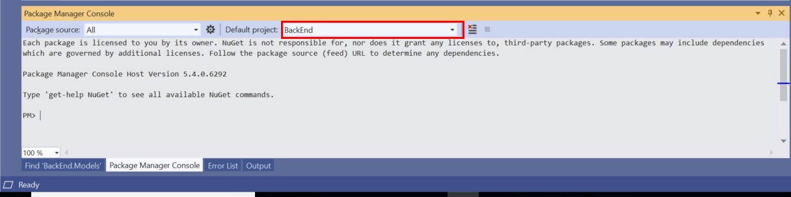
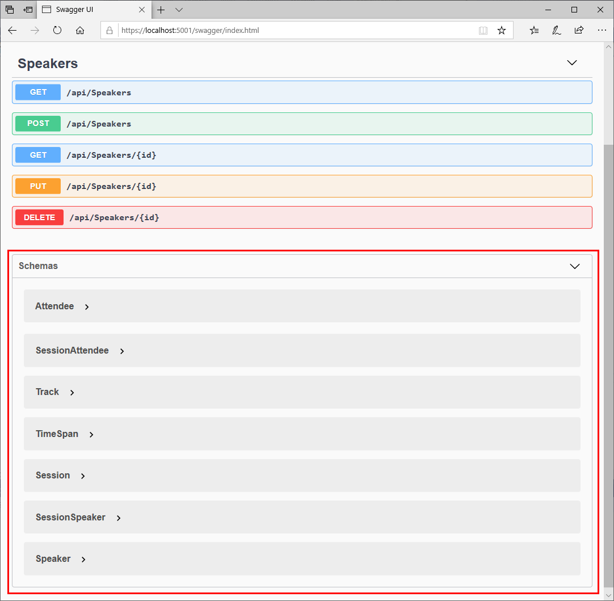

# Extend the BackEnd Web API and Add Data Transfer Objects

In this session, you'll create Data Transfer Objects to transmit and receive data in a neutral format. This level of abstraction is useful to prevent client applications requiring dependencies on the underlying Entity Framework model. You'll implement the DTOs in a shared library that can be easily incorporated into a client application. You'll add further models to represent conference attendees, sessions, and tracks, and you'll add controllers to handle them. These controllers will include additional operations that support tasks such as bulk import of conference data. You'll generate the corresponding tables in the database, and then test the application using the Swagger API.

## Create the shared library for DTOs

You'll create the shared library as a new project in the ConferencePlanner solution. You can continue with your solution from the previous exercise, or you can copy the code from the [Session 1 Savepoint folder](../save-points/1-Create-API-and-EF-Model).

**If you're using Visual Studio, perform the following steps:**

1. In the Solution Explorer window, right-click **ConferencePlanner** solution, click **Add**, and then click  **New Project**.

    

2. In the **Add a new project** dialog box, scroll down and select the **Class Library (.NET Standard)** project template. Make sure that you select the C# template rather than Visual Basic, and then click **Next**

    

3. In the **Configure you new project** dialog box, name the project **ConferenceDTO**, and then click **Create**.

    

4. In the **Solution Explorer** window, delete the generated **Class1.cs** file from the new project.

    

5. Right-click the **Dependencies** folder in the **BackEnd** project, and then click **Add Reference...**. 

    

6. In the **Reference Manager - BackEnd** dialog box, expand the **Project** tab, select the **ConferenceDTO** project, and then click **OK**.

    

**If you're using the .NET Core CLI, perform the following steps:**

1. In a command prompt window, move to the **ConferencePlanner** folder for your solution.

2. Run the following command to create a .NET Standard shared library project named **ConferenceDTO**:

   ```console
   dotnet new classlib -o ConferenceDTO -f netstandard2.0
   ```

3. Move to the **ConferenceDTO** project folder and delete the **Class1.cs** file.

4. Move to the **BackEnd** project folder under the **ConferencePlanner** solution folder.

5. Run the command shown below to add a reference to the **ConferenceDTO** project to the BackEnd project. 

   ```console
   dotnet add reference ../ConferenceDTO
   ```

6. Return to the **ConferencePlanner** folder, and then run the following command to add the **ConferenceDTO** project to the solution:

   ```console
   dotnet sln add ConferenceDTO/ConferenceDTO.csproj
   ```

## Refactor the Speaker model as a DTO

1. Copy the **Speaker.cs** file from the **Models** folder in the **BackEnd** project into the root folder of the **ConferenceDTO** project.
2. Edit the **Speaker.cs** file in the **ConferenceDTO** project and change the namespace to **ConferenceDTO**, as shown below.

    ```csharp
    using System;
    ...

    namespace ConferenceDTO
    {
        public class Speaker
        {
            public int Id { get; set; }
            ...
        }
    }
    ```

   > **Note:**  The data annotations references should be broken at this point because the **ConferenceDTO**project doesn't contain the NuGet appropriate package.

3. Add a reference to the NuGet package `System.ComponentModel.Annotations` version `4.7.0`:

    - **If you're using Visual Studio 2019:**

        1. In the **Solution Explorer** window, right-click the **ConferenceDTO** project, and then click **Manage NuGet Packages**.
        2. In the **NuGet: ConferenceDTO** window, click the **Browse** tab.
        3. In the search box, type **System.ComponentModel.Annotations**, set the **Version** to **Latest stable 4.7.0**, and then click **Install**.
        4. If the **Preview Changes** dialog box appears, click **OK**.
        5. In the **License Acceptance** dialog box, click **I Accept**.

    - **If you're using the .NET Core CLI:**

        1. Move to the **ConferenceDTO** folder.
        2. Run the following command:

        ```console
        dotnet add package System.ComponentModel.Annotations --version 4.7.0
        ```

4. In the **BackEnd** project, edit the **Speaker.cs** file in the models folder, remove the properties from the **Speaker** class, and instead mark the class as a descendent of the **Speaker** class in the **ConferenceDTO** project, as shown below:

   ```csharp
   public class Speaker : ConferenceDTO.Speaker
   {
   }
   ```

5. Rebuild and run the application:

    - **If you're using Visual Studio 2019:**

        - Press **F5** to start the application in debug mode. When the application runs, a browser window should appear, open at the URL **https://localhost:*port*/api/speakers**.

    - **If you're using the .NET Core CLI:**

        1. Move to the **ConferencePlanner** solution folder.
        2. Execute the following command to start the application:

            ```console
            dotnet run --project BackEnd
            ```

        3. Open a web browser window and move to the URL **https://localhost:*port*/api/speakers**.

6. Verify that the details of the speaker **Tyrion Lannister** are displayed. You added this speaker in the previous session.

    

    > **Note:** If the speaker data is missing, you can add it again. Navigate to the URL **https://localhost:*port*/swagger**, and use the Swagger page to recreate the speaker, following the instructions described at the end of session 1.

7. Close the web browser and terminate the application.

## Add the remaining models to the ConferenceDTO project

In this task, you'll add DTOs that represent conference attendees, sessions, and tracks to the **ConferenceDTO** project.

1. Add a class file named **Attendee.cs** to the **ConferenceDTO** project:

    - **If you're using Visual Studio 2019:**

        1. In the **Solution Explorer** window, right-click the **ConferenceDTO** project, click **Add**, and then click **Class**.
        2. In the **Add New Item - ConferenceDTO** dialog box. Select te **Class** template, enter **Attendees.cs** in the **Name** field, and then click **Add**.

    - **If you're using the .NET Core CLI:**

        1. Move to the **ConferenceDTO** project folder.
        2. Create a new file named **Attendee.cs** using an editor of your choice.

2. Add the following code to the **Attendee.cs** file. This class records the details of a conference attendee:

    ```csharp
    using System;
    using System.Collections.Generic;
    using System.ComponentModel.DataAnnotations;

    namespace ConferenceDTO
    {
        public class Attendee
        {
            public int Id { get; set; }

            [Required]
            [StringLength(200)]
            public virtual string FirstName { get; set; }

            [Required]
            [StringLength(200)]
            public virtual string LastName { get; set; }

            [Required]
            [StringLength(200)]
            public string UserName { get; set; }

            [StringLength(256)]
            public virtual string EmailAddress { get; set; }
        }
    }
    ```

3. Add a class file named **Track.cs** to the **ConferenceDTO** project. Add the code shown below to this file. A conference can be divided into several tracks. Each track contains sessions that follow a particular theme.

    ```csharp
    using System;
    using System.Collections.Generic;
    using System.ComponentModel.DataAnnotations;

    namespace ConferenceDTO
    {
        public class Track
        {
            public int Id { get; set; }

            [Required]
            [StringLength(200)]
            public string Name { get; set; }
        }
    }
    ```

4. Add a class file named **Session.cs** to the **ConferenceDTO** project, with the following code. This class models a conference session, including the title of the session, a brief description of the session,  the start time, end time, and length of the session, and the conference track to which the session belongs:

    ```csharp
    using System;
    using System.Collections;
    using System.Collections.Generic;
    using System.ComponentModel.DataAnnotations;

    namespace ConferenceDTO
    {
        public class Session
        {
            public int Id { get; set; }

            [Required]
            [StringLength(200)]
            public string Title { get; set; }

            [StringLength(4000)]
            public virtual string Abstract { get; set; }

            public virtual DateTimeOffset? StartTime { get; set; }

            public virtual DateTimeOffset? EndTime { get; set; }

            public TimeSpan Duration => EndTime?.Subtract(StartTime ?? EndTime ?? DateTimeOffset.MinValue) ?? TimeSpan.Zero;

            public int? TrackId { get; set; }
        }
    }
    ```

5. Rebuild the solution, and correct any compiler errors:

    - **If you're using Visual Studio 2019:**

        - On the **Build** menu, click **Rebuild Solution**.

    - **If you're using the .NET Core CLI:**

        1. Move to the **ConferencePlanner** solution folder.
        2. Run the following command:

            ```console
            dotnet build
            ```

## Create derived models in the BackEnd project

In this task, you'll create some additional model classes in the **BackEnd** project, to support attendees and sessions. Rather than create the Entity Framework models directly from the DTO types in the **ConferenceDTO** project, you'll create some composite classes, such as **SessionSpeaker**, that will align more closely to the requirements of the front end application. You'll build the front end application in the next session.

1. Rename the **Models** folder in the **BackEnd** project as **Data**. This new name reflects the fact that the folder will no longer contain just models.

    - **If you're using Visual Studio 2019:**

        - In the **Solution Explorer** window, in the **BackEnd** project, right-click the **Models** folder, click **Rename**, and change the name of the folder to **Data**.

    - **If you're using the .NET Core CLI:**

        1. Move to the **BackEnd** project folder.
        2. Rename the **Models** folder to **Data**

2. Open the **Speaker.cs** file in the **Data** folder, and change the namespace from **BackEnd.Models** to **BackEnd.Data**.

3. Open the **ApplicationDbContext.cs** file in the **Data** folder, and change the namespace from **BackEnd.Models** to **BackEnd.Data**.

4. Edit the **SpeakersController.cs** file in the **Controllers** folder, and change the directive `using BackEnd.Models` to `using BackEnd.Data`.

5. Edit the **Startup.cs** file in the root folder of the **BackEnd** project, and change the directive `using BackEnd.Models` to `using BackEnd.Data`.

6. Add a class file named **Session.cs** to the **Data** folder. Add the code shown below to this file. The **Session** class stores information about the speakers and attendees for a conference session:

    ```csharp
    using System.Collections.Generic;

    namespace BackEnd.Data
    {
        public class Session : ConferenceDTO.Session
        {
            public virtual ICollection<SessionSpeaker> SessionSpeakers { get; set; }

            public virtual ICollection<SessionAttendee> SessionAttendees { get; set; }

            public Track Track { get; set; }
        }
    }
    ```

7. Add a class file named  **Track.cs** to the **Data** folder, with the following code. The **Track** class records which sessions belong to each conference track:

   ```csharp
   using System.Collections.Generic;

   namespace BackEnd.Data
   {
       public class Track : ConferenceDTO.Track
       {
           public virtual ICollection<Session> Sessions { get; set; }
       }
   }
   ```

8. Add a class file named **SessionSpeaker.cs** to the **Data** folder, with the code shown below. The **SessionSpeaker** class records which speakers present which sessions:

    ```csharp
    namespace BackEnd.Data
    {
        public class SessionSpeaker
        {
            public int SessionId { get; set; }

            public Session Session { get; set; }

            public int SpeakerId { get; set; }

            public Speaker Speaker { get; set; }
        }
    }
    ```

9. Add a class file named **Attendee.cs** to the **Data** folder, with the following code. This class stores information about the conference attendees. It is based on the **Attendee** DTO class:

    ```csharp
    using System.Collections.Generic;

    namespace BackEnd.Data
    {
        public class Attendee : ConferenceDTO.Attendee
        {
            public virtual ICollection<SessionAttendee> SessionsAttendees { get; set; }
        }
    }
    ```

10. Add class file named **SessionAttendee.cs** to the **Data** folder, with the code shown below. This class tracks which sessions have been, or might be, attended by a conference delegate:

    ```csharp
    namespace BackEnd.Data
    {
        public class SessionAttendee
        {
            public int SessionId { get; set; }

            public Session Session { get; set;}

            public int AttendeeId { get; set; }

            public Attendee Attendee { get; set; }
        }
    }
    ```

11. Modify the **Speaker** class in the **Speaker.cs** file in the **Data** folder. Remove any unnecessary `using` directives, and add a referece to the **SessionSpeaker** composite class, as shown below:

    ```csharp
    using System.Collections.Generic;

    namespace BackEnd.Data
    {
        public class Speaker : ConferenceDTO.Speaker
        {
            public virtual ICollection<SessionSpeaker> SessionSpeakers { get; set; } 
                = new List<SessionSpeaker>();
        }
    }
    ```

## Update the database context class

In this task, you'll update the **ApplicationDbContext** with the details of the new models.

1. Edit the **ApplicationDbContext.cs** file in the **Data** folder.  Modify the code in this file as shown below:

    ```csharp
    using Microsoft.EntityFrameworkCore;

    namespace BackEnd.Data
    {
        public class ApplicationDbContext : DbContext
        {
            public ApplicationDbContext(DbContextOptions<ApplicationDbContext> options)
                : base(options)
            {

            }

            protected override void OnModelCreating(ModelBuilder modelBuilder)
            {
                modelBuilder.Entity<Attendee>()
                .HasIndex(a => a.UserName)
                .IsUnique();

                // Many-to-many: Session <-> Attendee
                modelBuilder.Entity<SessionAttendee>()
                    .HasKey(ca => new { ca.SessionId, ca.AttendeeId });

                // Many-to-many: Speaker <-> Session
                modelBuilder.Entity<SessionSpeaker>()
                    .HasKey(ss => new { ss.SessionId, ss.SpeakerId });
            }

            public DbSet<Session> Sessions { get; set; }

            public DbSet<Track> Tracks { get; set; }

            public DbSet<Speaker> Speakers { get; set; }

            public DbSet<Attendee> Attendees { get; set; }
        }
    }
    ```

2. Remove all files in the **Migrations** folder for the **BackEnd** project. These files were generated by using the database migration tool, and were based on the previous version of the model.

3. Rebuild the **ConferencePlanner** solution, and ensure that it builds withouy any errors or warnings.

## Add a new database migration

In this task, you'll update the database with the new models you added in the previous tasks.

**If you're using Visual Studio, perform the following steps:**

1. On the **Tools** menu, click **NuGet Package Manager**, and then click **Package Manager Console**.

2. In the **Package Manager Console** window, set the **Default project** to **BackEnd**.

    

3. Run the following commands in the **Package Manager Console** window, at the **PM>** prompt:

    ```console
    Add-Migration Refactor
    Drop-Database
    Update-Database
    ```

    When prompted to drop the existing database, press **Y**.

**If you're using the .NET Core CLI, perform the following steps:**

1. In a command prompt window, move to the **BackEnd** project folder.

2. Run the following commands:

    ```console
    dotnet ef migrations add Refactor
    dotnet ef database drop
    dotnet ef database update
    ```

    When prompted to drop the existing database, press **y**.

## Verify the updated database model

1. Rebuild and run the **ConferencePlanner** application.

2. If you are using Visual Studio 2019, a web browser window will open automatically. If you are using the .NET Core CLI, open a new web browser window.

3. In the web browser, navigate to the URL **https://localhost:*port*/swagger**. You should see the new models appear under the **Schemas** section of the Swagger page.

    

4. Expand each schema in turn, and compare the fields in each schema to the properties in the corresponding types in the **BackEnd** web application.

5. Close the browser window, and terminate the application.

## Update the Speakers API controller

In this task, you'll update the **Speakers** controller to retrieve speaker information using the composite types you defined in the earlier task.

1. Open the **Speakers.cs** file in the **Controllers** folder in the **BackEnd** project.

2. Modify the the **GetSpeakers()** method as shown below. The data returned by this method now includes **SessionSpeaker** information, and **Session** information for the **SessionSpeaker** property:

    ```csharp
    // GET: api/Speakers
    [HttpGet]
    public async Task<ActionResult<IEnumerable<Speaker>>> GetSpeakers()
    {
        var speakers = await _context.Speakers.AsNoTracking()
                               .Include(s => s.SessionSpeakers)
                                   .ThenInclude(ss => ss.Session)
                               .ToListAsync();
        return speakers;
    }
    ```

   While this code will work, it returns an object based directly on the model class. This approach can introduce a tight coupling between the model and client applications. A better practice is to return an output model class that maps to an independent representation that doesn't depend on the Entity Framework model. This is the approach you'll implement in the next steps.

3. Create a new class file named **SpeakerResponse.cs** class in the **ConferenceDTO** project, with the following code. The **SpeakerResponse** class is an ehnaced version of the **Speaker** class that includes the list of sessions the speaker presents:

    ```csharp
    using System;
    using System.Collections.Generic;
    using System.Text;

    namespace ConferenceDTO
    {
        public class SpeakerResponse : Speaker
        {
            public ICollection<Session> Sessions { get; set; } = new List<Session>();
        }
    }
    ```

4. Add a new folder, named **Infrastructure**, to the **BackEnd** project.

5. Add a class file named **EntityExtenions.cs** to the **Infrastructure** folder, using the following code. **MapSpeakerReponse** is an extension method of the **Speaker** class that generates a **SpeakerResponse** object from a **Speaker** object:

    ```csharp
    using System.Linq;

    namespace BackEnd.Data
    {
        public static class EntityExtensions
        {
            public static ConferenceDTO.SpeakerResponse MapSpeakerResponse(this Speaker speaker) =>
                new ConferenceDTO.SpeakerResponse
                {
                    Id = speaker.Id,
                    Name = speaker.Name,
                    Bio = speaker.Bio,
                    WebSite = speaker.WebSite,
                    Sessions = speaker.SessionSpeakers?
                        .Select(ss =>
                            new ConferenceDTO.Session
                            {
                                Id = ss.SessionId,
                                Title = ss.Session.Title
                            })
                        .ToList()
                };
        }
    }
    ```

6. Update the **GetSpeakers()** method of the **SpeakersController** so that it returns a **SpeakerResponse** object, as follows:

    ```csharp
    [HttpGet]
    public async Task<ActionResult<List<ConferenceDTO.SpeakerResponse>>> GetSpeakers()
    {
        var speakers = await _context.Speakers.AsNoTracking()
                                        .Include(s => s.SessionSpeakers)
                                            .ThenInclude(ss => ss.Session)
                                        .Select(s => s.MapSpeakerResponse())
                                        .ToListAsync();
        return speakers;
    }
    ```

7. Update the **GetSpeaker()** method to use **SpeakerResponse** model:

    ```csharp
    [HttpGet("{id}")]
    public async Task<ActionResult<ConferenceDTO.SpeakerResponse>> GetSpeaker(int id)
    {
        var speaker = await _context.Speakers.AsNoTracking()
                                        .Include(s => s.SessionSpeakers)
                                            .ThenInclude(ss => ss.Session)
                                        .SingleOrDefaultAsync(s => s.Id == id);
        if (speaker == null)
        {
            return NotFound();
        }
        return speaker.MapSpeakerResponse();
    }
    ```

8. Remove the actions **PutSpeaker**, **PostSpeaker**, and **DeleteSpeaker**, from the **SpeakersController**. The **Speakers** controller will only be used for querying speaker information. Also remove the private **SpeakerExists** method.

## Add an API Controller and DTO for managing Attendees

1. Create a new class file, named **AttendeeResponse.cs**, in the **ConferenceDTO** project. Add the code shown below to this file:

    ```csharp
    using System.Collections.Generic;

    namespace ConferenceDTO
    {
        public class AttendeeResponse : Attendee
        {
            public ICollection<Session> Sessions { get; set; } = new List<Session>();
        }
    }
    ```

    You'll use the **AttendeeResponse** class to return information about conference attendees, including the sessions they have attended.

2. In the **BackEnd** project, edit the **EntityExtension.cs** file in the **Infrastructure** folder, and add the **MapAttendeeResponse** method shown below to the **EntityExtensions** class, after the **MapSessionResponse** method:

    ```csharp
    public static class EntityExtensions
    {
        public static ConferenceDTO.SessionResponse MapSessionResponse(this Session session) =>
        ...

        public static ConferenceDTO.AttendeeResponse MapAttendeeResponse(this Attendee attendee) =>
            new ConferenceDTO.AttendeeResponse
            {
                Id = attendee.Id,
                FirstName = attendee.FirstName,
                LastName = attendee.LastName,
                UserName = attendee.UserName,
                Sessions = attendee.SessionsAttendees?
                    .Select(sa =>
                        new ConferenceDTO.Session
                        {
                            Id = sa.SessionId,
                            Title = sa.Session.Title,
                            StartTime = sa.Session.StartTime,
                            EndTime = sa.Session.EndTime
                        })
                    .ToList()
            };
    }
    ```

3. Add a new controller, named **AttendeesController**, to the **BackEnd** project:

    - **If you're using Visual Studio 2019:**

        1. In the **Solution Explorer** window, in the **BackEnd** project, right-click the **Controllers** folder, click **Add**, and then click **Controller**.
        2. In the **Add New Scaffolded Item** dialog box, select **API Controller with actions, using Entity Framework**, and then click **Add**.
        3. In the **Add API Controller with actions, using Entity Framework** dialog box, in the **Model class** field select **Attendee (BackEnd.Data)**, in the **Data context class** field select **ApplicationDbContext (BackEnd.Data)**, and then click **Add**.

    - **If you're using the .NET Core CLI:**

        1. Move to the **BackEnd** project folder.
        2. Execute the following command to create the **Attendees** controller:

            ```console
            dotnet aspnet-codegenerator controller -api -name AttendeesController -m BackEnd.Data.Attendee -dc BackEnd.Data.ApplicationDbContext -outDir Controllers
            ```

4. In the **Controllers** folder, open the **AttendeesController.cs** file.

5. Add the following `using` directive to the list at the start of the file:

    ```csharp
    using ConferenceDTO;
    ```

6. Delete the **GetAttendees** method, including the **HttpGet** attribute.

7. Replace the **GetAttendee** method with the code shown below. Note that the method now returns a value based on the **AttendeeResponse** type, and the parameter is a string rather than an integer.

    ```csharp
    [HttpGet("{username}")]
    public async Task<ActionResult<AttendeeResponse>> GetAttendee(string username)
    {
        var attendee = await _context.Attendees.Include(a => a.SessionsAttendees)
                                               .ThenInclude(sa => sa.Session)
                                               .SingleOrDefaultAsync(a => a.UserName == username);

        if (attendee == null)
        {
            return NotFound();
        }

        var result = attendee.MapAttendeeResponse();

        return result;
    }
    ```

8. Delete the **PutAttendee** method, including the **HttpPut** attribute.

9. Replace the **PostAttendee** method with the following code. This method creates a new attendee and returns the details of the new attendee as an **AttendeeResponse** object.

    ```csharp
    [HttpPost]
    [ProducesResponseType(StatusCodes.Status201Created)]
    [ProducesResponseType(StatusCodes.Status409Conflict)]
    public async Task<ActionResult<AttendeeResponse>> PostAttendee(ConferenceDTO.Attendee input)
    {
        // Check if the attendee already exists
        var existingAttendee = await _context.Attendees
            .Where(a => a.UserName == input.UserName)
            .FirstOrDefaultAsync();

        if (existingAttendee != null)
        {
            return Conflict(input);
        }

        var attendee = new Data.Attendee
        {
            FirstName = input.FirstName,
            LastName = input.LastName,
            UserName = input.UserName,
            EmailAddress = input.EmailAddress
        };

        _context.Attendees.Add(attendee);
        await _context.SaveChangesAsync();

        var result = attendee.MapAttendeeResponse();
        return CreatedAtAction(nameof(GetAttendee), new { username = result.UserName }, result);
    }
    ```

10. Add the **AddSession** method shown below to the controller. This method records the attendee as having attended the specified session:

    ```csharp
    [HttpPost("{username}/session/{sessionId}")]
    [ProducesResponseType(StatusCodes.Status200OK)]
    [ProducesResponseType(StatusCodes.Status400BadRequest)]
    [ProducesResponseType(StatusCodes.Status404NotFound)]
    [ProducesDefaultResponseType]
    public async Task<ActionResult<AttendeeResponse>> AddSession(string username, int sessionId)
    {
        var attendee = await _context.Attendees.Include(a => a.SessionsAttendees)
                                               .ThenInclude(sa => sa.Session)
                                               .SingleOrDefaultAsync(a => a.UserName == username);

        if (attendee == null)
        {
            return NotFound();
        }

        var session = await _context.Sessions.FindAsync(sessionId);

        if (session == null)
        {
            return BadRequest();
        }

        attendee.SessionsAttendees.Add(new SessionAttendee
        {
            AttendeeId = attendee.Id,
            SessionId = sessionId
        });

        await _context.SaveChangesAsync();

        var result = attendee.MapAttendeeResponse();

        return result;
    }
    ```

11. Remove the **DeleteAttendee** method, and replace it with the **RemoveSession** method shown below. This method removes the specified session from the attendance record for the attendee:

    ```csharp
    [HttpDelete("{username}/session/{sessionId}")]
    [ProducesResponseType(StatusCodes.Status204NoContent)]
    [ProducesResponseType(StatusCodes.Status400BadRequest)]
    [ProducesResponseType(StatusCodes.Status404NotFound)]
    [ProducesDefaultResponseType]
    public async Task<IActionResult> RemoveSession(string username, int sessionId)
    {
        var attendee = await _context.Attendees.Include(a => a.SessionsAttendees)
                                               .SingleOrDefaultAsync(a => a.UserName == username);

        if (attendee == null)
        {
            return NotFound();
        }

        var session = await _context.Sessions.FindAsync(sessionId);

        if (session == null)
        {
            return BadRequest();
        }

        var sessionAttendee = attendee.SessionsAttendees.FirstOrDefault(sa => sa.SessionId == sessionId);
        attendee.SessionsAttendees.Remove(sessionAttendee);

        await _context.SaveChangesAsync();

        return NoContent();
    }
    ```

12. Delete the **AttendeeExists** method.

13. Rebuild the solution, and correct any errors.

## Add an API Controller and DTO for managing Sessions

1. Return to the **ConferenceDTO** project and create a new class file, named **SessionResponse.cs**. Add the code shown below to this file. The **SessionResponse** class contains the details for a session, and includes information about the track for a session, and the speakers presenting the session:

    ```csharp
    using System.Collections.Generic;

    namespace ConferenceDTO
    {
        public class SessionResponse : Session
        {
            public Track Track { get; set; }

            public List<Speaker> Speakers { get; set; } = new List<Speaker>();
        }
    }
    ```

1. In the **BackEnd** project, edit the **EntityExtension** class in the **Infrastructure** folder, and add the **MapSessionResponse** method shown below, after the **MapAttendeeResponse** method. 
2. 
3. Copy the following controllers from [the save point folder](/save-points/2-BackEnd-completed/ConferencePlanner/BackEnd/Controllers) into the current project's `BackEnd/Controllers` directory:
   - `SessionsController`
   - `AttendeesController`

## Adding Conference Upload support
1. Copy the `DataLoader.cs` class from [here](/src/BackEnd/Data/DataLoader.cs) into the `Data` directory of the `BackEnd` project.
1. Copy the `SessionizeLoader.cs` and `DevIntersectionLoader.cs` classes from [here](/src/BackEnd/Data/) into the current project's `/src/BackEnd/Data/` directory. 
    > Note: We have data loaders from the two conference series where this workshop has been presented most; you can update this to plug in your own conference file format.
1. To improve the UI for upload, add a converter to the JSON serializer options to map enums to strings by changing `AddControllers()` in `Startup.cs` to the following:
    ```c#
    services.AddControllers()
            .AddJsonOptions(options =>
            {
                options.JsonSerializerOptions.Converters.Add(new JsonStringEnumConverter());
            });
    ```
1. Run the application to see the updated data via Swagger UI.
1. Use the Swagger UI to upload [NDC_London_2020.json](/src/BackEnd/Data/Import/NDC_London_2020.json) to the `/api/Sessions/upload` API.

> **Note:** You can find the completed code for the exercises in this session in the [Session 2 save point folder](../save-points/2-BackEnd-completed/ConferencePlanner/BackEnd/Infrastructure)

**Next**: [Session #3 - Front-end](3.%20Add%20front-end%2C%20render%20agenda%2C%20set%20up%20front-end%20models.md) | **Previous**: [Session #1 - Setup, basic EF model](/docs/1.%20Create%20BackEnd%20API%20project.md)
