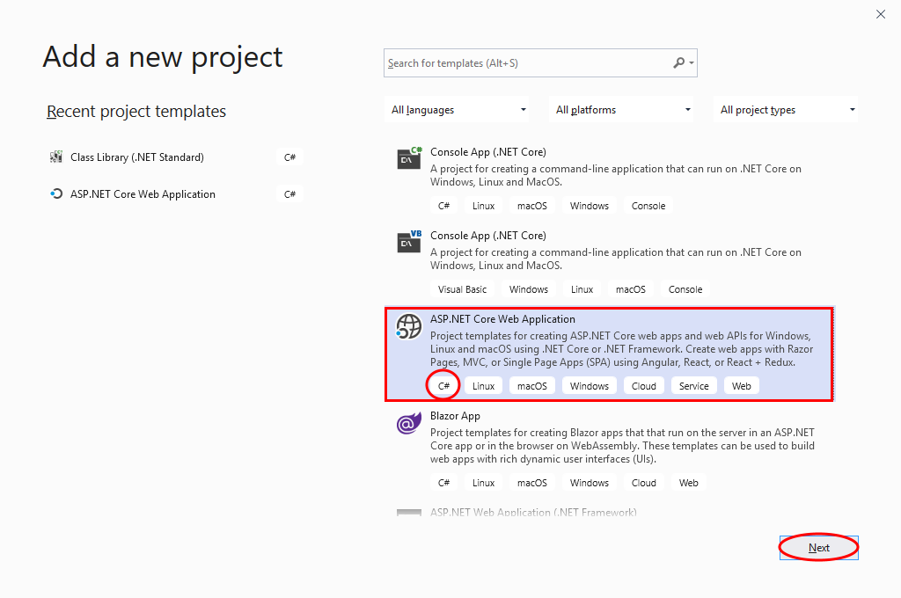
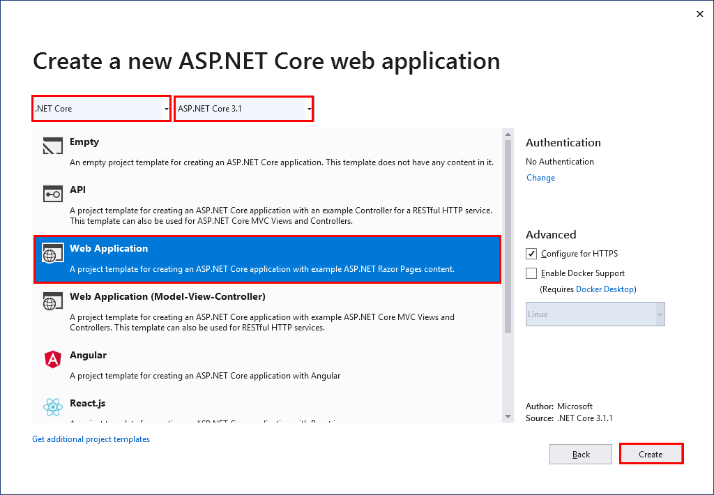
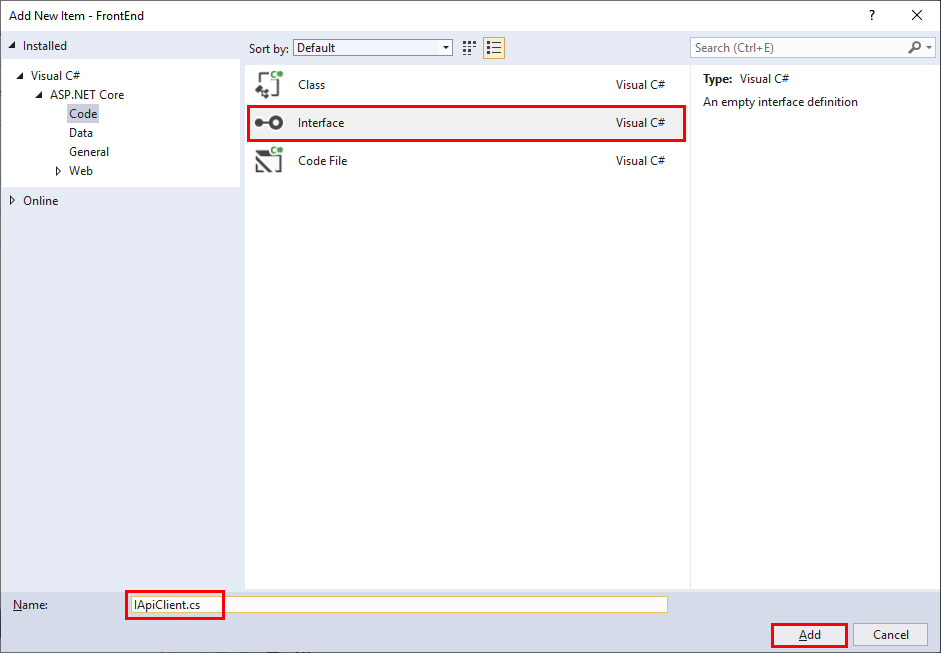

# Create the FrontEnd Web Application

In this session, you'll create a front-end web application that enables users to browse sessions and speakers. This application uses the DTOs created in Session 2 to package data when communicating with the back-end web API.

## Create the FrontEnd project

You'll create the front end as a new web application. This application will be part of the **ConferencePlanner** solution.

**If you're using Visual Studio, perform the following steps:**

1. In the Solution Explorer window, right-click ConferencePlanner solution, click Add, and then click New Project.

2. In the **Add a new project** dialog box, select the **ASP.NET Core Web Application** project type. Make sure you select the C# version of the template. Click **Next**.

    

3. In the **Configure you new project** dialog box, name the project **FrontEnd**, and then click **Create**.

4. In the **Create a new ASP.NET Core web application** dialog box, make sure the framework is set to **.NET Core**, and the version is set to **ASP.NET Core 3.1**. Select the **Web Application** template. Leave all other options at their default values, and then click **Create**:

    

5. When the project has been created, in the **Solution Explorer** window, right-click the **FrontEnd** project, click **Add**, and then click **Reference**.
6. In the **Reference Manager - FrontEnd** fialog box, on the **Project** tab, select the **ConferenceDTO** project, and then click **OK**.

> **Note:** Don't accidentally add a reference to the **BackEnd** project.

**If you're using the .NET Core CLI, perform the following steps:**

1. In a command prompt window, move to the **ConferencePlanner** folder for your solution.

2. Run the following command to create a new Web application project named **FrontEnd**.

   ```console
   dotnet new webapp -o FrontEnd
   ```

3. Move to the **FrontEnd** folder, and run the command shown below to add a reference to the **ConferenceDTO**.

   ```console
   dotnet add reference ../ConferenceDTO/ConferenceDTO.csproj
   ```

## Create the API service client class

In this task, you'll create a class to communicate with the backend web API service. You'll isolate this logic in a single class that the various web pages in the application can use.

1. Create a folder called **Services** in the root folder of the **FrontEnd** project

2. In the **Services** folder, add a new interface file called **IApiClient.cs**:

    - **If you're using Visual Studio 2019**:
        1. In the **Solution Explorer** window, right-click the **Services** folder, click **Add**, and then click **Class**.
        1. In the **Add New Item - FrontEnd** dialog box, select the **Interface** template, enter **IApiClient.cs** in the **Name** field, and then click **Add**.

            

    - **If you're using Visual Studio 2019**:
        1. Move to the **Services** folder, and create a new file named **IApiClient.cs** using an editor of your choice.

3. Add the code shown below to the **IApiClient** interface file. This interface defines the methods that the client application will use to send requests to the backend web API service:

    ``` csharp
    using System.Collections.Generic;
    using System.Threading.Tasks;
    using ConferenceDTO;

    namespace FrontEnd.Services
    {
        public interface IApiClient
        {
            Task<List<SessionResponse>> GetSessionsAsync();
            Task<SessionResponse> GetSessionAsync(int id);
            Task<List<SpeakerResponse>> GetSpeakersAsync();
            Task<SpeakerResponse> GetSpeakerAsync(int id);
            Task PutSessionAsync(Session session);
            Task<bool> AddAttendeeAsync(Attendee attendee);
            Task<AttendeeResponse> GetAttendeeAsync(string name);
            Task DeleteSessionAsync(int id);
        }
    }
    ```

4. Add a reference to the **Microsoft.AspNet.WebApi.Client** version 5.2.7 NuGet package to the **FrontEnd** project:

    - **If you're using Visual Studio 2019**:
        1. In the **Solution Explorer** window, right-click the **FrontEnd** project, and then click **Manage NuGet Packages**.
        2. In the **NuGet Package Managee** window, on the **Browse** tab, search for **Microsoft.AspNet.WebApi.Client** package.
        3. Select the package, set the **Version** to **Latest stable 5.2.7**, and then click **Install**.
        4. In the **Preview Changes** dialog box, click **OK**.
        5. In the **License Acceptance** dialog box, click **I Accept**.

    - **If you're using the .NET Core CLI**:
        1. Move to the **FrontEnd** folder.
        2. Run the following command:

            ```console
            dotnet add package Microsoft.AspNet.WebApi.Client -v 5.2.7
            ```

5. Add a new class file called called **ApiClient.cs** to the **Services** folder.

6. Add the code shown below to the **ApiClient** class. This class implements the **IApiClient** interface. The methods use an **HttpClient** object to send requests to the various endpoints exposed by the web API, and handle the responses:

    ``` csharp
    using System.Collections.Generic;
    using System.Net;
    using System.Net.Http;
    using System.Threading.Tasks;
    using ConferenceDTO;

    namespace FrontEnd.Services
    {
        public class ApiClient : IApiClient
        {
            private readonly HttpClient _httpClient;

            public ApiClient(HttpClient httpClient)
            {
                _httpClient = httpClient;
            }

            public async Task<bool> AddAttendeeAsync(Attendee attendee)
            {
                var response = await _httpClient.PostAsJsonAsync($"/api/attendees", attendee);

                if (response.StatusCode == HttpStatusCode.Conflict)
                {
                    return false;
                }

                response.EnsureSuccessStatusCode();

                return true;
            }

            public async Task<AttendeeResponse> GetAttendeeAsync(string name)
            {
                if (string.IsNullOrEmpty(name))
                {
                    return null;
                }

                var response = await _httpClient.GetAsync($"/api/attendees/{name}");

                if (response.StatusCode == HttpStatusCode.NotFound)
                {
                    return null;
                }

                response.EnsureSuccessStatusCode();

                return await response.Content.ReadAsAsync<AttendeeResponse>();
            }

            public async Task<SessionResponse> GetSessionAsync(int id)
            {
                var response = await _httpClient.GetAsync($"/api/sessions/{id}");

                if (response.StatusCode == HttpStatusCode.NotFound)
                {
                    return null;
                }

                response.EnsureSuccessStatusCode();

                return await response.Content.ReadAsAsync<SessionResponse>();
            }

            public async Task<List<SessionResponse>> GetSessionsAsync()
            {
                var response = await _httpClient.GetAsync("/api/sessions");

                response.EnsureSuccessStatusCode();

                return await response.Content.ReadAsAsync<List<SessionResponse>>();
            }

            public async Task DeleteSessionAsync(int id)
            {
                var response = await _httpClient.DeleteAsync($"/api/sessions/{id}");

                if (response.StatusCode == HttpStatusCode.NotFound)
                {
                    return;
                }

                response.EnsureSuccessStatusCode();
            }

            public async Task<SpeakerResponse> GetSpeakerAsync(int id)
            {
                var response = await _httpClient.GetAsync($"/api/speakers/{id}");

                if (response.StatusCode == HttpStatusCode.NotFound)
                {
                    return null;
                }

                response.EnsureSuccessStatusCode();

                return await response.Content.ReadAsAsync<SpeakerResponse>();
            }

            public async Task<List<SpeakerResponse>> GetSpeakersAsync()
            {
                var response = await _httpClient.GetAsync("/api/speakers");

                response.EnsureSuccessStatusCode();

                return await response.Content.ReadAsAsync<List<SpeakerResponse>>();
            }

            public async Task PutSessionAsync(Session session)
            {
                var response = await _httpClient.PutAsJsonAsync($"/api/sessions/{session.Id}", session);

                response.EnsureSuccessStatusCode();
            }
        }
    }
    ```

## Configure the API client

In this task, you'll configure the client to connect to the web API.

1. Open the **Startup.cs** file in the root folder of the **FrontEnd** project.

2. Add the following `using` directive to the list at the start of the file:

    ```csharp
    using FrontEnd.Services;
    ```

3. Locate the **ConfigureServices** method, and add the statement shown in the code sample below, after the call to `services.AddRazorParges();`. This code creates an **HttpClient** object based on the **IApiClient** interface. The object connects to the web API specified by the URL in the **serviceUrl** property of the application configuration file:

    ``` csharp
    public void ConfigureServices(IServiceCollection services)
    {
        services.AddRazorPages();
        services.AddHttpClient<IApiClient, ApiClient>(client =>
        {
            client.BaseAddress = new Uri(Configuration["serviceUrl"]);
        });
    }
    ```

4. Open the **appsettings.json** file in the root folder of the **FrontEnd** project.

5. Add the configuration key for `serviceUrl` to the end of the configuration information, as shown below. In the URL, replace *\<port\>* with the port used by your web API. You can find this information in the *launchSettings.json* file in the **Properties** folder of the **BackEnd** project:

    ``` json
    {
      "Logging": {
        "LogLevel": {
          "Default": "Information",
          "Microsoft": "Warning",
          "Microsoft.Hosting.Lifetime": "Information"
        }
      },
      "AllowedHosts": "*",
      "ServiceUrl": "https://localhost:<port>/"
    }
    ```


**START HERE TOMORROW**

## List the sessions on the home page

>Now that we have an API client we can use to talk to our BackEnd API application, we'll update the home page to show a basic list of all sessions for the conference to ensure the FrontEnd can talk to the BackEnd correctly.

### Load the data into the PageModel

1. Open the */Pages/Index.cshtml.cs* file
1. Edit the constructor to accept the `IApiClient` interface and store it in a local field:

   ``` csharp
   protected readonly IApiClient _apiClient;

   public IndexModel(IApiClient apiClient)
   {
       _apiClient = apiClient;
   }
   ```

1. Add some properties to store sessions and other data we'll need when rendering the page:

   ``` csharp
   public IEnumerable<IGrouping<DateTimeOffset?, SessionResponse>> Sessions { get; set; }

   public IEnumerable<(int Offset, DayOfWeek? DayofWeek)> DayOffsets { get; set; }

   public int CurrentDayOffset { get; set; }
   ```

1. Add a page handler method to handle GET requests to the page, that loads the session data and calculates the data required to build the day navigation UI:

   ``` csharp
   public async Task OnGet(int day = 0)
   {
       CurrentDayOffset = day;

       var sessions = await _apiClient.GetSessionsAsync();

       var startDate = sessions.Min(s => s.StartTime?.Date);

       DayOffsets = sessions.Select(s => s.StartTime?.Date)
                            .Distinct()
                            .OrderBy(d => d)
                            .Select(day => ((int)Math.Floor((day.Value - startDate)?.TotalDays ?? 0),
                                            day?.DayOfWeek))
                            .ToList();

       var filterDate = startDate?.AddDays(day);

       Sessions = sessions.Where(s => s.StartTime?.Date == filterDate)
                          .OrderBy(s => s.TrackId)
                          .GroupBy(s => s.StartTime)
                          .OrderBy(g => g.Key);
   }
   ```

### Render the sessions list on the home page

1. Open the */Pages/Index.cshtml* Razor Page file
2. Delete all the existing HTML content (after line 6)
3. Add some Razor markup to show the sessions as a simple list, grouped by time-slot:

   ``` html
   <div class="agenda">
       <h1>My Conference @System.DateTime.Now.Year</h1>

       @foreach (var timeSlot in Model.Sessions)
       {
           <h4>@timeSlot.Key?.ToString("HH:mm")</h4>
           <ul>
               @foreach (var session in timeSlot)
               {
                   <li>@session.Title</li>
               }
           </ul>
       }
   </div>
   ```
4. Right-click the solution, select Properties and set both BackEnd and FrontEnd as startup projects
5. Run the FrontEnd application at this stage and we should see the sessions listed on the home page

### Add buttons to allow showing sessions for different days

1. In */Pages/Index.cshtml*, add some markup to allow the user to show sessions for the different days of the conference, below the `<h1>` we added previously:

   ``` html
   <ul class="nav nav-pills mb-3">
       @foreach (var day in Model.DayOffsets)
       {
           <li role="presentation" class="nav-item">
               <a class="nav-link @(Model.CurrentDayOffset == day.Offset ? "active" : null)" asp-route-day="@day.Offset">@day.DayofWeek?.ToString()</a>
           </li>
       }
   </ul>
   ```

1. Run the application again and try clicking the buttons to show sessions for the different days

## Update the sessions list UI

1. Make the list of sessions better looking by updating the markup to use [Bootstrap cards](https://getbootstrap.com/docs/4.0/components/card/):

   ``` html
   <h4>@timeSlot.Key?.ToString("HH:mm")</h4>
   <div class="row">
   @foreach (var session in timeSlot)
    {
        <div class="col-md-3 mb-4">
            <div class="card shadow session h-100">
                <div class="card-header">@session.Track?.Name</div>
                <div class="card-body">
                    <h5 class="card-title"><a asp-page="Session" asp-route-id="@session.Id">@session.Title</a></h5>
                </div>
                <div class="card-footer">
                    <ul class="list-inline mb-0">
                        @foreach (var speaker in session.Speakers)
                        {
                            <li class="list-inline-item">
                                <a asp-page="Speaker" asp-route-id="@speaker.Id">@speaker.Name</a>
                            </li>
                        }
                    </ul>
                </div>
            </div>
        </div>
    }
   </div>
   ```

1. Run the page again and see the updated sessions list UI. Click the buttons again to show sessions for the different days.

## Add a session details page
> Now that we have a home page showing all the sessions, we'll create a page to show all the details of a specific session

### Add a Session Razor Page
1. Add a new Razor Page using the *Razor Page* template. Call the page *Session.cshtml* and save it in the */Pages* directory.
1. Open *Session.cshtml.cs* and change the page model class to `SessionModel`.
1. Accept the `IApiClient` in the constructor and add supporting members to the Page model `SessionModel`:
   ``` csharp
   public class SessionModel : PageModel
   {
       private readonly IApiClient _apiClient;

       public SessionModel(IApiClient apiClient)
       {
           _apiClient = apiClient;
       }

       public SessionResponse Session { get; set; }

       public int? DayOffset { get; set; }
   }
   ```
1. Add a page handler method to retrieve the Session details and set them on the model:
   ``` csharp
   public async Task<IActionResult> OnGetAsync(int id)
   {
       Session = await _apiClient.GetSessionAsync(id);

       if (Session == null)
       {
           return RedirectToPage("/Index");
       }

       var allSessions = await _apiClient.GetSessionsAsync();

       var startDate = allSessions.Min(s => s.StartTime?.Date);

       DayOffset = Session.StartTime?.Subtract(startDate ?? DateTimeOffset.MinValue).Days;

        return Page();
    }
   ```
1. Open the *Session.cshtml* file and add markup to display the details and navigation UI:
   ``` html
   @page "{id}"
   @model SessionModel

   <ol class="breadcrumb">
       <li class="breadcrumb-item"><a asp-page="/Index">Agenda</a></li>
       <li class="breadcrumb-item"><a asp-page="/Index" asp-route-day="@Model.DayOffset">Day @(Model.DayOffset + 1)</a></li>
       <li class="breadcrumb-item active">@Model.Session.Title</li>
   </ol>

   <h1>@Model.Session.Title</h1>
   <span class="label label-default">@Model.Session.Track?.Name</span>

   @foreach (var speaker in Model.Session.Speakers)
   {
       <em><a asp-page="Speaker" asp-route-id="@speaker.Id">@speaker.Name</a></em>
   }

    @foreach (var para in Model.Session.Abstract.Split("\r\n", StringSplitOptions.RemoveEmptyEntries))
    {
       <p>@para</p>
    }
   ```

## Add a page to show speaker details
>We'll add a page to show details for a given speaker

1. Add a new Razor Page using the *Razor Page* template. Call the page *Speaker.cshtml* and save it in the */Pages* directory.
1. Accept the `IApiClient` in the constructor and add supporting members to the Page model `SpeakerModel`:
   ``` csharp
   public class SpeakerModel : PageModel
   {
       private readonly IApiClient _apiClient;

       public SpeakerModel(IApiClient apiClient)
       {
           _apiClient = apiClient;
       }

       public SpeakerResponse Speaker { get; set; }
   }
   ```
1. Add a page handler method to retrieve the Speaker details and set them on the model:
   ``` csharp
   public async Task<IActionResult> OnGet(int id)
   {
       Speaker = await _apiClient.GetSpeakerAsync(id);

       if (Speaker == null)
       {
           return NotFound();
       }

       return Page();
   }
   ```
1. Open the *Speaker.cshtml* file and add markup to display the details and navigation UI:
   ``` html
   @page "{id}"
   @model SpeakerModel

   <ol class="breadcrumb">
       <li class="breadcrumb-item"><a asp-page="/Speakers">Speakers</a></li>
       <li class="breadcrumb-item active">@Model.Speaker.Name</li>
   </ol>

   <h2>@Model.Speaker.Name</h2>

   <p>@Model.Speaker.Bio</p>

   <h3>Sessions</h3>
   <div class="row">
       <div class="col-md-5">
           <ul class="list-group">
               @foreach (var session in Model.Speaker.Sessions)
               {
                   <li class="list-group-item"><a asp-page="Session" asp-route-id="@session.Id">@session.Title</a></li>
               }
           </ul>
       </div>
   </div>
   ```

## Add search functionality
>We'll add a page to allow users to search the conference agenda, finding sessions and speakers that match the supplied search term.

### Add DTOs for search
1. Add a new DTO class `SearchTerm` in the DTO project:
    ```csharp
    using System;
    using System.Collections.Generic;
    using System.Text;

    namespace ConferenceDTO
    {
        public class SearchTerm
        {
            public string Query { get; set; }
        }
    }
    ```
1. Add a new DTO class `SearchResult` in the DTO project:
   ```csharp
   using System;
   using System.Collections.Generic;
   using System.Text;

   namespace ConferenceDTO
   {
       public class SearchResult
       {
            public SearchResultType Type { get; set; }

            public SessionResponse Session { get; set; }

            public SpeakerResponse Speaker { get; set; }
        }

        public enum SearchResultType
        {
            Session,
            Speaker
        }
   }
   ```

### Add a search controller
1. Add a `SearchController` with an action method that accepts a `SearchTerm` and searchs for sessions and speakers with matching titles or names, and concatenates the results as `SearchResult`s:
   ```csharp
   using System;
   using System.Collections.Generic;
   using System.Linq;
   using System.Threading.Tasks;
   using BackEnd.Data;
   using ConferenceDTO;
   using Microsoft.AspNetCore.Mvc;
   using Microsoft.EntityFrameworkCore;

   namespace BackEnd.Controllers
   {
       [Route("api/[controller]")]
       [ApiController]
       public class SearchController : ControllerBase
       {
           private readonly ApplicationDbContext _context;

           public SearchController(ApplicationDbContext context)
           {
               _context = context;
           }

           [HttpPost]
           public async Task<ActionResult<List<SearchResult>>> Search(SearchTerm term)
           {
               var query = term.Query;
               var sessionResults = await _context.Sessions.Include(s => s.Track)
                                                   .Include(s => s.SessionSpeakers)
                                                       .ThenInclude(ss => ss.Speaker)
                                                   .Where(s =>
                                                       s.Title.Contains(query) ||
                                                       s.Track.Name.Contains(query)
                                                   )
                                                   .ToListAsync();

               var speakerResults = await _context.Speakers.Include(s => s.SessionSpeakers)
                                                       .ThenInclude(ss => ss.Session)
                                                   .Where(s =>
                                                       s.Name.Contains(query) ||
                                                       s.Bio.Contains(query) ||
                                                       s.WebSite.Contains(query)
                                                   )
                                                   .ToListAsync();

               var results = sessionResults.Select(s => new SearchResult
               {
                   Type = SearchResultType.Session,
                   Session = s.MapSessionResponse()
               })
               .Concat(speakerResults.Select(s => new SearchResult
               {
                   Type = SearchResultType.Speaker,
                   Speaker = s.MapSpeakerResponse()
               }));

               return results.ToList();
           }
       }
   }
   ```

### Add search methods to the IApiClient
1. Add the `SearchAsync` method to IApiClient:
   ```csharp
   Task<List<SearchResult>> SearchAsync(string query);
   ```
1. Add the implementation to ApiClient:
   ```csharp
   public async Task<List<SearchResult>> SearchAsync(string query)
   {
       var term = new SearchTerm
       {
           Query = query
       };

       var response = await _httpClient.PostAsJsonAsync($"/api/search", term);

       response.EnsureSuccessStatusCode();

       return await response.Content.ReadAsAsync<List<SearchResult>>();
   }
   ```

### Add a search page to the Front End
1. Add a new Razor Page using the *Razor Page* template. Call the page *Search.cshtml* and save it in the */Pages* directory.
1. Accept the `IApiClient` in the constructor and add supporting members to the Page model `SearchModel`:
   ``` csharp
   public class SearchModel : PageModel
   {
       private readonly IApiClient _apiClient;

       public SearchModel(IApiClient apiClient)
       {
           _apiClient = apiClient;
       }

       public string Term { get; set; }

       public List<SearchResult> SearchResults { get; set; }
   }
   ```
1. Add a page handler method to retrieve the search results and set them on the model, deserializing the individual search items to the relevant model type:
   ``` csharp
   public async Task OnGetAsync(string term)
   {
       Term = term;
       SearchResults = await _apiClient.SearchAsync(term);
   }
   ```
1. Open the *Search.cshtml* file and add markup to allow users to enter a search term and display the results, casting each result to the relevant display model type:
   ``` html
   @page
   @using ConferenceDTO
   @model SearchModel

   <div class="search">
       <h1>Search</h1>
       <form method="get">
           <div class="input-group mb-3">
               <input asp-for="Term" placeholder="Search for sessions or speakers..." class="form-control" />
               <div class="input-group-append">
                   <button class="btn btn-outline-secondary" type="submit">Go!</button>
               </div>
           </div>
           @if (Model.SearchResults?.Count > 0)
           {
               <p>
                   @Model.SearchResults.Count result(s)
               </p>
           }
       </form>
   </div>

   <div class="row">
       @foreach (var result in Model.SearchResults)
       {
           <div class="col-md-12">
               @switch (result.Type)
               {
                   case SearchResultType.Speaker:
                       <div class="card shadow mb-3">
                           <div class="card-header">
                               <h3 class="card-title">Speaker: <a asp-page="Speaker" asp-route-id="@result.Speaker.Id">@result.Speaker.Name</a></h3>
                           </div>
                           <div class="card-body">
                               <p>
                                   @foreach (var session in result.Speaker.Sessions)
                                   {
                                       <a asp-page="/Session" asp-route-id="@session.Id"><em>@session.Title</em></a>
                                   }
                               </p>
                               <p>
                                   @result.Speaker.Bio
                               </p>
                           </div>
                       </div>
                       break;

                   case SearchResultType.Session:
                       <div class="card shadow mb-3">
                           <div class="card-header">
                               <h3 class="card-title">Session: <a asp-page="Session" asp-route-id="@result.Session.Id">@result.Session.Title</a></h3>
                               @foreach (var speaker in result.Session.Speakers)
                               {
                                   <a asp-page="/Speaker" asp-route-id="@speaker.Id"><em>@speaker.Name</em></a>
                               }
                           </div>
                           <div class="card-body">
                               <p>
                                   @result.Session.Abstract
                               </p>
                           </div>
                       </div>
                       break;
               }
           </div>
       }
   </div>
   ```
1. Add the search link to the navigation pane in `_Layout.cshtml`:
    ```html
    <li class="nav-item">
        <a class="nav-link text-dark" asp-page="/Search">Search</a>
    </li>
    ```
1. Click on the `Search` link to test the new search feature.

> **Note:** You can find the completed code for the exercises in this session in the [Session 3 save point folder](../save-points/3-Front-End-started/).

**Next**: [Session #4 - Add authentication to the front-end web application](4.%20Add%20auth%20features.md) | **Previous**: [Session #2 - Extend the BackEnd Web API and Add Data Transfer Objects](2.%20Build%20out%20BackEnd%20and%20Refactor.md)
