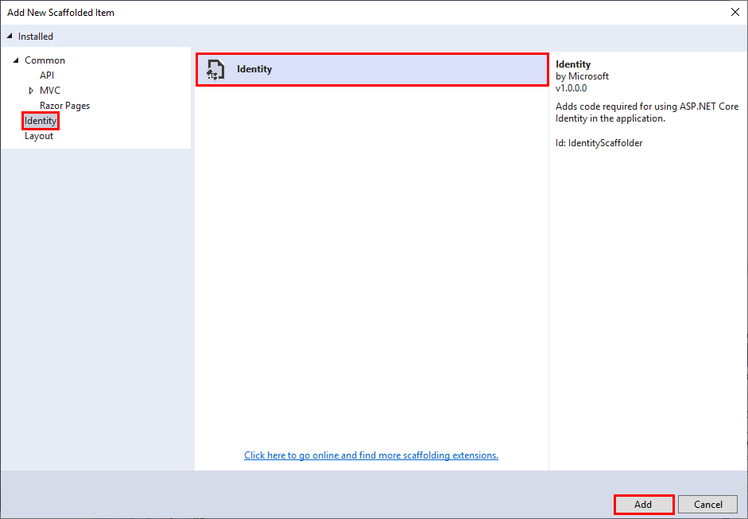
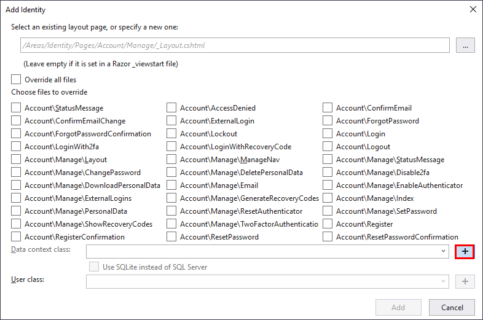
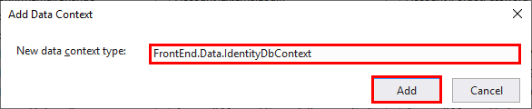
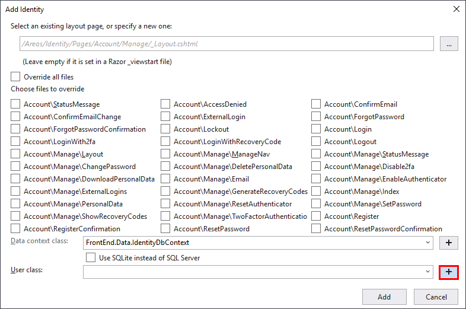
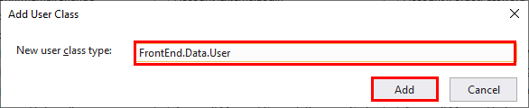
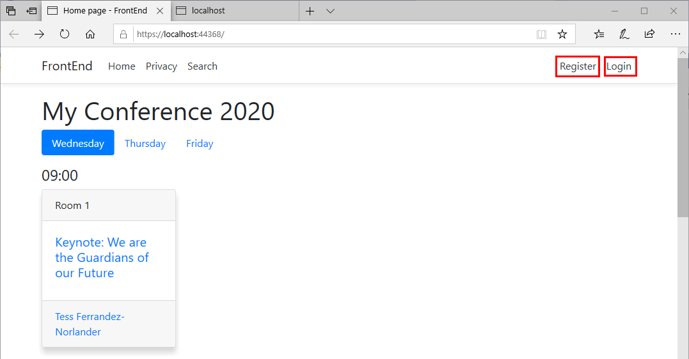
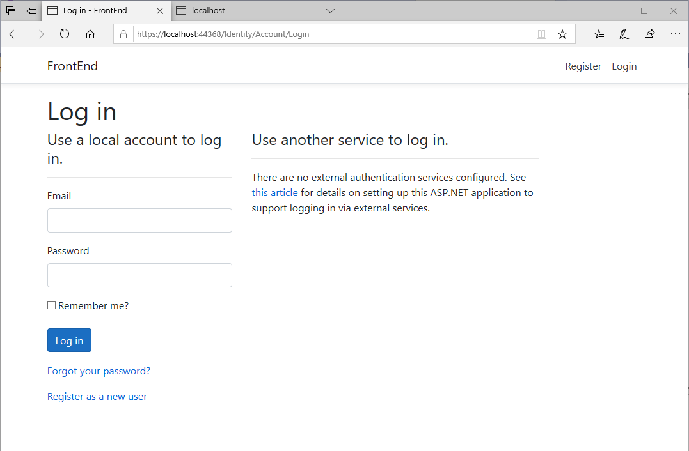
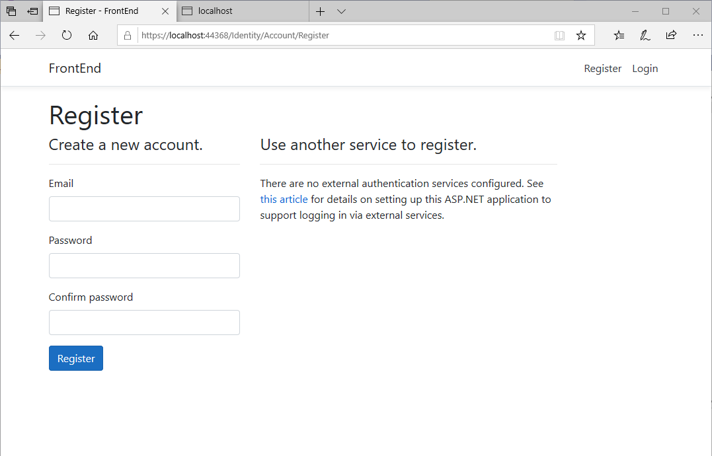
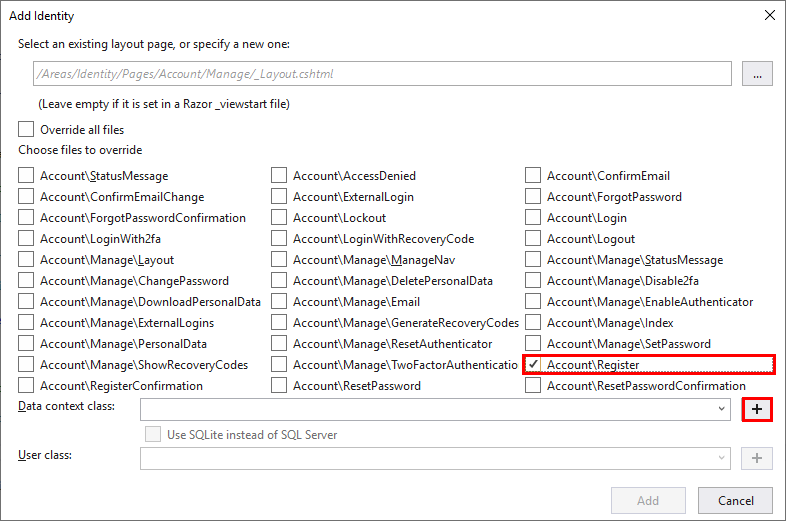

# Add authentication to the front-end web application

In this session, you'll add security by implementing authentication and authorization. You'll also implement an administrative policy that enables specific users to modify the details of sessions. You'll also implement a custom authentication tag helper, to simplify the authentication logic in the front-end web pages.

> **Note:** You can either continue with your own project, or use the code in the [Session 4 save point folder](../save-points/3-Front-End-Started).

## Add ASP.NET Core Identity capabilities

In this task, you'll add authentication capabilities to the **FrontEnd** web application using the **ASP.NET Core Identity** feature. **ASP.NET Core Identity** stores user information in a local SQl Server database. You can use the Entity Framework to retrieve and manage the information in this database.

> **Note:** For detailed information about implementing authentication in an ASP.NET Core Web application, visit [Introduction to Identity on ASP.NET Core](https://docs.microsoft.com/aspnet/core/security/authentication/identity?view=aspnetcore-3.1&tabs=visual-studio)

**If you're using Visual Studio, perform the followig steps:**

1. In the **Solution Explorer** window, right-click the **FrontEnd** project, click **Add**, and then click **New Scaffolded Item...".

2. In the **Add New Scaffolded Item** dialog box, in the tree-view on the left select **Identity**, click the **Identity** template, and then click **Add**.

    

3. In the **Add Identity** dialog, click **+** next to the **Data context class** box.

    

    > **Note:** If you're using a non-Windows computer, select the **Use SQLite instead of SQL Server** checkbox.

4. In the **Add Data Context** dialog box, name the data context class **FrontEnd.Data.IdentityDbContext**, and then click **Add**.

    

5. Back in the **Add Identity** dialog, click **+** next to the **User class** box.

    

6. In the **Add User Class** dialog box, name the user class **FrontEnd.Data.User**, and then click **Add**.

    .

7. In the **Add Identity** dialog, click **Add**.

**if you're using the .NET Core CLI, perform the following steps:**

1. Move to the **FrontEnd** project folder

2. If you haven't done so already, install the command-line scaffolding tool with the following command.

    ```console
    dotnet tool install -g dotnet-aspnet-codegenerator
    ```

3. Run the following commands to add the NuGet packages required by ASP.NET Core Identity to the project:

    ```console
    dotnet add package Microsoft.VisualStudio.Web.CodeGeneration.Design --version 3.1.1
    dotnet add package Microsoft.AspNetCore.Identity.UI --version 3.1.1
    dotnet add package Microsoft.EntityFrameworkCore.Design --version 3.1.1
    dotnet add package Microsoft.AspNetCore.Identity.EntityFrameworkCore --version 3.1.1
    ```

4. If you're running on a Windows computer, install the SQL Server NuGet package for the Entity Framework Core:

    ```console
    dotnet add package Microsoft.EntityFrameworkCore.SqlServer --version 3.1.1
    ```

    If you're running on a non-Windows platform, install the SQLite package instead:

    ```console
    dotnet add package Microsoft.EntityFrameworkCore.Sqlite --version 3.1.1
    ```

5. Run the command shown below to generate add the **ASP.NET Core Identity** feature to the project. This command generates a data context class named **FrontEnd.Data.IdentityDbContext** that the application can use to connect to the SQL Server database containing the authentication information, and a class named **FrontEnd.Data.User** that the application can use to store and retrieve information about authenticated users.

    - If you're running on Windows, run this command to store identity information in SQL Server:

        ```console
        dotnet aspnet-codegenerator identity --dbContext FrontEnd.Data.IdentityDbContext --userClass FrontEnd.Data.User --useDefaultUI
        ```

    - If you're running on a non-Windows platform, run this command to use a SQLite database:

        ```console
        dotnet aspnet-codegenerator identity --dbContext FrontEnd.Data.IdentityDbContext --userClass FrontEnd.Data.User --useDefaultUI --useSqLite
        ```

## Add the authentication middleware

In this task, you'll configure the request pipeline so that contains the Authentication middleware before any other middleware that represents resources the application might want to authorize, such as Razor Pages.

1. In the root folder of the **FrontEnd** project, open the **Startup.cs** file.

2. In the **Configure** method of the **Startup** class, call the **UseAuthentication** method after **UseRouting**, but before **UseAuthorization** and **UseEndpoints**, as shown below:

    ```csharp
    public void Configure(IApplicationBuilder app, IHostingEnvironment env)
    {
        ...
        app.UseRouting();

        app.UseAuthentication();

        app.UseAuthorization();

        app.UseEndpoints(endpoints =>
        {
            endpoints.MapRazorPages();
        });
    }
    ```

## Update the layout with Identity links

The scaffolded out Identity system includes a Razor partial view that contains the Identity-related UI for the site header, including Login and Register links, the user name once logged in, and so on. In this task, you'll integrate this partial view into the layout page for the web site:

1. In the **FrontEnd** project, go to the **Areas/Identity/Pages** folder. Delete the **_ValidationScriptsPartial.cshtml** and **_ViewStart.cshtml** files in this folder folder. You don't need these files as similar pages already exist in the **Pages/Shared** and **Pages** folders.

2. Delete the **ScaffoldingReadme.txt** file in the root folder of the **FrontEnd** project.

3. Go to the **Shared** folder under the **Pages** folder, open the **_Layout.cshtml** file.

4. In this file, locate the following markup. It should be on or around line 20:

    ```html
    <div class="navbar-collapse collapse d-sm-inline-flex flex-sm-row-reverse">
    ```

5. Immediately after this line, add the `<partial>` tag helper to render the newly added `_LoginPartial.cshtml` content, as shown below:

    ```html
    <div class="navbar-collapse collapse d-sm-inline-flex flex-sm-row-reverse">
        <partial name="_LoginPartial" />
        <ul class="navbar-nav flex-grow-1">
            ...
        </ul>
    </div>
    ```

6. Start the solution:

    - **If you're using Visual Studio**:
        1. Press **F5** to build and run the solution. The **FrontEnd** and **BackEnd** projects will start. A web browser will open displaying two web pages; one for the **BackEnd** project and the other for the **FrontEnd**

        2. Switch to the window displaying the web page for the **FrontEnd** web app.

    - **If you're using the .NET Core CLI**:
        1. Open the **launchSettings.json** file in the **Properties** folder of the **FrontEnd** project.
        2. Make a note of the HTTPS URL in the **applicationUrl** property in the **FrontEnd** profile, and then close the **launchSettings.json** file.
        3. Move to the ConferencePlanner solution folder.
        4. Run the following command to run the **BackEnd** project in a new console window:

            ```console
            start dotnet run --project BackEnd
            ```

        5. When the BackEnd project has started, return to the original console window and run the following command to start the **FrontEnd** project:

            ```console
            dotnet run --project FrontEnd
            ```

        6. Open a web browser, and navigate to the HTTPS URL of the **FrontEnd** web application that you noted earlier.

7. Verify that the home page now displays links labelled **Register** and **Login**.

    

8. Click the **Login** link. The default login page should appear. Don't try and sign in yet:

    

9. Click the **Register** link. The default register page should be displayed. Users can utilize this page to create a new account and set a password. Don't register yourself yet.

    

10. Stop the web application and web API service:

    - **If you're using Visual Studio 2019:**

        - Close the web browser. The FrontEnd and BackEnd projects will stop automatically.

    - **If you're using the .NET Core CLI:**

        1. Close the web browser.
        2. Switch to the console window for the **BackEnd** project and press **Ctrl-C** to stop the web API service.
        3, Return to the console window for the **FrontEnd** project and press **Ctrl-C** to stop the web application.

## Update the web application to support administrative users

Identity supports simple customization of the classes representing users. You can also customize the default Identity UI. In this task, you'll add the ability to create an administrative user. In the **FrontEnd** web application, the first user to register with the site will be deemed to be the administrator.

1. Open the **User.cs** class file in the **/Areas/Identity/Data** folder in te **FrontEnd** project.

2. Add a `bool` property called **IsAdmin** to the **User** class, to indicate whether the user is an administrator:

    ```csharp
    public class User : IdentityUser
    {
        public bool IsAdmin { get; set; }
    }
    ```

3. Update the database with the changes to the schema

    - **If you're using Visual Studio 2019:**

        1. On the **Tools** menu, click **NuGet Package Manager**, and then click **Package Manager Console**.

        2. In the toolbar for the **Package Manager Console**, set the default project to **FrontEnd**.

        3. Run the following commands in the **Package Manager Console**

            ```console
            Add-Migration CreateIdentitySchema
            Update-Database
            ```

    - **If you're using the .NET Core CLI:**

        1. Install the Core Entity Framework migration tools if you haven't done so previously:

            ```console
            dotnet tool install -g dotnet-ef --version 3.1.1
            ```

        2. Move to the **FrontEnd** project folder.

        3. Run the following commands:

            ```console
            dotnet build
            dotnet ef migrations add CreateIdentitySchema
            dotnet ef database update
            ```

4. Create a new interface file named **IAdminService.cs** in the **Services** folder.

5. Add the code shown below to this file. 

    ```csharp
    using System.Threading.Tasks;

    namespace FrontEnd.Services
    {
        public interface IAdminService
        {
            Task<bool> AllowAdminUserCreationAsync();
        }
    }
    ```

6. Create a new class file named  **AdminService.cs** in the **Services** folder. This class will implement the **IAdminService** interface, and will be responsible for tracking whether the site should allow creating administrative users.

7. Add the following directives to the list at the start of the file, if they aren't already present:

    ```csharp
    using FrontEnd.Data;
    using Microsoft.EntityFrameworkCore;
    using System.Threading.Tasks;
    ```

8. Add the code shown below to the **AdminService** class:

    ```csharp
    public class AdminService: IAdminService
    {
        private readonly IdentityDbContext _dbContext;

        private bool _adminExists;

        public AdminService(IdentityDbContext dbContext)
        {
            _dbContext = dbContext;
        }

        public async Task<bool> AllowAdminUserCreationAsync()
        {
            if (_adminExists)
            {
                return false;
            }
            else
            {
                if (await _dbContext.Users.AnyAsync(user => user.IsAdmin))
                {
                    // There are already admin users so disable admin creation
                    _adminExists = true;
                    return false;
                }

                // There are no admin users so enable admin creation
                return true;
            }
        }
    }
    ```

9. Return to the **Startup.cs** file in the root folder of the **FrontEnd** project.

10. In the **Startup** class, modify the **ConfigureServices** method to add **AdminService** to the DI container, as shown below:

    ```csharp
    public void ConfigureServices(IServiceCollection services)
    {
        services.AddSingleton<IAdminService, AdminService>();
        ...
    }
    ```

11. Override the default **Register** page to enable creating the admin account when the first user is registered:

    - **If you're using Visual Studio 2019:**
  
        1. In the **Solution Explorer** window, right-click the **FrontEnd** project, click **Add**, and then click **New Scaffolded Item**.

        2. In the **Add New Scaffolded Item** dialog box, select the **Identity** template, and then click **Add**.

        3. In the **Add Identity** dialog box, select the checbox for the **Account\Register** page, and then click **+** by the **Data context class** box.

            

        4. In the **Add Data Context** dialog box, set the data context name to **FrontEnd.Data.IdentityDbContext**, and then click **Add**.

        5. In the **Add Identity** dialog box, if you're not running on Windows, select the **Use SQLite instead of SQL Server** checkbox.

        6. Click **Add**.

    - **If you're using the .NET Core CLI:**
  
        1. Move to the **FrontEnd** project folder.

        2. If you're running on Windows, execute the following command:

            ```console
            dotnet aspnet-codegenerator identity --dbContext FrontEnd.Data.IdentityDbContext --files Account.Register
            ```

            If you're running on a non-Windows platform, execute this command instead:

            ```console
            dotnet aspnet-codegenerator identity --dbContext FrontEnd.Data.IdentityDbContext --files Account.Register --useSqLite
            ```

12. Delete the file **ScaffoldingReadMe.txt** from the root folder of the **FrontEnd** project.

13. In the **Areas/Identity/Pages/Account** folder, open the **Register.cshtml.cs** file.

14. Add the directive `using FrontEnd.Services;` to the list at the start of the file.

15. In the **RegisterModel** class, modify the constructor and add an **IAdminService** parameter. Save the object passed it to a local field, as shown in the code below:

    ```csharp
    [AllowAnonymous]
    public class RegisterModel : PageModel
    {
        private readonly SignInManager<User> _signInManager;
        private readonly UserManager<User> _userManager;
        private readonly ILogger<RegisterModel> _logger;
        private readonly IEmailSender _emailSender;
        private readonly IAdminService _adminService;

        public RegisterModel(
            UserManager<User> userManager,
            SignInManager<User> signInManager,
            ILogger<RegisterModel> logger,
            IEmailSender emailSender,
            IAdminService adminService)
        {
            _userManager = userManager;
            _signInManager = signInManager;
            _logger = logger;
            _emailSender = emailSender;
            _adminService = adminService;
        }

        ...
    }
    ```

15. Add code to the `OnPostAsync` that marks the new user as an admin if the `IAdminService.AllowAdminUserCreationAsync` returns true before creating the user:
    ``` c#
    if (await _adminService.AllowAdminUserCreationAsync())
    {
        // Set as admin user
        user.IsAdmin = true;
    }

    var result = await _userManager.CreateAsync(user, Input.Password);
    ```
16. Update the code that logs a message when users are created to indicate when an admin user is created:
    ``` c#
    if (user.IsAdmin)
    {
        _logger.LogInformation("Admin user created a new account with password.");
    }
    else
    {
        _logger.LogInformation("User created a new account with password.");
    }
    ```

> If you run the app at this point, you'll see an exception stating that you can't inject a scoped type into a type registered as a singleton. This is the DI system protecting you from a common anti-pattern that can arise when using IoC containers. Let's fix the `AdminService` to use the scoped `IdentityDbContext` correctly.

1. Open the `AdminService.cs` file and change the code to accept an `IServiceProvider` instead of the `IdentityDbContext` in its constructor:
    ``` csharp
    public class AdminService : IAdminService
    {
        private readonly IServiceProvider _serviceProvider;

        private bool _adminExists;

        public AdminService(IServiceProvider serviceProvider)
        {
            _serviceProvider = serviceProvider;
        }

        // ...
    ```
1. Now update the `AllowAdminUserCreationAsync` method to create a service scope so we can ask for an instance of the `IdentityDbContext` within a scoped context:
    ``` csharp
    public async Task<bool> AllowAdminUserCreationAsync()
    {
        if (_adminExists)
        {
            return false;
        }
        else
        {
            using (var scope = _serviceProvider.CreateScope())
            {
                var dbContext = scope.ServiceProvider.GetRequiredService<IdentityDbContext>();

                if (await dbContext.Users.AnyAsync(user => user.IsAdmin))
                {
                    // There are already admin users so disable admin creation
                    _adminExists = true;
                    return false;
                }

                // There are no admin users so enable admin creation
                return true;
            }
        }
    }
    ```
1. Re-launch the application and now you shouldn't get an exception.

# Adding admin section

## Add an admin policy
> Rather than looking up the user in the database each time the app needs to check if a user is an admin, we can read this information once when the user logs in, then store it as an additional claim on the user identity. We also need to add an authoriation policy to the app that corresponds to this claim, that we can use to protect resources we only want admins to be able to access.

1. Add a new class `ClaimsPrincipalFactory` in the `/Areas/Identity` folder and add code that adds an admin claim for users who are admins:
    ``` c#
    public class ClaimsPrincipalFactory : UserClaimsPrincipalFactory<User>
    {
        private readonly IApiClient _apiClient;

        public ClaimsPrincipalFactory(IApiClient apiClient, UserManager<User> userManager, IOptions<IdentityOptions> optionsAccessor)
            : base(userManager, optionsAccessor)
        {
            _apiClient = apiClient;
        }

        protected override async Task<ClaimsIdentity> GenerateClaimsAsync(User user)
        {
            var identity = await base.GenerateClaimsAsync(user);

            if (user.IsAdmin)
            {
                identity.MakeAdmin();
            }

            return identity;
        }
    }
    ```
1. Add a new class file `AuthHelpers.cs` in the `Infrastructure` folder and add the following helper methods for reading and setting the admin claim:
    ``` c#
    namespace FrontEnd.Infrastructure
    {
        public static class AuthConstants
        {
            public static readonly string IsAdmin = nameof(IsAdmin);
            public static readonly string IsAttendee = nameof(IsAttendee);
            public static readonly string TrueValue = "true";
        }
    }

    namespace System.Security.Claims
    {
        public static class AuthnHelpers
        {
            public static bool IsAdmin(this ClaimsPrincipal principal) =>
                principal.HasClaim(AuthConstants.IsAdmin, AuthConstants.TrueValue);

            public static void MakeAdmin(this ClaimsPrincipal principal) =>
                principal.Identities.First().MakeAdmin();

            public static void MakeAdmin(this ClaimsIdentity identity) =>
                identity.AddClaim(new Claim(AuthConstants.IsAdmin, AuthConstants.TrueValue));
        }
    }

    namespace Microsoft.Extensions.DependencyInjection
    {
        public static class AuthzHelpers
        {
            public static AuthorizationPolicyBuilder RequireIsAdminClaim(this AuthorizationPolicyBuilder builder) =>
                builder.RequireClaim(AuthConstants.IsAdmin, AuthConstants.TrueValue);
        }
    }
    ```

1. Register the custom `UserClaimsPrincipalFactory<User>` in the `IdentityHostingStartup` class:

    ```csharp
    services.AddDefaultIdentity<User>()
            .AddEntityFrameworkStores<IdentityDbContext>()
            .AddClaimsPrincipalFactory<ClaimsPrincipalFactory>();
    ```
1. Add authorization services with an admin policy to the `ConfigureServices()` method of `Startup.cs` that uses the just-added helper methods to require the admin claim:

    ```csharp
    services.AddAuthorization(options =>
    {
        options.AddPolicy("Admin", policy =>
        {
            policy.RequireAuthenticatedUser()
                  .RequireIsAdminClaim();
        });
    });
    ```
1. Add `System.Security.Claims` to the list of usings in `Index.cshtml.cs`, then use the helper method in the page model to determine if the current user is an administrator.

    ```csharp
    public bool IsAdmin { get; set; }

    public async Task OnGetAsync(int day = 0)
    {
        IsAdmin = User.IsAdmin();

        // More stuff here
        // ...
    }
    ```
1. On the `Index` razor page, add an edit link to allow admins to edit sessions. You'll add the following code directly after the session `foreach` loop:

    ```html
	<div class="card-footer">
	    <ul class="list-inline mb-0">
		@foreach (var speaker in session.Speakers)
		{
		    <li class="list-inline-item">
			    <a asp-page="Speaker" asp-route-id="@speaker.Id">@speaker.Name</a>
		    </li>
		}
		@if (Model.IsAdmin)
		{
		    <li>
			    <a asp-page="/Admin/EditSession" asp-route-id="@session.Id" class="btn btn-default btn-xs">Edit</a>
		    </li>
		}
	    </ul>
	</div>
    ```
1. Add a nested `Admin` folder to the `Pages` folder then add an `EditSession.cshtml` razor page and `EditSession.cshtml.cs` page model to it.
1. Next, we'll protect pages in the `Admin` folder with an Admin policy by making the following change to the `services.AddRazorPages()` call in `Startup.ConfigureServices`:

   ```csharp
   services.AddRazorPages(options =>
   {
       options.Conventions.AuthorizeFolder("/Admin", "Admin");
   });
   ```

## Add a form for editing a session
1. Change `EditSession.cshtml.cs` to render the session in the edit form:

   ```csharp
   public class EditSessionModel : PageModel
   {
      private readonly IApiClient _apiClient;

      public EditSessionModel(IApiClient apiClient)
      {
         _apiClient = apiClient;
      }

      public Session Session { get; set; }

      public async Task OnGetAsync(int id)
      {
         var session = await _apiClient.GetSessionAsync(id);
         Session = new Session
         {
             Id = session.Id,
             TrackId = session.TrackId,
             Title = session.Title,
             Abstract = session.Abstract,
             StartTime = session.StartTime,
             EndTime = session.EndTime
         };
      }
   }
   ```

1. Add the "{id}" route to the `EditSession.cshtml` form:

    ```html
    @page "{id}"
    @model EditSessionModel
    ```

1. Add the following edit form to `EditSession.cshtml`:

   ```html
   <h3>Edit Session</h3>

   <form method="post" class="form-horizontal">
       <div asp-validation-summary="All" class="text-danger"></div>
       <input asp-for="Session.Id" type="hidden" />
       <input asp-for="Session.TrackId" type="hidden" />
       <div class="form-group">
           <label asp-for="Session.Title" class="col-md-2 control-label"></label>
           <div class="col-md-10">
               <input asp-for="Session.Title" class="form-control" />
               <span asp-validation-for="Session.Title" class="text-danger"></span>
           </div>
       </div>
       <div class="form-group">
           <label asp-for="Session.Abstract" class="col-md-2 control-label"></label>
           <div class="col-md-10">
               <textarea asp-for="Session.Abstract" class="form-control"></textarea>
               <span asp-validation-for="Session.Abstract" class="text-danger"></span>
           </div>
       </div>
       <div class="form-group">
           <label asp-for="Session.StartTime" class="col-md-2 control-label"></label>
           <div class="col-md-10">
               <input asp-for="Session.StartTime" class="form-control" />
               <span asp-validation-for="Session.StartTime" class="text-danger"></span>
           </div>
       </div>
       <div class="form-group">
           <label asp-for="Session.EndTime" class="col-md-2 control-label"></label>
           <div class="col-md-10">
               <input asp-for="Session.EndTime" class="form-control" />
               <span asp-validation-for="Session.EndTime" class="text-danger"></span>
           </div>
       </div>
       <div class="form-group">
           <div class="col-md-offset-2 col-md-10">
               <button type="submit" class="btn btn-primary">Save</button>
               <button type="submit" asp-page-handler="Delete" class="btn btn-danger">Delete</button>
           </div>
       </div>
   </form>

   @section Scripts {
        <partial name="_ValidationScriptsPartial" />
   }
   ```
1. Add code to handle the `Save` and `Delete` button actions in `EditSession.cshtml.cs`:

   ```csharp
   public async Task<IActionResult> OnPostAsync()
   {
      if (!ModelState.IsValid)
      {
          return Page();
      }

      await _apiClient.PutSessionAsync(Session);

      return Page();
   }

   public async Task<IActionResult> OnPostDeleteAsync(int id)
   {
      var session = await _apiClient.GetSessionAsync(id);

      if (session != null)
      {
          await _apiClient.DeleteSessionAsync(id);
      }

      return Page();
   }
   ```

1. Add a `[BindProperty]` attribute to the `Session` property in `EditSession.cshtml.cs` to make sure properties get bound
on form posts:
   ```csharp
   [BindProperty]
   public Session Session { get; set; }
   ```

1. The form should be fully functional.

## Add success message to form post and use the [PRG](https://en.wikipedia.org/wiki/Post/Redirect/Get) pattern

1. Add a `TempData` decorated `Message` property and a `ShowMessage` property to `EditSession.cshtml.cs`:

   ```csharp
   [TempData]
   public string Message { get; set; }

   public bool ShowMessage => !string.IsNullOrEmpty(Message);
   ```

1. Set a success message in the `OnPostAsync` and `OnPostDeleteAsync` methods and change `Page()` to `RedirectToPage()`:

   ```csharp
   public async Task<IActionResult> OnPostAsync()
   {
      if (!ModelState.IsValid)
      {
          return Page();
      }
      
      Message = "Session updated successfully!";

      await _apiClient.PutSessionAsync(Session);

      return RedirectToPage();
   }

   public async Task<IActionResult> OnPostDeleteAsync(int id)
   {
      var session = await _apiClient.GetSessionAsync(id);

      if (session != null)
      {
          await _apiClient.DeleteSessionAsync(id);
      }
      
      Message = "Session deleted successfully!";

      return RedirectToPage("/Index");
   }
   ```

1. Update `EditSession.cshtml` to show the message after posting. Add the following code directly below the `<h3>` tag at the top:

   ```html
   @if (Model.ShowMessage)
   {
       <div class="alert alert-success alert-dismissible" role="alert">
           <button type="button" class="close" data-dismiss="alert" aria-label="Close"><span aria-hidden="true">&times;</span>   </button>
           @Model.Message
       </div>
   }
   ```

> TempData-backed properties also flow across pages, so we can update the Index page to show the message value too, e.g. when the session is deleted

1. Copy the message display markup from the top of the `EditSession.cshtml` file to the top of the `Index.cshtml` file:
    ``` html
    @if (Model.ShowMessage)
    {
        <div class="alert alert-success alert-dismissible" role="alert">
            <button type="button" class="close" data-dismiss="alert" aria-label="Close"><span aria-hidden="true">&times;</span>   </button>
            @Model.Message
        </div>
    }
    ```
1. Copy the properties from the `EditSession.cshtml.cs` Page Model class file to the `Index.cshtml.cs` Page Model too:
    ``` csharp
    [TempData]
   public string Message { get; set; }

   public bool ShowMessage => !string.IsNullOrEmpty(Message);
    ```
1. Rebuild and run the app then delete a session and observe it redirect to the home page and display the success message

## Create a Tag Helper for setting authorization requirements for UI elements
We're currently using `if` blocks to determine whether to show parts of the UI based the user's auth policies. We can clean up this code by creating a custom [Tag Helper](https://docs.microsoft.com/en-us/aspnet/core/mvc/views/tag-helpers/intro).

1. Create a new folder called `TagHelpers` in the root of the *FrontEnd* project. Right-click on the folder, select *Add* / *New Item...* / *Razor Tag Helper*. Name the Tag Helper `AuthzTagHelper.cs`.
1. Modify the `HtmlTargetElement` attribute to bind to all elements with an "authz" attribute:
   ```csharp
   [HtmlTargetElement("*", Attributes = "authz")]
   ```
1. Add an additional `HtmlTargetElement` attribute to bind to all elements with an "authz-policy" attribute:
   ```csharp
   [HtmlTargetElement("*", Attributes = "authz-policy")]
   ```
1. Inject the `AuthorizationService` as shown:
   ```csharp
   private readonly IAuthorizationService _authzService;

   public AuthzTagHelper(IAuthorizationService authzService)
   {
       _authzService = authzService;
   }
   ```
1. Add the following properties which will represent the `auth` and `authz` attributes we're binding to:
   ```csharp
   [HtmlAttributeName("authz")]
   public bool RequiresAuthentication { get; set; }

   [HtmlAttributeName("authz-policy")]
   public string RequiredPolicy { get; set; }
   ```
1. Add a `ViewContext` property:
   ```csharp
   [ViewContext]
   public ViewContext ViewContext { get; set; }
   ```
1. Mark the `ProcessAsync` method as `async`.
1. Add the following code to the `ProcessAsync` method:
   ```csharp
   public override async Task ProcessAsync(TagHelperContext context, TagHelperOutput output)
   {
       var requiresAuth = RequiresAuthentication || !string.IsNullOrEmpty(RequiredPolicy);
       var showOutput = false;

       if (context.AllAttributes["authz"] != null && !requiresAuth && !ViewContext.HttpContext.User.Identity.IsAuthenticated)
       {
           // authz="false" & user isn't authenticated
           showOutput = true;
       }
       else if (!string.IsNullOrEmpty(RequiredPolicy))
       {
           // authz-policy="foo" & user is authorized for policy "foo"
           var authorized = false;
           var cachedResult = ViewContext.ViewData["AuthPolicy." + RequiredPolicy];
           if (cachedResult != null)
           {
               authorized = (bool)cachedResult;
           }
           else
           {
               var authResult = await _authzService.AuthorizeAsync(ViewContext.HttpContext.User, RequiredPolicy);
               authorized = authResult.Succeeded;
               ViewContext.ViewData["AuthPolicy." + RequiredPolicy] = authorized;
           }

           showOutput = authorized;
       }
       else if (requiresAuth && ViewContext.HttpContext.User.Identity.IsAuthenticated)
       {
           // authz="true" & user is authenticated
           showOutput = true;
       }

       if (!showOutput)
       {
           output.SuppressOutput();
       }
   }
   ```
1. Register the new Tag Helper in the `_ViewImports.cshtml` file:
   ```html
   @namespace FrontEnd.Pages
   @addTagHelper *, Microsoft.AspNetCore.Mvc.TagHelpers
   @addTagHelper *, FrontEnd
   ```
1. We can now update the `Index.cshtml` page to replace the `if` block which controls the Edit button's display with declarative code using our new Tag Helper. Remove the `if` block and add `authz="true` to the `<a>` which displays the edit button:
   ```html
	<div class="card-footer">
	    <ul class="list-inline mb-0">
		@foreach (var speaker in session.Speakers)
		{
		    <li class="list-inline-item">
			<a asp-page="Speaker" asp-route-id="@speaker.Id">@speaker.Name</a>
		    </li>
		}
        </ul>
        <a authz-policy="Admin" asp-page="/Admin/EditSession" asp-route-id="@session.Id" class="btn btn-default btn-xs">Edit</a>
	</div>
    ```

> **Note:** You can find the completed code for the exercises in this session in the Any [Session 4 save point folder](../save-points/4-Authentication-and-Tag-Helpers/).

**Next**: [Session #5 - Add Registration and Agendas](5.%20Add%20personal%20agenda.md) | **Previous**: [Session #3 - Create the FrontEnd Web Application](3.%20Add%20front-end%2C%20render%20agenda%2C%20set%20up%20front-end%20models.md)
