# Deploy the Application to a Production Environment

In this session, you'll prepare the **BackEnd** web API service, and the **FrontEnd** web application for deployment to a production environment by adding health checks. You'll then see how to deploy the solution to the following environments:

- A Windows App Service running in Azure.
- A Linux App Service, also running in Azure.
- A Docker image running locally.
- A Kubernetes cluster, using Azure Kubernetes services.

> **Note:** You can either continue with your own project, or use the code in the [Session 5 save point folder](../save-points/5-User-association-and-personal-agenda).

## Add Entity Framework health-checks to the BackEnd web API service

In this task, you'll configure support for health checking to the **BackEnd** web API service. A health check adds an endpoint that an application or service can use to determine whether the host running the **BackEnd** service is available.

1. Add a reference to the NuGet package `Microsoft.Extensions.Diagnostics.HealthChecks.EntityFrameworkCore` version `3.1.1` to the **BackEnd** project:

    - **If you're using Visual Studio 2019:**

        1. In the **Solution Explorer** window, right-click the **BackEnd** project, and then click **Manage NuGet Packages**.

        2. In the **NuGet Package Manager** window, click the **Browse** tab, and search for the package **Microsoft.Extensions.Diagnostics.HealthChecks.EntityFrameworkCore**.

        3. Select the version **Latest stable 3.1.1**, and then click **Install**.

        4. In the **Preview CHanges** dialog box, click **OK**.

        5. In the **License Acceptance** dialog box, click **I Accept**.
  
    - **If you're using the .NET Core CLI:**

        1. Move to the **BackEnd** project folder.

        2. Run the following command:

            ```console
            dotnet add package Microsoft.Extensions.Diagnostics.HealthChecks.EntityFrameworkCore --version 3.1.1
            ```

2. Open the **Startup.cs** file in the root folder of the **BackEnd** project.

3. Add the statement shown below to the end of the **ConfigureServices** method. This statement adds an Entity Framework health check to the service:

    ```csharp
    public void ConfigureServices(IServiceCollection services)
    {
        ...
        services.AddHealthChecks()
                .AddDbContextCheck<ApplicationDbContext>();
    }
    ```

4. In the **Configure** method, modify the `app.UseEndpoints` statement as shown below. This change configures the service to respond to health check requests that appear on the `/health` end point.

    ```csharp
    public void Configure(IApplicationBuilder app, IWebHostEnvironment env)
    {
        ...
        app.UseEndpoints(endpoints =>
        {
            endpoints.MapControllers();
            endpoints.MapHealthChecks("/health");
        });
    }
    ```

## Add Entity Framework health-checks to the FrontEnd web application

1. Add a reference to the NuGet package `Microsoft.Extensions.Diagnostics.HealthChecks.EntityFrameworkCore` version `3.1.1` to the **FrontEnd** project. Follow the steps described in the previous task

2. Open the **Startup.cs** file in the root folder of the **FrontEnd** project.

3. Add the directive `using FrontEnd.Data;` to the list at the start of the file.

4. Add the code shown below to end of the **ConfigureServices** method. This statement adds the same health checking capability the you implemented in the **BackEnd** project, but based on the **IdentityDbContext** database context:

    ```csharp
    public void ConfigureServices(IServiceCollection services)
    {
        ...
        services.AddHealthChecks()
                .AddDbContextCheck<IdentityDbContext>();
    }
    ```

5. In the **Configure** method, modify the `app.UseEndpoints` statement and configures the service to respond to health check requests that appear on the `/health` end point.

    ```csharp
    public void Configure(IApplicationBuilder app, IWebHostEnvironment env)
    {
        ...
        app.UseEndpoints(endpoints =>
        {
            endpoints.MapRazorPages();
            endpoints.MapHealthChecks("/health");
        });
    }
    ```

6. Start the solution:

    - **If you're using Visual Studio:**

        1. Press **F5** to build and run the solution. The **FrontEnd** and **BackEnd** projects will start. A web browser will open displaying two web pages: one for the **BackEnd** project and the other for the **FrontEnd**.

        2. Switch to the window displaying the webpage for the **BackEnd** web API service.

    - **If you're using the .NET Core CLI:**

        1. Open the **launchSettings.json** file in the **Properties** folder of the **BackEnd** project.

        2. Make a note of the HTTPS URL in the **applicationUrl** property in the **BackEndEnd** profile, and then close the **launchSettings.json** file.

        3. Open the **launchSettings.json** file in the **Properties** folder of the **FrontEnd** project.

        4. Make a note of the HTTPS URL in the **applicationUrl** property in the **FrontEnd** profile, and then close the **launchSettings.json** file.

        5. Move to the **ConferencePlanner** solution folder.

        6. Run the following command to run the **BackEnd** project in a new console window:

            ```console
            start dotnet run --project BackEnd
            ```

        7. When the **BackEnd** project has started, return to the original console window and run the following command to start the **FrontEnd** project:

            ```console
            dotnet run --project FrontEnd
            ```

        8. Open a web browser, and go to the HTTPS URL of the **FrontEnd** web application that you noted earlier.

        9. Open another web browser window, and go to the HTTPS URL of the **BackEnd** web API service.

7. In the browser window for the **BackEnd** web API service, navigate to the health endpoint. This URL has the form `https://localhost:*port*/health`. Verify that the web API service responds with the message **Healthy**

    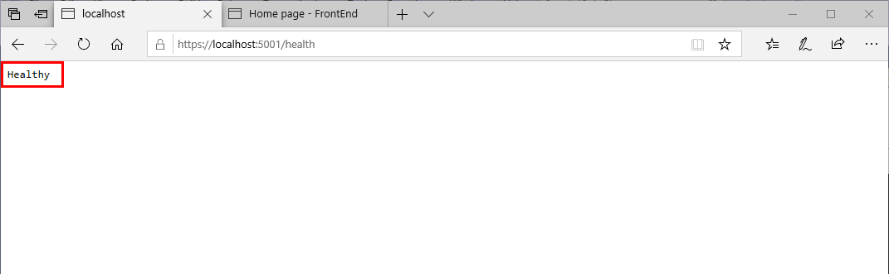

8. In the browser window for the **FrontEnd** web application, move to the health endpoint. The address of this endpoint is the URL of the **FrontEnd** web app with the suffix `/health`. Verify that the **FrontEnd** wab application also responds with the **Healthy** message.

9. Stop the web application and web API service:

    - **If you're using Visual Studio 2019:**

        - Close the web browser. The **FrontEnd** and **BackEnd** projects will stop automatically.

    - **If you're using the .NET Core CLI:**

        1. Close both web browser windows.

        2. Switch to the console window for the **BackEnd** project and press **Ctrl-C** to stop the web API service.

        3. Return to the console window for the **FrontEnd** project, and press **Ctrl-C** to stop the web application.

## Add a custom health check to test for BackEnd availability from the FrontEnd

In this task, you'l customize the health check for the **Front** web application. You can create your own health check class by implementing the `IHealthCheck` interface. You can then perform more extensive health checking to ensure that any additional services on which the web API depends (such as a database), are accessible. In this exercise, you'll add a custom health check to the **FrontEnd** web application to check for the availablity of the **BackEnd** web API service.

1. In the **FrontEnd** project, open the **IApiClient.cs** file in the **Services** folder.

2. Add the method **CheckHealthAsync** method to the end of the **IApiClient** interface, as shown below.

   ```csharp
   public interface IApiClient
   {
       ...
       Task<bool> CheckHealthAsync();
   }
   ```

3. Open the **ApiClient.cs** file in the **Services** folder.

4. Add the directive `using System;` to the list at the start of the file, if it isn't already present.

5. In the **ApiClient** class, add the **CheckHealthAsync** method shown below. This method sends a request to the `health` endpoint of the **BackEnd** web API service. If the service responds with the message **Healthy**, the **CheckHealthAsync** method returns true, otherwise it returns false.

    ```csharp
    public class ApiClient : IApiClient
    {
        ...
        public async Task<bool> CheckHealthAsync()
        {
            try
            {
                var response = await _httpClient.GetStringAsync("/health");

                return string.Equals(response, "Healthy", StringComparison.OrdinalIgnoreCase);
            }
            catch
            {
                return false;
            }
        }
    }
    ```

6. Create a folder named **HealthChecks** folder under the root folder in the **FrontEnd** project.

7. In the **HealthChecks** folder, add a class file named **BackendHealthCheck.cs**.

8. Replace the contents of the **BackendHealthCheck.cs** file with the following code. The **BackendHealthChecks** method implements the **IHealthCheck** interface. This interface defines a method named **CheckHealthAsync**. The code below implements this method by calling the **CheckHealthAsync** method of the **ApiClient** class. If the method in the **ApiClient** method returns true, this method returns a status of `Healthy`, otherwise it returns `Unhealthy`.

    ```csharp
    using System;
    using System.Collections.Generic;
    using System.Linq;
    using System.Threading;
    using System.Threading.Tasks;
    using FrontEnd.Services;
    using Microsoft.Extensions.Diagnostics.HealthChecks;

    namespace FrontEnd.HealthChecks
    {
        public class BackendHealthCheck : IHealthCheck
        {
            private readonly IApiClient _client;

            public BackendHealthCheck(IApiClient client)
            {
                _client = client;
            }

            public async Task<HealthCheckResult> CheckHealthAsync(HealthCheckContext context, CancellationToken cancellationToken = default(CancellationToken))
            {
                if (await _client.CheckHealthAsync())
                {
                    return HealthCheckResult.Healthy();
                }

                return HealthCheckResult.Unhealthy();
            }
        }
    }
    ```

9. Return to the **Startup.cs** file in the root folder of the **FrontEnd** project.

10. Add the directive `using FrontEnd.HealthChecks;` to the list at the start of the file.

11. In the **ConfigureServices** method, modify the statement that calls the **AddHealthChecks** method, and register the **BackendHealthCheck** method, as shown in the following code:

    ```csharp
    public void ConfigureServices(IServiceCollection services)
    {
        ...
        services.AddHealthChecks()
                .AddCheck<BackendHealthCheck>("backend")
                .AddDbContextCheck<IdentityDbContext>();
    }
    ```

12. Start the solution, and browse to the URL of **FrontEnd** application.

13. Navigate to the `/health` endpoint. The page should display the text **Healthy**.

14. Close the console window running the **BackEnd** project, but leave the **FrontEnd** project running.

15. In the web browser window for the **FrontEnd** web app, refresh the page open at the `/health' endpoint. The page should now display the text **Unhealthy**, because the **BackEnd** service is no longer available.

    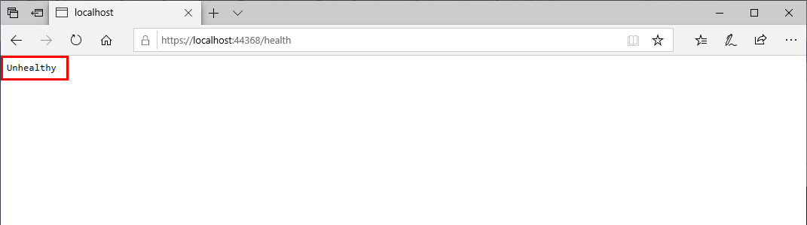

16. Close the web browser and stop the solution.

## Publish the **BackEnd** web API service and **FrontEnd** web application as Azure Windows Web Apps

In this task, you'll deploy the **BackEnd** web API service and the **FrontEnd** web app to Azure, running as Windows Web Apps. This task assumes you have an Azure subscription. If you don't already have an Azure account, you can sign up for a free account on the [Azure page of the Microsoft website](https://azure.microsoft.com/free/).

1. Sign in to your Azure subscription:

    ### If you're using Visual Studio 2019
  
    1. On the **View** menu, click **Cloud Explorer**.

          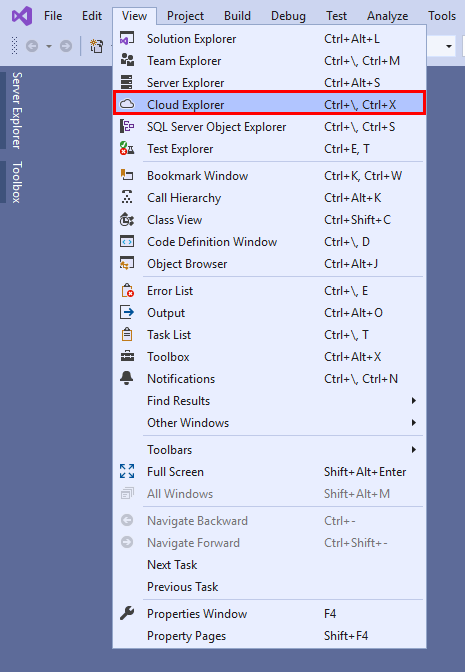

    2. In the **Cloud Explorer** window, click the **Account Management** button, and then click **MAnage Accounts**.

          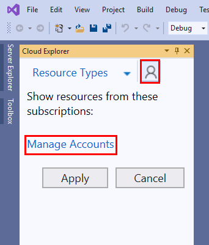

    3. In the **Sign in to Visual Studio** dialog box, click **Sign in**.

          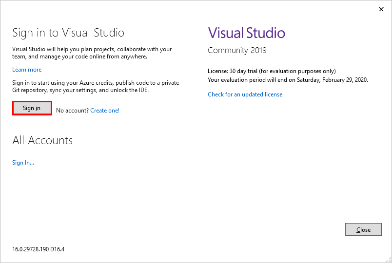

    4. In the **Sign in to your account** dialog box, sign in using the credentials associated with your Azure subscription.

          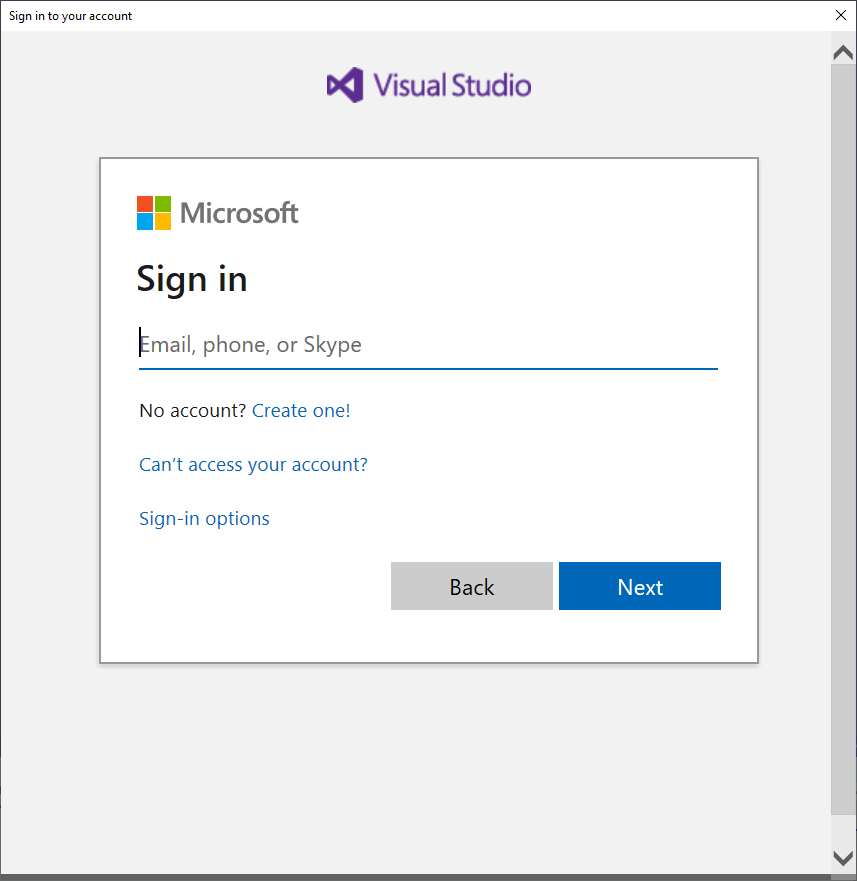

    5. When you have signed in, in the **Personalization Account** dialog box, click **Close**.

          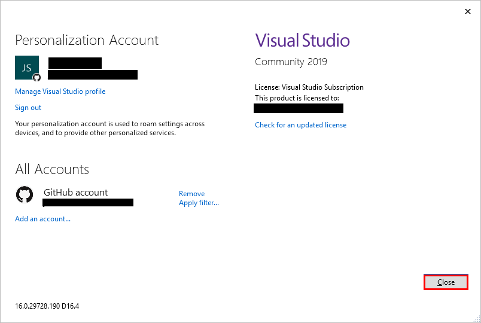

    6. In the **Cloud Explorer** window, click **Apply**, and then close the **Cloud Explorer** window.

          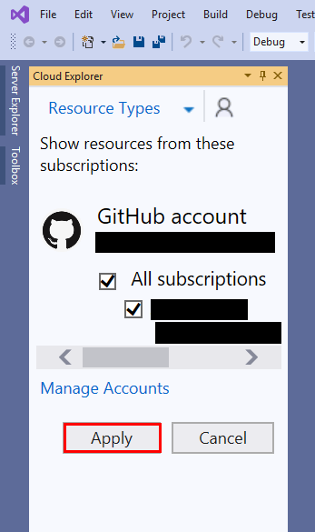

    ### If you're using the .NET Core CLI

    1. If you haven't already done so, [install the Azure CLI](https://docs.microsoft.com/cli/azure/install-azure-cli?view=azure-cli-latest).

    2. Run the following command, and follow the instructions to sign in to the account associated with your Azure subscription:

        ```console
        az login
        ```

2. Deploy the **BackEnd** web API service to Azure:

    ### If you're using Visual Studio 2019
  
    1. In the **Solution Explorer** window, right-click the **BackEnd** project, and then click **Publish**.

        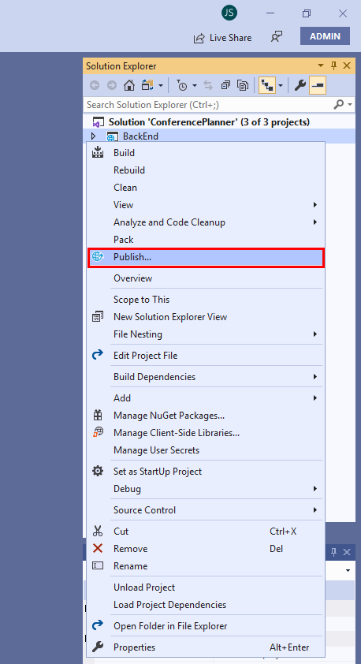

    2. In the **Pick a publish target** dialog box, in te left-hand pane click **App Service**, in the **Azure App Service** pane click **Create New**, and then click **Create Profile**.

        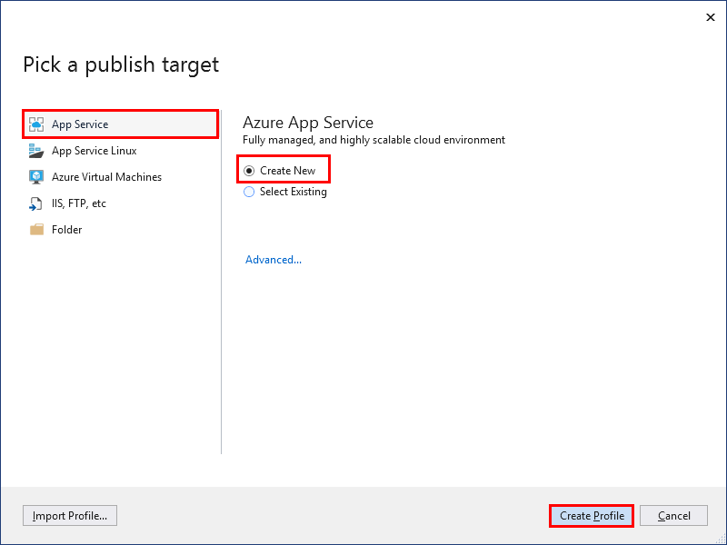

    3. In the **App Service Create New** dialog box, enter the following details. **Don't** click **Create** just yet.

        | Field | Value |
        |-|-|
        | Name | Accept the default App Service name |
        | Subscription | Select your Azure subscription |
        | Resource group | Click **New**, and create a resource group named **aspnetrg** |
        | Hosting Plan | Accept the default plan name |
        | Application Insights | None |

    4. Under **Explore Additional Azure services**, click **Create a SQL Database**.

        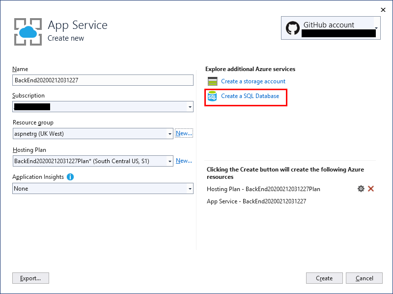

    5. In the **Azure SQL Database Create New** dialog box, enter the following details, and then click **OK**.

        | Field | Value |
        |-|-|
        | Database name | **Conference_db** |
        | Database server | Click **New**. Create a database server with the default server name and location. Set the **Administrator username** to **azureadmin**, and specify a password of your choice. Click **OK** to return to the **Azure SQL Database Create New** dialog box. |
        | Database administrator username | Accept the default value |
        | Database administrator password | Accept the default value |
        | Connection string name | **DefaultConnection** |

    6. Back in the **App Service Create New** dialog box, click **Create**.

    7. On the **Publish** page in Visual Studio, click **Edit**.

        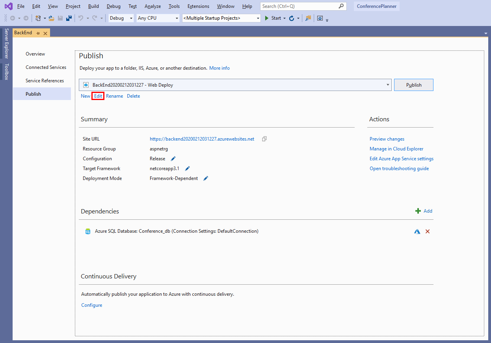

    8. In the **Publish** dialog box, click the **Settings** tab. Expand **Databases**, and then select **Use this connection string at runtime**. Expand **Entity Framework Migrations**, and then select **Apply this migration on publish**.

        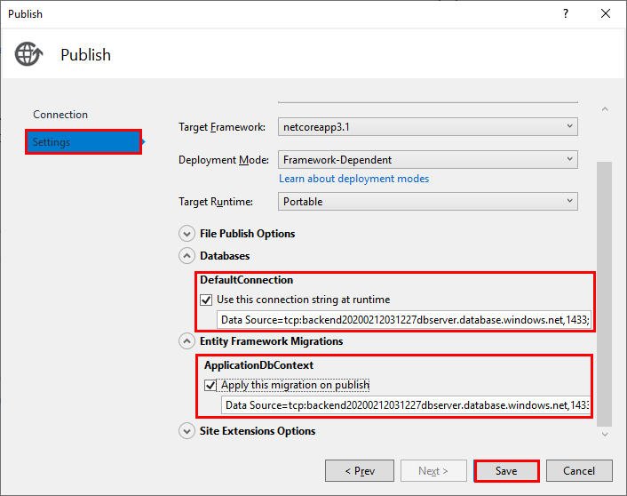

    9. Click **Save** to return to the **Publish** page, and then click **Publish**.

        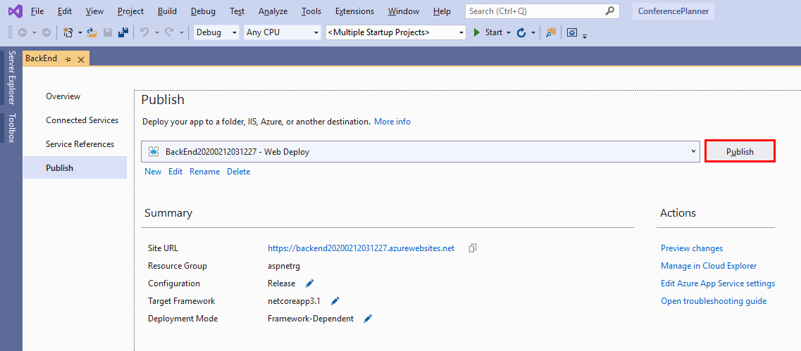

        When the web API service has been published, a web browser window will open and attempt to navigate to the URL of the service. The page will fail to open, with an HTTP 404 error. This error occurs because the root URL of the web API service is not a valid address.

        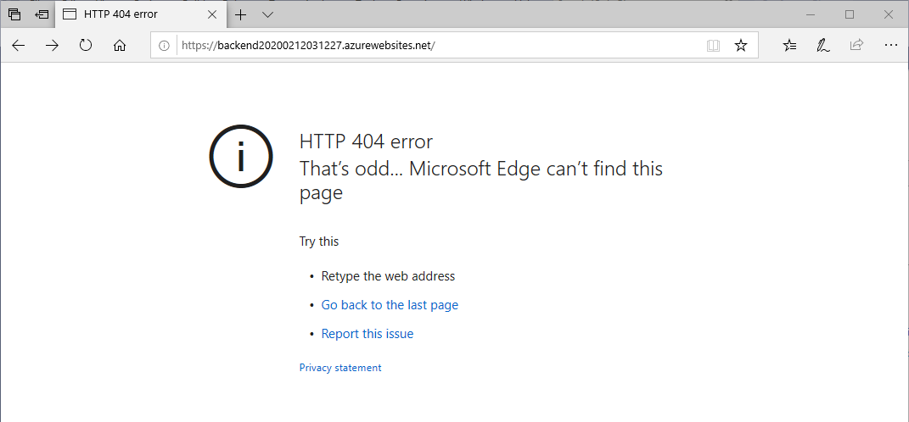

    10. In the web browser, make a note of the URL of the web API service. It will have the form `https://backendnnnnnnnnnnnnnnnn.azurewebsites.net`, where `nnnnnnnnnnnnnnnn` is a string of digits intended to give each web app a unique URL. append the suffix `/api/speakers` to the URL. The web API service should respond with an empty list of speakers.

        

    ### If you're using the .NET Core CLI

    1. Run the following command to create a new resource group named **aspnetrg**. Replace *\<location\>* with the name of your nearest Azure location, such as *westus*, *eastus*, *westuerope**, and so on.

        **Note:** You can obtain a list of valid locations using the command `az account list-locations`. 
  
        ```console
        az group create --location <location> --name aspnetrg
        ```

    2. Create a new Azure App Service plan with the following command. The **D1** SKU utilizes a low-cost shared infrastructure which is suitable for development environments.
  
        ```console
        az appservice plan create --name backendplan --resource-group aspnetrg --sku D1
        ```

    3. Create a new Windows Azure App Service using the App Service plan. Each app service must have a unique name, so replace *\<service-name-suffix\*> with your initials and the current data in numeric format. For example **JPWS01012020**.

        ```console
        az webapp create --name backend<service-name-suffix> --plan backendplan --resource-group aspnetrg
        ```

    4. Run the following command to create a new Azure SQL Server. Use the same location as before, and specify an administrator password of your choice.
  
        ```console
        az sql server create --name backendserver --resource-group aspnetrg --location <location> --admin-user azureadmin --admin-password <password>
        ```

    5. Run the following command to open the SQL Server firewall. This command will allow you to access the server from your computer, and from the **BackEnd** web API service.
  
        ```console
        ```

    6. Create a SQL Server database named **conference_db**, as shown below.

        ```
## Publish the **BackEnd** web API service as an Azure Linux Web App

https://docs.microsoft.com/en-us/aspnet/core/publishing/#publish-to-a-folder

## Publishing to Production (Azure App Service)

- [Visual Studio](https://docs.microsoft.com/en-us/aspnet/core/tutorials/publish-to-azure-webapp-using-vs)


7. Click the "Publish" button. When the app launches, find the Sessions section, scroll to /api/sessions/upload. Click the post button to upload your session data

8. In the FrontEnd application, open the AppSettings.json and replace the ServiceUrl with the URL from your backend in App Service.
9. Right Click Frontend | Publish
10. Select App Service, make sure the publish drop down is set to "Create Profile", click "Create Profile"
11. Fill in name, same resource group as above and same hosting plan as above.
12. Click "Create Database", fill in name, select the same database server from above, fill in the same password as above and change the Connection string name to "IdentityDbContextConnection". Press OK.
13. Click "Create".
15. On the publish page click "Edit". Click Settings. Open Databases and check the box for the default database. Click Migrations and check the box to apply migrations on publish. Click Save.
16. Click the "Publish" button.

- [Git](https://docs.microsoft.com/en-us/aspnet/core/publishing/azure-continuous-deployment)

## Publishing using Docker

**Prerequisites**

- [Docker for Windows](https://www.docker.com/docker-windows) or [Docker for Mac](https://www.docker.com/docker-mac)
- [Visual Studio Tools for Docker with ASP.NET Core](https://docs.microsoft.com/aspnet/core/host-and-deploy/docker/visual-studio-tools-for-docker)

**Enable Database Errors and switch to SQL since that is what runs in the container**

For both the front end and backend make the following code chanages:
1. Add the package "Microsoft.AspNetCore.Diagnostics.EntityFrameworkCore"
2. Add the database error page in Startup.cs, after app.UseDeveloperExceptionPage() add app.UseDatabaseErrorPage():

    ```csharp
    app.UseDeveloperExceptionPage();
    app.UseDatabaseErrorPage();
    ```
3. In the backend project, in Startup.cs, comment out the code to support SQLite:

    ```csharp
   //if (RuntimeInformation.IsOSPlatform(OSPlatform.Windows))
   //{
       options.UseSqlServer(Configuration.GetConnectionString("DefaultConnection"));
   //}
   //else
   //{
   //    options.UseSqlite("Data Source=conferences.db");
   //}
    ```
### Using Visual Studio

Add Docker support to the **BackEnd** project by right clicking the project file and selecting Add > Docker Support

A **Dockerfile** is added to the **BackEnd** project.

```Dockerfile
FROM mcr.microsoft.com/dotnet/core/aspnet:3.1-buster-slim AS base
WORKDIR /app
EXPOSE 80
EXPOSE 443

FROM mcr.microsoft.com/dotnet/core/sdk:3.1-buster AS build
WORKDIR /src
COPY ["BackEnd/BackEnd.csproj", "BackEnd/"]
COPY ["ConferenceDTO/ConferenceDTO.csproj", "ConferenceDTO/"]
RUN dotnet restore "BackEnd/BackEnd.csproj"
COPY . .
WORKDIR "/src/BackEnd"
RUN dotnet build "BackEnd.csproj" -c Release -o /app/build

FROM build AS publish
RUN dotnet publish "BackEnd.csproj" -c Release -o /app/publish

FROM base AS final
WORKDIR /app
COPY --from=publish /app/publish .
ENTRYPOINT ["dotnet", "BackEnd.dll"]
```
Add Container Orchestration support to the project, right click the project file and selecting Add > Container Orchestration Support Select Docker Comppose and click OK. This creates a **docker-compose** project with a docker.compose.yml file.

Repeat the same step for the **FrontEnd** project. The Dockerfile is added to the project for it.

Add Docker support to the **FrontEnd** project by right clicking the project file and selecting Add > Docker Support

```Dockerfile
FROM mcr.microsoft.com/dotnet/core/aspnet:3.1-buster-slim AS base
WORKDIR /app
EXPOSE 80
EXPOSE 443

FROM mcr.microsoft.com/dotnet/core/sdk:3.1-buster AS build
WORKDIR /src
COPY ["FrontEnd/FrontEnd.csproj", "FrontEnd/"]
COPY ["ConferenceDTO/ConferenceDTO.csproj", "ConferenceDTO/"]
RUN dotnet restore "FrontEnd/FrontEnd.csproj"
COPY . .
WORKDIR "/src/FrontEnd"
RUN dotnet build "FrontEnd.csproj" -c Release -o /app/build

FROM build AS publish
RUN dotnet publish "FrontEnd.csproj" -c Release -o /app/publish

FROM base AS final
WORKDIR /app
COPY --from=publish /app/publish .
ENTRYPOINT ["dotnet", "FrontEnd.dll"]
```
Add Container Orchestration support to the project, right click the project file and selecting Add > Container Orchestration Support Select Docker Comppose and click OK.

The **docker-compose.yml** file is updated to reflect that there are two projects to build images.

```yaml
version: '3.4'

services:

  frontend:
    image: ${DOCKER_REGISTRY-}frontend
    build:
      context: .
      dockerfile: FrontEnd/Dockerfile

  backend:
    image: ${DOCKER_REGISTRY-}backend
    build:
      context: .
      dockerfile: BackEnd/Dockerfile
```

#### Linking / Networking

In the previous architecture, there were some setting and manual orchestration to start up and wire the applications together.

- **BackEnd** tested for OS type and set the application to use SQL Server or SQLite
- **FrontEnd** application had the API url set in the *appsetting.json* file.

Using Docker, adding a container for SQL Server and linking the containers in the compose file simplifies this.

#### Adding SQL Server

Open the docker-compose.yml file and add the following entry. *Note the $ is doubled for escaping*

```yaml
  db:
    image: "microsoft/mssql-server-linux"
    environment:
      SA_PASSWORD: "ConferencePlanner1234$$"
      ACCEPT_EULA: "Y
```

Since the **BackEnd** application must have connectivity and cannot start until the database container is ready. Add the **depends_on** entry to the **backend** definition in the compose file.

```yaml
  backend:
    image: backend
    build:
      context: .
      dockerfile: BackEnd/Dockerfile
    depends_on:
      - db
```

Finally, change the connection string for the database in the BackEnd\appsettings.json file.

```javascript
  "ConnectionStrings": {
    "DefaultConnection": "Server=db;Initial Catalog=ConferencePlanner;User=sa;Password=ConferencePlanner1234$;MultipleActiveResultSets=true"
  }
```

##### Linking / Networking FrontEnd & BackEnd

In the **docker-compose.yml** file, add the **links** section to the **frontend** definition. This sets up the host name in the Docker networking allowing for the web application to call the API by name. `http://backend`

```yaml
  frontend:
    image: frontend
    build:
      context: .
      dockerfile: FrontEnd/Dockerfile
    links:
      - backend
```

Change the value for the **ServiceUrl** in FrontEnd/appsetting.json

```javascript
{
  "ServiceUrl": "http://backend/",
```

Remove or comment out the `app.UseHttpsRedirection();` in BackEnd\Startuo.cs.

#### Starting and Debugging

Once the changes are complete, F5 to build start the application in Docker. Debugging is still available in all projects, but now the application is running in containers.

Changes can be made to Razor pages and seen immediately without rebuilds, however and *.cs file changes require rebuilds.

### Using VS Code or other editors

Create and add the following Dockerfile for the BackEnd application.

```Dockerfile
FROM mcr.microsoft.com/dotnet/core/aspnet:3.1-buster-slim AS base
WORKDIR /app
EXPOSE 80
EXPOSE 443

FROM mcr.microsoft.com/dotnet/core/sdk:3.1-buster AS build
WORKDIR /src
COPY ["BackEnd/BackEnd.csproj", "BackEnd/"]
COPY ["ConferenceDTO/ConferenceDTO.csproj", "ConferenceDTO/"]
RUN dotnet restore "BackEnd/BackEnd.csproj"
COPY . .
WORKDIR "/src/BackEnd"
RUN dotnet build "BackEnd.csproj" -c Release -o /app/build

FROM build AS publish
RUN dotnet publish "BackEnd.csproj" -c Release -o /app/publish

FROM base AS final
WORKDIR /app
COPY --from=publish /app/publish .
```

Create and add the following Dockerfile for the FrontEnd application.

```Dockerfile
FROM mcr.microsoft.com/dotnet/core/aspnet:3.1-buster-slim AS base
WORKDIR /app
EXPOSE 80
EXPOSE 443

FROM mcr.microsoft.com/dotnet/core/sdk:3.1-buster AS build
WORKDIR /src
COPY ["BackEnd/BackEnd.csproj", "BackEnd/"]
COPY ["ConferenceDTO/ConferenceDTO.csproj", "ConferenceDTO/"]
RUN dotnet restore "BackEnd/BackEnd.csproj"
COPY . .
WORKDIR "/src/BackEnd"
RUN dotnet build "BackEnd.csproj" -c Release -o /app/build

FROM build AS publish
RUN dotnet publish "BackEnd.csproj" -c Release -o /app/publish

FROM base AS final
WORKDIR /app
COPY --from=publish /app/publish .
```

At the root of the ConferencePlanner solution, add the following **docker-compose.yml** file.

```yaml
version: '3.4'

services:

  frontend:
    image: ${DOCKER_REGISTRY-}frontend
    build:
      context: .
      dockerfile: FrontEnd/Dockerfile

  backend:
    image: ${DOCKER_REGISTRY-}backend
    build:
      context: .
      dockerfile: BackEnd/Dockerfile
    depends_on:
      - db 

  db:
    image: "microsoft/mssql-server-linux"
    environment:
      SA_PASSWORD: "ConferencePlanner1234$$"
      ACCEPT_EULA: "Y"
```
At the root of the ConferencePlanner solution, add the following **docker-compose.override.yml** file.

```yaml
version: '3.4'

services:
  backend:
    environment:
      - ASPNETCORE_ENVIRONMENT=Development
      - ASPNETCORE_URLS=https://+:443;http://+:80
      - ASPNETCORE_HTTPS_PORT=44370
    ports:
      - "63145:80"
      - "44370:443"
    volumes:
      - ${APPDATA}/Microsoft/UserSecrets:/root/.microsoft/usersecrets:ro
      - ${APPDATA}/ASP.NET/Https:/root/.aspnet/https:ro
  frontend:
    environment:
      - ASPNETCORE_ENVIRONMENT=Development
      - ASPNETCORE_URLS=https://+:443;http://+:80
      - ASPNETCORE_HTTPS_PORT=44384
    ports:
      - "56004:80"
      - "44384:443"
    volumes:
      - ${APPDATA}/Microsoft/UserSecrets:/root/.microsoft/usersecrets:ro
      - ${APPDATA}/ASP.NET/Https:/root/.aspnet/https:ro
```

#### SQL Server Configuration

Change the connection string for the database in the BackEnd\appsettings.json file.

```javascript
  "ConnectionStrings": {
    "DefaultConnection": "Server=db;Initial Catalog=ConferencePlanner;User=sa;Password=ConferencePlanner1234$;MultipleActiveResultSets=true"
  }
```

#### Linking / Networking FrontEnd & Backend

Change the value for the **ServiceUrl** in FrontEnd/appsetting.json

```javascript
{
  "ServiceUrl": "http://backend/",
```

Remove or comment out the `app.UseHttpsRedirection();` in BackEnd\Startuo.cs.

#### Building and Running

- Build the Docker images `docker-compose build`
- Run `docker-compose up -d` to start the application
- Run `docker-compose down` to stop the application
- Open the application at <http://localhost:5002>

> **Note:** You'll find the completed code for the exercises in this session in the [Session 6 save point folder](../save-points/6-Deployment-docker).

**Next**: [Session #7 - Additional challenges](7.%20Challenges.md) | **Previous**: [Session #5 - Add user registration and personal agendas](5.%20Add%20personal%20agenda.md).
