# Deploy the Application to a Production Environment

In this session, you'll prepare the **BackEnd** web API service, and the **FrontEnd** web application for deployment to a production environment by adding health checks. You'll then see how to deploy the solution to the following environments:

- A Windows App Service running in Azure, using Zip deployment.
- A Linux App Service, also running in Azure, using Git deployment.
- A Docker image running locally.
- Azure DevOps, to support CI/CD.

> **Note:** You can either continue with your own project, or use the code in the [Session 5 save point folder](../save-points/5-User-association-and-personal-agenda).

## Add Entity Framework health-checks to the BackEnd web API service

In this task, you'll configure support for health checking to the **BackEnd** web API service. A health check adds an endpoint that an application or service can use to determine whether the host running the **BackEnd** service is available.

1. Add a reference to the NuGet package `Microsoft.Extensions.Diagnostics.HealthChecks.EntityFrameworkCore` version `3.1.1` to the **BackEnd** project:

    - **If you're using Visual Studio 2019:**

        1. In the **Solution Explorer** window, right-click the **BackEnd** project, and then click **Manage NuGet Packages**.

        2. In the **NuGet Package Manager** window, click the **Browse** tab, and search for the package **Microsoft.Extensions.Diagnostics.HealthChecks.EntityFrameworkCore**.

        3. Select the version **Latest stable 3.1.1**, and then click **Install**.

        4. In the **Preview Changes** dialog box, click **OK**.

        5. In the **License Acceptance** dialog box, click **I Accept**.
  
    - **If you're using the .NET Core CLI:**

        1. Move to the **BackEnd** project folder.

        2. Run the following command:

            ```console
            dotnet add package Microsoft.Extensions.Diagnostics.HealthChecks.EntityFrameworkCore --version 3.1.1
            ```

2. Open the **Startup.cs** file in the root folder of the **BackEnd** project.

3. Add the statement shown below to the end of the **ConfigureServices** method. This statement adds an Entity Framework health check to the service:

    ```csharp
    public void ConfigureServices(IServiceCollection services)
    {
        ...
        services.AddHealthChecks()
                .AddDbContextCheck<ApplicationDbContext>();
    }
    ```

4. In the **Configure** method, modify the `app.UseEndpoints` statement as shown below. This change configures the service to respond to health check requests that appear on the `/health` end point.

    ```csharp
    public void Configure(IApplicationBuilder app, IWebHostEnvironment env)
    {
        ...
        app.UseEndpoints(endpoints =>
        {
            endpoints.MapControllers();
            endpoints.MapHealthChecks("/health");
        });
    }
    ```

## Add Entity Framework health-checks to the FrontEnd web application

1. Add a reference to the NuGet package `Microsoft.Extensions.Diagnostics.HealthChecks.EntityFrameworkCore` version `3.1.1` to the **FrontEnd** project. Follow the steps described in the previous task

2. Open the **Startup.cs** file in the root folder of the **FrontEnd** project.

3. Add the directive `using FrontEnd.Data;` to the list at the start of the file.

4. Add the code shown below to end of the **ConfigureServices** method. This statement adds the same health checking capability the you implemented in the **BackEnd** project, but based on the **IdentityDbContext** database context:

    ```csharp
    public void ConfigureServices(IServiceCollection services)
    {
        ...
        services.AddHealthChecks()
                .AddDbContextCheck<IdentityDbContext>();
    }
    ```

5. In the **Configure** method, modify the `app.UseEndpoints` statement and configures the service to respond to health check requests that appear on the `/health` end point.

    ```csharp
    public void Configure(IApplicationBuilder app, IWebHostEnvironment env)
    {
        ...
        app.UseEndpoints(endpoints =>
        {
            endpoints.MapRazorPages();
            endpoints.MapHealthChecks("/health");
        });
    }
    ```

6. Start the solution:

    - **If you're using Visual Studio:**

        1. Press **F5** to build and run the solution. The **FrontEnd** and **BackEnd** projects will start. A web browser will open displaying two web pages: one for the **BackEnd** project and the other for the **FrontEnd**.

        2. Switch to the window displaying the webpage for the **BackEnd** web API service.

    - **If you're using the .NET Core CLI:**

        1. Open the **launchSettings.json** file in the **Properties** folder of the **BackEnd** project.

        2. Make a note of the HTTPS URL in the **applicationUrl** property in the **BackEndEnd** profile, and then close the **launchSettings.json** file.

        3. Open the **launchSettings.json** file in the **Properties** folder of the **FrontEnd** project.

        4. Make a note of the HTTPS URL in the **applicationUrl** property in the **FrontEnd** profile, and then close the **launchSettings.json** file.

        5. Move to the **ConferencePlanner** solution folder.

        6. Run the following command to run the **BackEnd** project in a new console window:

            ```console
            start dotnet run --project BackEnd
            ```

        7. When the **BackEnd** project has started, return to the original console window and run the following command to start the **FrontEnd** project:

            ```console
            dotnet run --project FrontEnd
            ```

        8. Open a web browser, and go to the HTTPS URL of the **FrontEnd** web application that you noted earlier.

        9. Open another web browser window, and go to the HTTPS URL of the **BackEnd** web API service.

7. In the browser window for the **BackEnd** web API service, navigate to the health endpoint. This URL has the form `https://localhost:*port*/health`. Verify that the web API service responds with the message **Healthy**

    

8. In the browser window for the **FrontEnd** web application, move to the health endpoint. The address of this endpoint is the URL of the **FrontEnd** web app with the suffix `/health`. Verify that the **FrontEnd** wab application also responds with the **Healthy** message.

9. Stop the web application and web API service:

    - **If you're using Visual Studio 2019:**

        - Close the web browser. The **FrontEnd** and **BackEnd** projects will stop automatically.

    - **If you're using the .NET Core CLI:**

        1. Close both web browser windows.

        2. Switch to the console window for the **BackEnd** project and press **Ctrl-C** to stop the web API service.

        3. Return to the console window for the **FrontEnd** project, and press **Ctrl-C** to stop the web application.

## Add a custom health check to test for BackEnd availability from the FrontEnd

In this task, you'l customize the health check for the **Front** web application. You can create your own health check class by implementing the `IHealthCheck` interface. You can then perform more extensive health checking to ensure that any additional services on which the web API depends (such as a database), are accessible. In this exercise, you'll add a custom health check to the **FrontEnd** web application to check for the availablity of the **BackEnd** web API service.

1. In the **FrontEnd** project, open the **IApiClient.cs** file in the **Services** folder.

2. Add the method **CheckHealthAsync** method to the end of the **IApiClient** interface, as shown below.

   ```csharp
   public interface IApiClient
   {
       ...
       Task<bool> CheckHealthAsync();
   }
   ```

3. Open the **ApiClient.cs** file in the **Services** folder.

4. Add the directive `using System;` to the list at the start of the file, if it isn't already present.

5. In the **ApiClient** class, add the **CheckHealthAsync** method shown below. This method sends a request to the `health` endpoint of the **BackEnd** web API service. If the service responds with the message **Healthy**, the **CheckHealthAsync** method returns true, otherwise it returns false.

    ```csharp
    public class ApiClient : IApiClient
    {
        ...
        public async Task<bool> CheckHealthAsync()
        {
            try
            {
                var response = await _httpClient.GetStringAsync("/health");

                return string.Equals(response, "Healthy", StringComparison.OrdinalIgnoreCase);
            }
            catch
            {
                return false;
            }
        }
    }
    ```

6. Create a folder named **HealthChecks** folder under the root folder in the **FrontEnd** project.

7. In the **HealthChecks** folder, add a class file named **BackendHealthCheck.cs**.

8. Replace the contents of the **BackendHealthCheck.cs** file with the following code. The **BackendHealthChecks** method implements the **IHealthCheck** interface. This interface defines a method named **CheckHealthAsync**. The code below implements this method by calling the **CheckHealthAsync** method of the **ApiClient** class. If the method in the **ApiClient** method returns true, this method returns a status of `Healthy`, otherwise it returns `Unhealthy`.

    ```csharp
    using System;
    using System.Collections.Generic;
    using System.Linq;
    using System.Threading;
    using System.Threading.Tasks;
    using FrontEnd.Services;
    using Microsoft.Extensions.Diagnostics.HealthChecks;

    namespace FrontEnd.HealthChecks
    {
        public class BackendHealthCheck : IHealthCheck
        {
            private readonly IApiClient _client;

            public BackendHealthCheck(IApiClient client)
            {
                _client = client;
            }

            public async Task<HealthCheckResult> CheckHealthAsync(HealthCheckContext context, CancellationToken cancellationToken = default(CancellationToken))
            {
                if (await _client.CheckHealthAsync())
                {
                    return HealthCheckResult.Healthy();
                }

                return HealthCheckResult.Unhealthy();
            }
        }
    }
    ```

9. Return to the **Startup.cs** file in the root folder of the **FrontEnd** project.

10. Add the directive `using FrontEnd.HealthChecks;` to the list at the start of the file.

11. In the **ConfigureServices** method, modify the statement that calls the **AddHealthChecks** method, and register the **BackendHealthCheck** method, as shown in the following code:

    ```csharp
    public void ConfigureServices(IServiceCollection services)
    {
        ...
        services.AddHealthChecks()
                .AddCheck<BackendHealthCheck>("backend")
                .AddDbContextCheck<IdentityDbContext>();
    }
    ```

12. Start the solution, and browse to the URL of **FrontEnd** application.

13. Navigate to the `/health` endpoint. The page should display the text **Healthy**.

14. Close the console window running the **BackEnd** project, but leave the **FrontEnd** project running.

15. In the web browser window for the **FrontEnd** web app, refresh the page open at the `/health' endpoint. The page should now display the text **Unhealthy**, because the **BackEnd** service is no longer available.

    

16. Close the web browser and stop the solution.

# Publish the BackEnd web API service and FrontEnd web application as Azure Windows Web Apps using Zip deployment

In this exercise, you'll deploy the **BackEnd** web API service and the **FrontEnd** web app to Azure, running as Windows Web Apps. This task assumes you have an Azure subscription. If you don't already have an Azure account, you can sign up for a free account on the [Azure page of the Microsoft website](https://azure.microsoft.com/free/).

## Sign in to your Azure subscription

### If you're using Visual Studio 2019
  
1. On the **View** menu, click **Cloud Explorer**.

    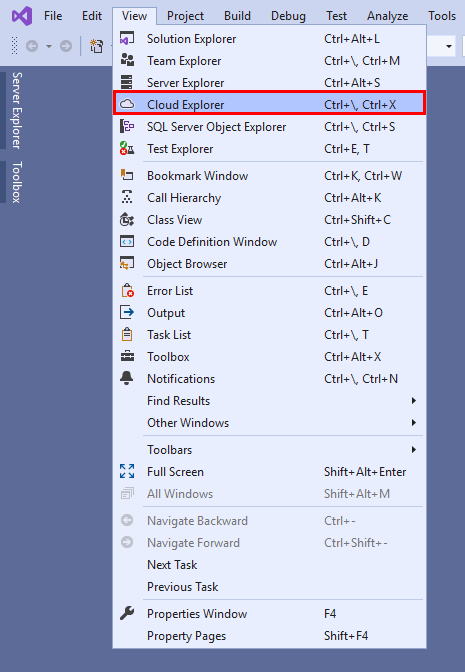

2. In the **Cloud Explorer** window, click the **Account Management** button, and then click **MAnage Accounts**.

    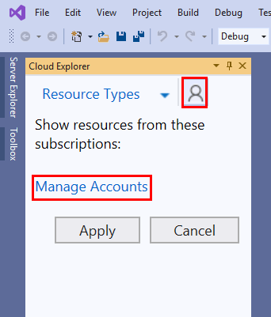

3. In the **Sign in to Visual Studio** dialog box, click **Sign in**.

    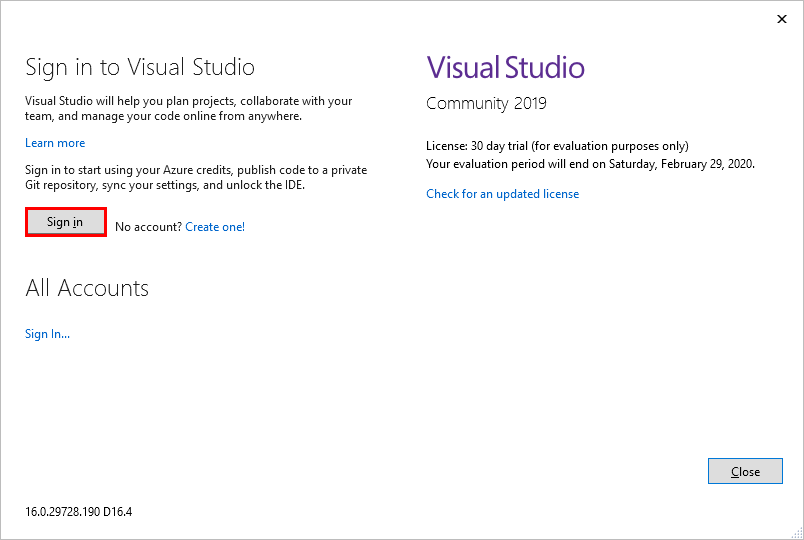

4. In the **Sign in to your account** dialog box, sign in using the credentials associated with your Azure subscription.

    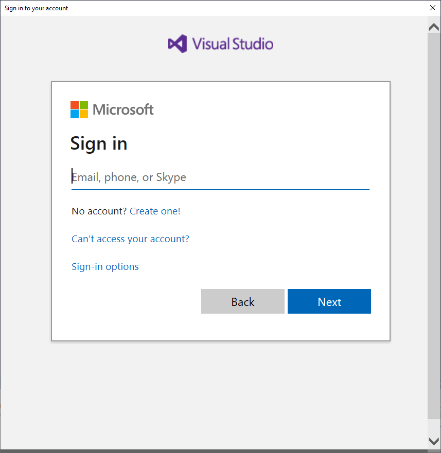

5. When you have signed in, in the **Personalization Account** dialog box, click **Close**.

    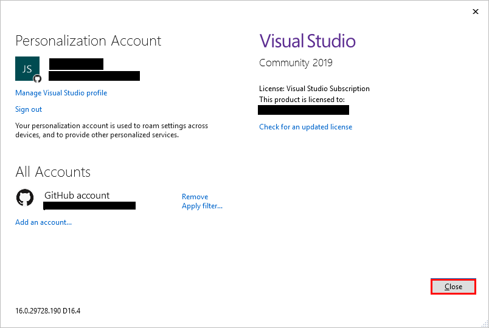

6. In the **Cloud Explorer** window, click **Apply**, and then close the **Cloud Explorer** window.

    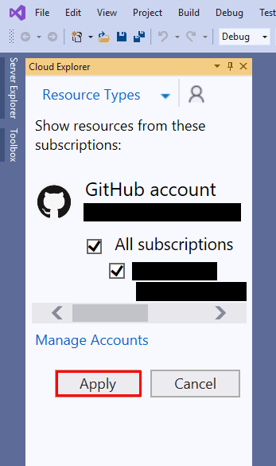

### If you're using the .NET Core CLI

1. If you haven't already done so, [install the Azure CLI](https://docs.microsoft.com/cli/azure/install-azure-cli?view=azure-cli-latest).

2. Run the following command, and follow the instructions to sign in to the account associated with your Azure subscription:

    ```console
    az login
    ```

## Prepare the BackEnd project for migration

> **Note:** This task is only necessary if you have prevously been using SQLite to manage the conference database. If you have been using SQL Server, omit this task.

### If you're using Visual Studio 2019

1. In the **Solution Explorer** window, right-click the **BackEnd** project, and then click **Manage NuGet Packages**.

2. In the **NuGet Package Manager** window, click the **Browse** tab, and search for the package **Microsoft.EntityFrameworkCore.SqlServer**.

3. Select the version **Latest stable 3.1.1**, and then click **Install**.

4. In the **Preview Changes** dialog box, click **OK**.

5. In the **License Acceptance** dialog box, click **I Accept**.

6. Open the **Startup.cs** file in the root folder of the **BackEnd** project.

7. In the **ConfigureServices** method, amend the `services.AddDbContext` statement. Replace the call to the **UseSqlite** method with **UseSqlServer**, as shown below:

    ```csharp
    public void ConfigureServices(IServiceCollection services)
    {
        services.AddDbContext<ApplicationDbContext>(options =>
        {
            // For SQL Server
            options.UseSqlServer(Configuration.GetConnectionString("DefaultConnection"));
        });
        ...
    }
    ```
  
### If you're using the .NET Core CLI

1. Move to the **BackEnd** project folder.

2. Run the following command:

    ```console
    dotnet add package Microsoft.EntityFrameworkCore.SqlServer --version 3.1.1
    ```

3. Open the **Startup.cs** file in the root folder of the **BackEnd** project.

4. In the **ConfigureServices** method, amend the `services.AddDbContext` statement. Replace the call to the **UseSqlite** method with **UseSqlServer**, as shown below:

    ```csharp
    public void ConfigureServices(IServiceCollection services)
    {
        services.AddDbContext<ApplicationDbContext>(options =>
        {
            // For SQL Server
            options.UseSqlServer(Configuration.GetConnectionString("DefaultConnection"));
        });
        ...
    }
    ```

## Deploy the BackEnd web API service to Azure

### If you're using Visual Studio 2019
  
1. In the **Solution Explorer** window, right-click the **BackEnd** project, and then click **Publish**.

    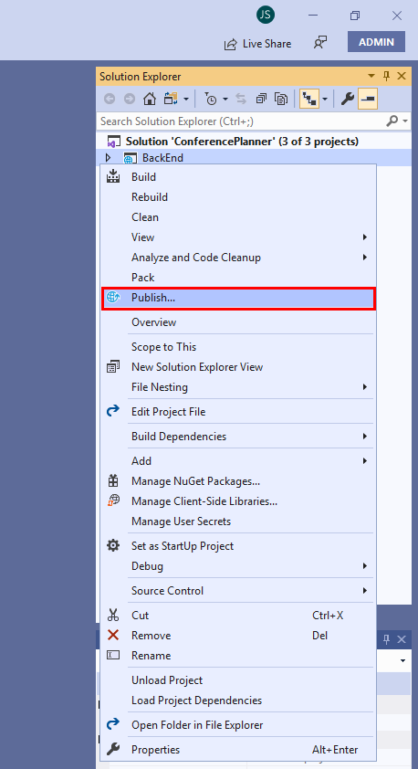

2. In the **Pick a publish target** dialog box, in the left-hand pane click **App Service**, in the **Azure App Service** pane click **Create New**, and then click **Create Profile**.

    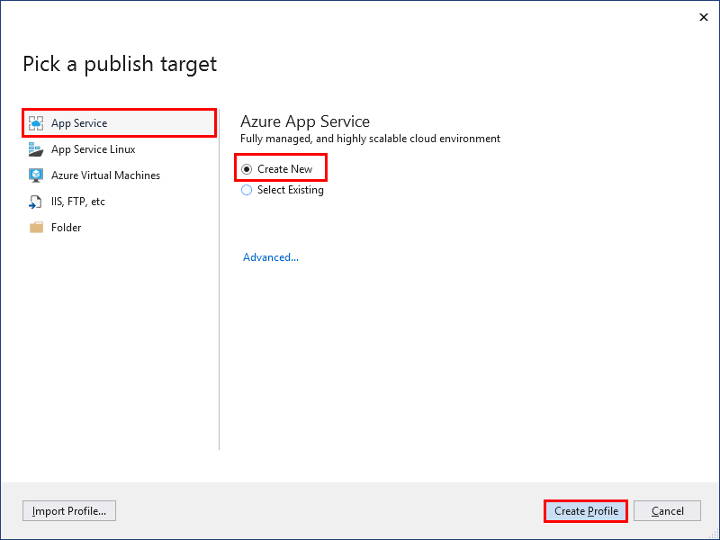

3. In the **App Service Create New** dialog box, enter the following details. **Don't** click **Create** just yet.

    | Field | Value |
    |-|-|
    | Name | Accept the default App Service name |
    | Subscription | Select your Azure subscription |
    | Resource group | Click **New**, and create a resource group named **aspnetrg** |
    | Hosting Plan | Accept the default plan name |
    | Application Insights | None |

4. Under **Explore Additional Azure services**, click **Create a SQL Database**.

    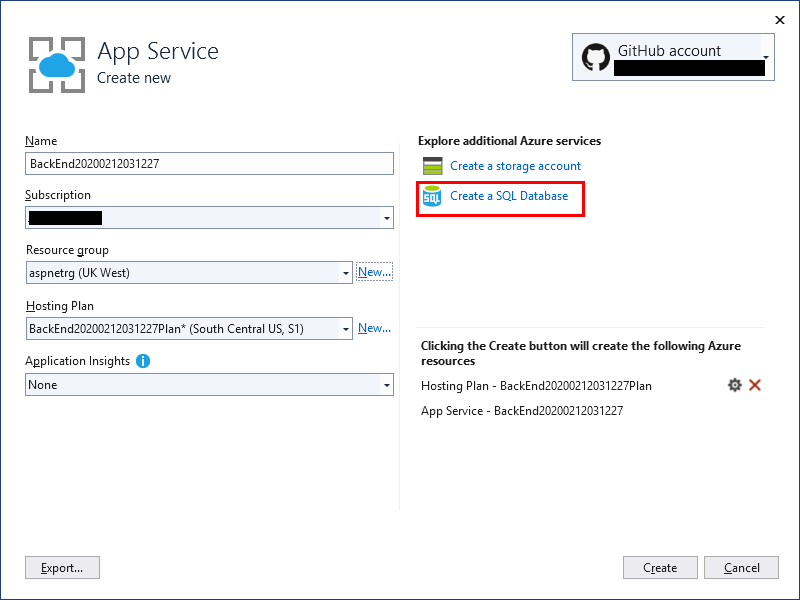

5. In the **Azure SQL Database Create New** dialog box, enter the following details, and then click **OK**.

    | Field | Value |
    |-|-|
    | Database name | **Conference_db** |
    | Database server | Click **New**. Create a database server with the default server name and location. Set the **Administrator username** to **azureadmin**, and specify a password of your choice. Click **OK** to return to the **Azure SQL Database Create New** dialog box. |
    | Database administrator username | azureadmin |
    | Database administrator password | Accept the default value |
    | Connection string name | **DefaultConnection** |

6. Back in the **App Service Create New** dialog box, click **Create**.

7. On the **Publish** page in Visual Studio, click **Edit**.

    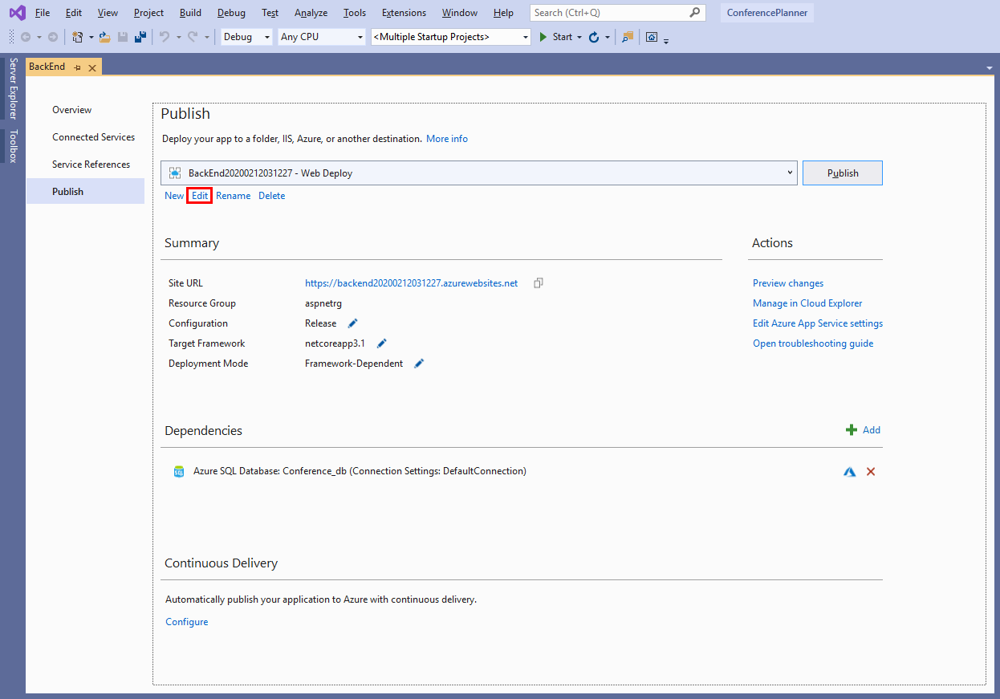

8. In the **Publish** dialog box, click the **Settings** tab. Expand **Databases**, and then select **Use this connection string at runtime**. Expand **Entity Framework Migrations**, and then select **Apply this migration on publish**.

    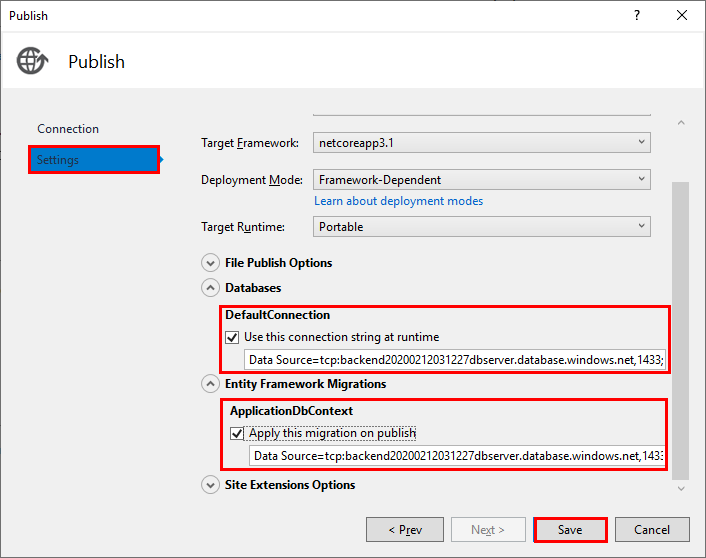

    > **Note:** The pubish settings also enable you to specify the target framework for the web app when it is deployed. In this case, the target framework is **.netcoreapp3.1**. However, Azure App Services don't currently support this version of .NET Core natively, so the target runtime is set to **Portable**. If you really need to run the web app using .NET Core version 3.1, you can change the deployment mode to **Self-Contained**, and specify a target runtime of **win-x86**. These settings cause the .NET Core framework to be bundled up in the deployment and uploaded to the App Service as part of the application.
    >
    > 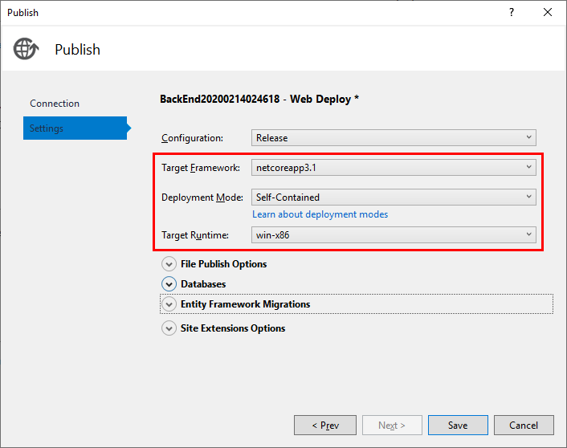
    >
    > You can use this technique wherever you require a version of a framework that is not yet currently available with App Services. For this exercise, leave the **Deployment Mode** set to **Framework-Dependent**, and the **Target Runtime** set to **Portable**.

9. Click **Save** to return to the **Publish** page, and then click **Publish**.

    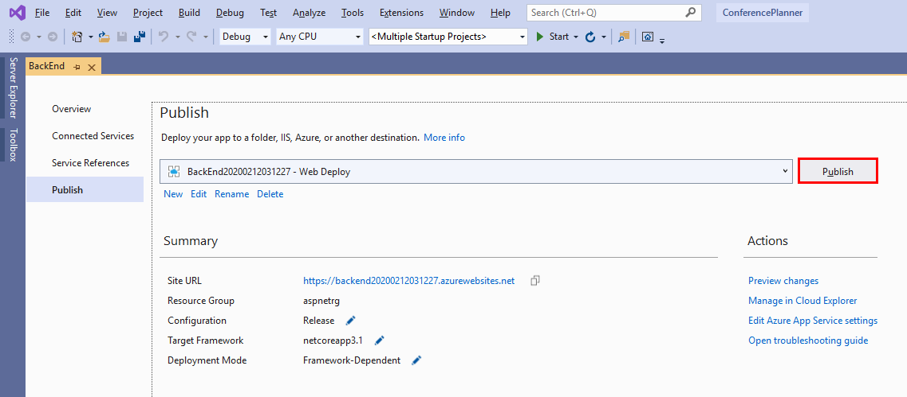

    When the web API service has been published, a web browser window will open and attempt to navigate to the URL of the service. The page will fail to open, with an HTTP 404 error. This error occurs because the root URL of the web API service is not a valid address.

    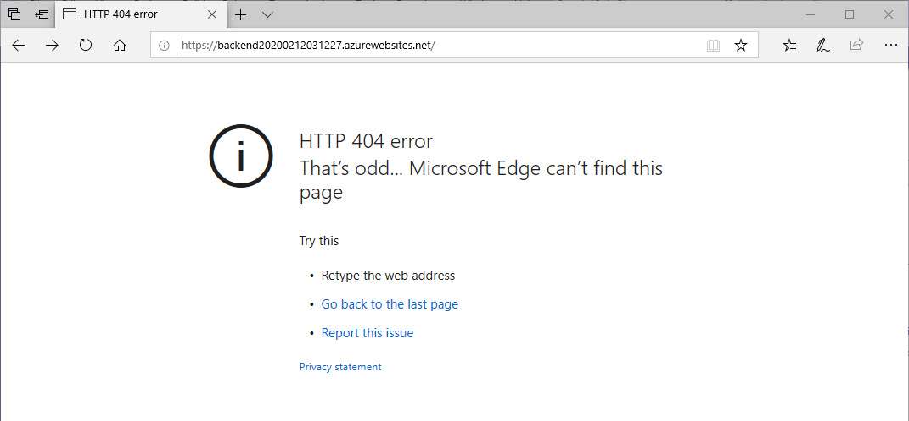

10. In the web browser, make a note of the URL of the web API service. It will have the form `https://backend<service-name-suffix>.azurewebsites.net`. You'll need this URL later, when you deploy the **FrontEnd** web application.

11. In the address bar of the browser, append the suffix `/api/speakers` to the URL. The web API service should respond with an empty list of speakers.

    

### If you're using the .NET Core CLI

1. Run the following command to create a new resource group named **aspnetrg**. Replace *\<location\>* with the name of your nearest Azure location, such as *westus*, *eastus*, *westuerope**, and so on.

    > **Note:** You can obtain a list of valid locations using the command `az account list-locations`. 
  
    ```console
    az group create --location <location> --name aspnetrg
    ```

2. Run the following command to create a new Azure SQL Server. Use the same location and value for *\<service-name-suffix\>* as before, and specify an administrator password of your choice.
  
    ```console
    az sql server create --name backendserver<service-name-suffix> --resource-group aspnetrg --location <location> --admin-user azureadmin --admin-password <password>
    ```

3. Run the command shown below to obtain the IP address of your computer. Make a note of the IP address.

    ```console
    ipconfig
    ```

4. Execute the following commands to open the SQL Server firewall. Replace *\<your-ip-address\>* with the address of your computer. These commands will allow you to access the server from your computer, and from Azure services, including the **BackEnd** web API service.
  
    ```console
    az sql server firewall-rule create --name azure --resource-group aspnetrg --server backendserver<service-name-suffix> --start-ip-address <your-ip-address> --end-ip-address <your-ip-address>

    az sql server firewall-rule create --name azure --resource-group aspnetrg --server backendserver<service-name-suffix> --start-ip-address 0.0.0.0 --end-ip-address 0.0.0.0
    ```

5. Create a SQL Server database named **conference_db**, as shown below.

    ```console
    az sql db create --name conference_db --resource-group aspnetrg --server backendserver<service-name-suffix> --edition Basic
    ```

6. Run the following command to retrieve the connection string for the **conference_db** database.

    ```console
    az sql db show-connection-string --name conference_db --server backendserver<service-name-suffix> --client ado.net
    ```

7. Move to the root folder of the **BackEnd** project.

8. Open the **appsettings.json** file. Replace the value of the **DefaultConnection** property with the string returned in the previous step. In this string, replace *\<username\>* with **azureadmin**, and replace *\<password\>* with the password that you specified when you created the Azure SQL Server. The file should look similar to this:

    ```json
    {
        "ConnectionStrings": {
            "DefaultConnection": "Server=tcp:backendservernnnnnnnn.database.windows.net,1433;Database=conference_db;User ID=azureadmin;Password=********;Encrypt=true;Connection Timeout=30;"
        },
        "Logging": {
            "LogLevel": {
                "Default": "Information",
                "Microsoft": "Warning",
                "Microsoft.Hosting.Lifetime": "Information"
            }
        },
        "AllowedHosts": "*"
    }
    ```

9. Perform the commands shown below to create and run a database migration. These commands will create the tables for the web API service in the new SQL Server database in the Azure.

    ```console
    dotnet ef migrations add MoveToAzure
    dotnet ef database update
    ```

10. Build the **BackEnd** project and publish the files to a local folder named **publish**. The following command also includes the .NET Core 3.1 runtime; Azure Web Apps running Windows currently don't include versions of the .NET Core later than version 2.2, so the web appliction must provide the runtime libraries itself:

    ```console
    dotnet publish --runtime win-x86 --self-contained --configuration Release --output publish
    ```

11. Run the following command to compress the contents of the **publish** folder into a zip file named **publish.zip**

    ```console
    powershell Compress-Archive -Path publish\* -DestinationPath publish.zip
    ```

12. Create a new Azure App Service plan with the following command. The **D1** SKU utilizes a low-cost shared infrastructure which is suitable for development environments.
  
    ```console
    az appservice plan create --name backendplan --resource-group aspnetrg --sku D1
    ```

13. Create an Azure Web App using the App Service Plan. Each Azure App service must have a unique name, so replace *\<service-name-suffix\*> with your initials and the current data in numeric format. For example **JPWS01012020**.

    ```console
    az webapp create --name backend<service-name-suffix> --plan backendplan --resource-group aspnetrg
    ```

14. Deploy the **BackEnd** project to the App Service using the **publish.zip** file you created earlier.

    ```console
    az webapp deployment source config-zip --name backend<service-name-suffix> --resource-group aspnetrg --src publish.zip
    ```

15. Run the following command to open a browser window at the URL of the Web App. 

    ```console
    az webapp browse --name backend<service-name-suffix> --resource-group aspnetrg
    ```

    The browser will attempt to navigate to the URL of the service. The page will fail to open, with an HTTP 404 error. This error occurs because the root URL of the web API service is not a valid address.

    

16. In the web browser, make a note of the URL of the web API service. It will have the form `https://backend<service-name-suffix>.azurewebsites.net`. You'll require this URL later, when you deploy the **FrontEnd** web application.

17. In the address bar of the browser, append the suffix `/api/speakers` to the URL. The web API service should respond with an empty list of speakers.

    

## Populate the Conference database

1. In the web browser, move to the swagger endpoint of the web API service, **https://backend\<*service-name-suffix*\>.azurewebsites.net/swagger**.

2. In the **Sessions** section, click the **POST** button for the **/api/Sessions/upload** operation, and then click **Try it out**.

3. In the **Parameters** section, at the **file** prompt, click **Browse**.

4. In the **Open** dialog box, browse to the folder containing your clone of the GitHub repository, move to the folder **src/BackEnd/Data/Import** in the repository, select the file **NDC_London_2020.json**, and then click **Open**.

5. Back in the web browser, click **Execute**, and wait for the data to be uploaded. Verify that the upload is successful (the server response code should be 200).

    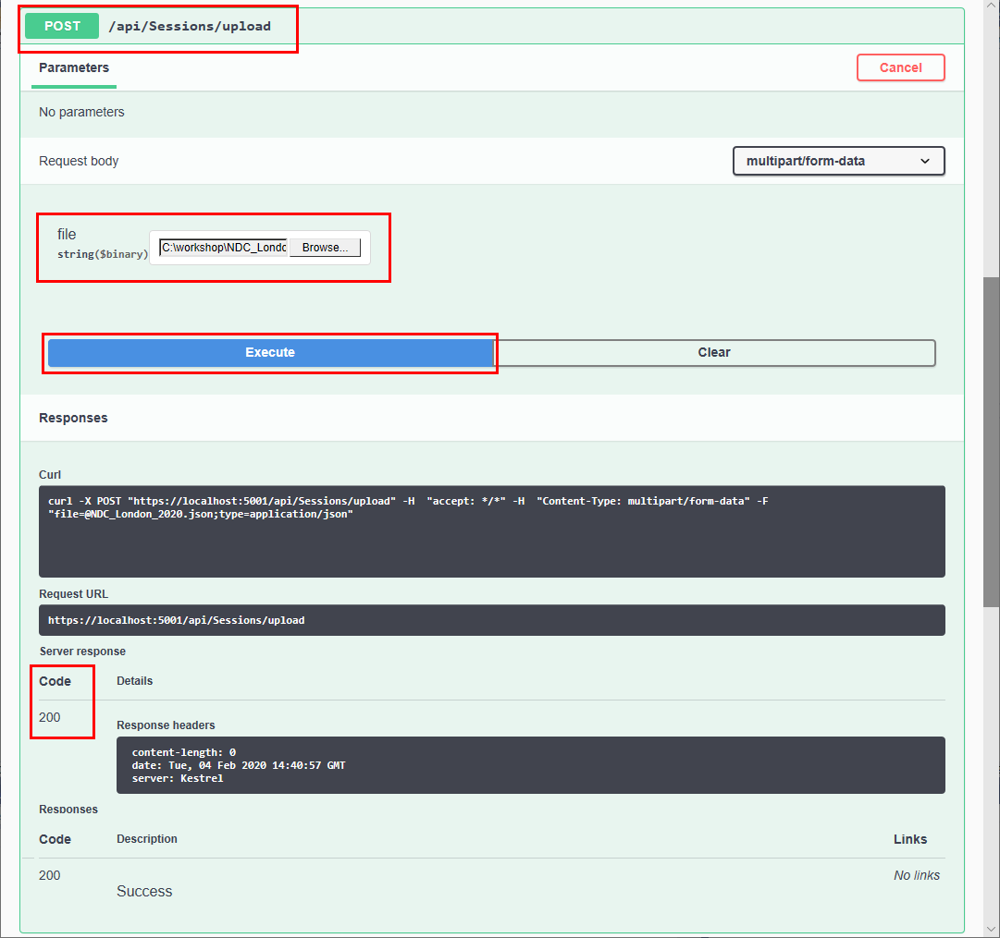

## Prepare the FrontEnd project for migration

> **Note:** This task is only necessary if you have prevously been using SQLite to manage the identity database. If you have been using SQL Server, omit this task.

1. Add the NuGet package **Microsoft.EntityFrameworkCore.SqlServer** version 3.1.1 to the project, using the steps described in the section [Prepare the BackEnd project for migration](#prepare-the-backend-project-for-migration)

2. Open the **IdentityHostingStartup.cs** file in the **Areas\Identity** folder of the **FrontEnd** project.

3. In the **Configure** method, amend the `services.AddDbContext` statement. Replace the call to the **UseSqlite** method with **UseSqlServer**, as shown below:

    ```csharp
    public void Configure(IWebHostBuilder builder)
    {
        builder.ConfigureServices((context, services) => {
            services.AddDbContext<IdentityDbContext>(options =>
                // For SQL Server
                options.UseSqlServer(
                    context.Configuration.GetConnectionString("IdentityDbContextConnection")));

            ...
        });
    }
    ```

4. Open the **appsettings.json** file in the root folder of the **FrontEnd** project, and replace the value of the **ServiceUrl** settings with the URL of the **BackEnd** service running as an App Service; you noted this URL earlier.

5. Delete all the files in the **Migrations** folder of the **FrontEnd** project.

## Deploy the Front web API service to Azure

### If you're using Visual Studio 2019
  
1. In the **Solution Explorer** window, right-click the **FrontEnd** project, and then click **Publish**.

2. In the **Pick a publish target** dialog box, in the left-hand pane click **App Service**, in the **Azure App Service** pane click **Create New**, and then click **Create Profile**.

3. In the **App Service Create New** dialog box, enter the following details. **Don't** click **Create** just yet.

    | Field | Value |
    |-|-|
    | Name | Accept the default App Service name |
    | Subscription | Select your Azure subscription |
    | Resource group | Select **aspnetrg** |
    | Hosting Plan | Accept the default plan name. This will be the same hosting plan you created for the **BackEnd** Web App |
    | Application Insights | None |

4. Under **Explore Additional Azure services**, click **Create a SQL Database**.

5. In the **Azure SQL Database Create New** dialog box, enter the following details, and then click **OK**.

    | Field | Value |
    |-|-|
    | Database name | **Identity_db** |
    | Database server | Select the database server that you created for holding the **Conference_db** database |
    | Database administrator username | **azureadmin** |
    | Database administrator password | Enter the password you created for the **azureadmin** user |
    | Connection string name | **DefaultConnection** |

6. Back in the **App Service Create New** dialog box, click **Create**.

7. On the **Publish** page in Visual Studio, click **Edit**.

8. In the **Publish** dialog box, click the **Settings** tab. Expand **Databases**, and then select **Use this connection string at runtime**. Expand **Entity Framework Migrations**, and then select **Apply this migration on publish**.

9. Click **Save** to return to the **Publish** page, and then click **Publish**.

    When the web API service has been published, a web browser window will open and display the home page of the Conference web app. The web app should display the conference data, retrieved from the web API service running as an App Service.

    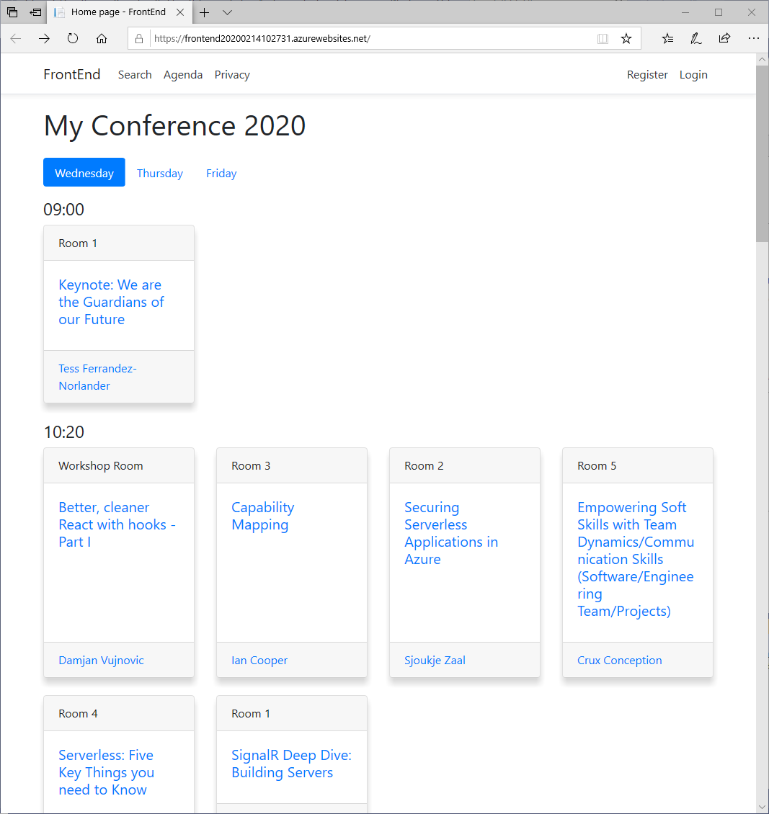

10. Verify that you can register as a conference attendee, and create your own agenda.

### If you're using the .NET Core CLI

1. Create a SQL Server database named **identity_db**, using the SQL Server you created for the **BackEnd** web API service, as shown below.

    ```console
    az sql db create --name identity_db --resource-group aspnetrg --server backendserver<service-name-suffix> --edition Basic
    ```

2. Run the following command to retrieve the connection string for the **identity_db** database.

    ```console
    az sql db show-connection-string --name identity_db --server backendserver<service-name-suffix> --client ado.net
    ```

3. Move to the root folder of the **FrontEnd** project.

4. Open the **appsettings.json** file. Replace the value of the **IdentityDbContextConnection** property with the string returned in the previous step. In this string, replace *\<username\>* with **azureadmin**, and replace *\<password\>* with the password that you specified when you created the Azure SQL Server.

5. Execute the commands shown below to create and run a database migration. These commands will create the tables for the identity database in Azure.

    ```console
    dotnet ef migrations add MoveIdentityToAzure
    dotnet ef database update
    ```

6. Build the **FrontEnd** project and publish the files to a local folder named **publish**. Include the .NET Core 3.1 runtime, as shown in the following command:

    ```console
    dotnet publish --runtime win-x86 --self-contained --configuration Release --output publish
    ```

7. Compress the contents of the **publish** folder into a zip file named **publish.zip**

    ```console
    powershell Compress-Archive -Path publish\* -DestinationPath publish.zip
    ```

8. Create an Azure Web App using the App Service Plan you created earlier for the **BackEnd** project. As with the **BackEnd** web app, replace *\<service-name-suffix\*> with your initials and the current data in numeric format.

    ```console
    az webapp create --name frontend<service-name-suffix> --plan backendplan --resource-group aspnetrg
    ```

9. Deploy the **FrontEnd** project to the App Service.

    ```console
    az webapp deployment source config-zip --name frontend<service-name-suffix> --resource-group aspnetrg --src publish.zip
    ```

10. Run the following command to open a browser window at the URL of the Web App.

    ```console
    az webapp browse --name frontend<service-name-suffix> --resource-group aspnetrg
    ```

    The web browser will display the home page of the Conference web app. The web app should display the conference data, retrieved from the web API service running as an App Service.

    

11. Verify that you can register as a conference attendee, and create your own agenda.

# Publish the BackEnd web API service as an Azure Linux Web App using Git deployment

In this exercise, you'll deploy the **BackEnd** web API service Azure, running as a Linux Web App (you'll leave the **FrontEnd** web app running locally, to save time and avoid repetition). This task assumes you have an Azure subscription. If you don't already have an Azure account, you can sign up for a free account on the [Azure page of the Microsoft website](https://azure.microsoft.com/free/). As a variatioon on the Windows Web App deployment scenario, you'll use GitHub deployment in this exercise. Git deployment enables you to publish updates to the web apps more easily, simply by pushing the changes to a Git repository managed by the Azure App service.

## Prepare the **BackEnd** project

1. If you haven't already done so, sign in to your Azure subscription [by following this procedure, described earlier](#sign-in-to-your-azure-subscription)

2. Change the version of the .NET Framework Core for the BackEnd project.

    > **Note:** This change is necessary because the *Oryx* build processor that rebuilds applications in the Azure App Service doesn't currently support later builds of the .NET Core Framework. This situation is expected to change soon, however.

    - **If you're using Visual Studio 2019:**

        1. In Visual Studio, in the **Solution Explorer** window, right-click the **BackEnd** project, and then click **Properties**.

        2. In the **Properties** window for the **BackEnd** project, on the **Application** tab, change the **Target framework** to **.NET Core 3.0**.

            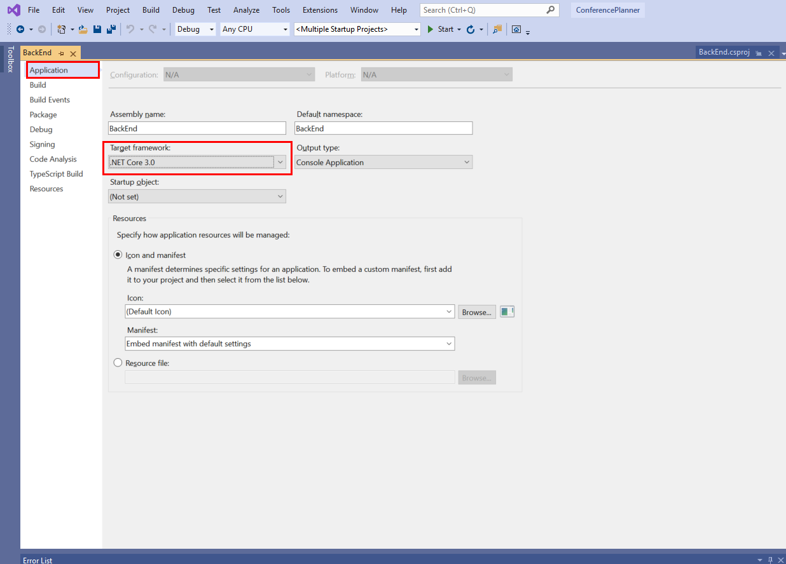

        3. Add a reference to the NuGet package `Newtonsoft.Json` version `12.0.3` to the **BackEnd** project. This package is not automatically included with the .NET Core 3.0 Framework.

        4. On the **Build** menu, click **Rebuild Solution**. You will receive a warning about the `Microsoft.VisualStudio.Web.CodeGeneration.Design` package, but you should not get any errors.

    - **If you're using the .NET Core CLI**

        1. In the **BackEnd** project folder, open the file **BackEnd.csproj** using a text editor of your choice.

        2. Change the value of the **TargetFramework** property to **netcoreapp3.0**, as shown in the example below:

            ```json
            <Project Sdk="Microsoft.NET.Sdk.Web">

                <PropertyGroup>
                    <TargetFramework>netcoreapp3.0</TargetFramework>
                </PropertyGroup>
                ...
            </Project>
            ```

        3. Run the following command to add a reference to the NuGet package `Newtonsoft.Json` version `12.0.3` to the **BackEnd** project.

            ```console
            dotnet add package Newtonsoft.Json --version 12.0.3
            ```

        4. Rebuild the solution. You will receive warnings about the `Microsoft.VisualStudio.Web.CodeGeneration.Design` package, but you should not get any errors.

            ```console
            dotnet build
            ```

## Switch the **BackEnd** project to use SQLite

This exercise uses SQLite to avoid repetition from the previous exercise. If you prefer to use SQL Server, you can configure a new SQL Server service in Azure, and configure the **BackEnd** project to use this service, by following the procedures in the previous exercise.

1. Add a reference to the Nuget Package `Microsoft.Data.Sqlite` version `3.1.1` to the **BackEnd** project.

    - **If you're using Visual Studio**, use the **NuGet Package Manager**, as described earlier

    - **If you're using the .NET Core CLI**, move to the root folder of the **BackEnd** project, and run the following command:
  
        ```console
        dotnet add package Microsoft.Data.Sqlite --version 3.1.1
        ```

2. Open the **Startup.cs** file in the root folder of the **BackEnd** project.

3. In the **ConfigureServices** method, change the `services.AddDbContext` statement, as shown below:

    ```csharp
    public void ConfigureServices(IServiceCollection services)
    {
        services.AddDbContext<ApplicationDbContext>(options =>
        {
            // For SQLite
            options.UseSqlite(Configuration.GetConnectionString("DefaultConnection"));
        });
        ...
    }
    ```

4. Open the **appsettings.json** file in the root folder of the **BackEnd** project.

5. In the **ConnectionStrings** section, modify the **DefaultConnection** setting as shown below:

    ```json
    {
        "ConnectionStrings": {
            "DefaultConnection": "Data Source=conference.db;"
        },
        "Logging": {
            ...
        }
    }
    ```

6. Migrate the database to SQLite:

    - **If you're using Visual Studio 2019:**
  
        1. Delete the files in the **Migrations** folder in the **BackEnd** project.

        2. On the **Tools** menu, point to **NuGet Package Manager**, and then click **Package Manager Console**.

        3. In the **Package Manager Console** window, set the **Default** project to **BackEnd**.

        4. Run the following commands in the **Package Manager Console** window, at the **PM>** prompt:

            ```console
            Add-Migration MoveToSqlite
            Update-Database
            ```

        5. In the **Solution Explorer** window, right-click the **conference.db** file in the **BackEnd** project, and then click **Properties**.

        6. In the **conference.db File Properties** window, set **Copy to Output Directory** to **Copy Always**. This action ensures that the database is deployed with the application.

            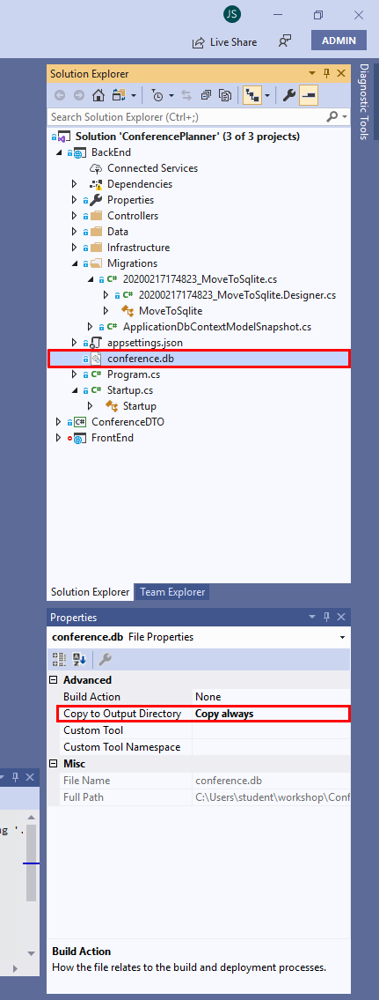

    - **If you're using the .NET Core CLI:**

        1. Delete the files in the **Migrations** folder in the **BackEnd** project.

        2. In a command prompt window, move to the BackEnd project folder.

        3. Install the Entity Framework database migration tools if you haven't already done so, as follows:

            1. Run the following command:

                ```console
                dotnet tool install -g dotnet-ef --version 3.1.1
                ```

            2. Close the command prompt window, and start a new command prompt session.

        4. Return to the **BackEnd** project folder.

        5. Run the following commands:

            ```console
            dotnet ef migrations add MoveToSqlite
            dotnet ef database update
            ```

        6. Edit the **BackEnd.csproj** file, and add the `<ItemGroup>` section shown in the example below to the end of the project settings. This section ensures that the conference.db database file is copied when the application is deployed.

            ```json
            <Project Sdk="Microsoft.NET.Sdk.Web">
                ...
                <ItemGroup>
                    <None Update="conference.db">
                        <CopyToOutputDirectory>Always</CopyToOutputDirectory>
                    </None>
                </ItemGroup>

            </Project>
            ```

## Create a Linux App Service that supports GitHub deployment

For this task, you can either use the Azure portal, or the Azure command line tools.

### If you're using the Azure portal

1. Open a web browser, and navigate to the Azure portal at https://portal.azure.com

2. Sign in to the portal with your Azure credentials.

3. On the home page, hover over the **App Services** icon, and then click **Create**.

    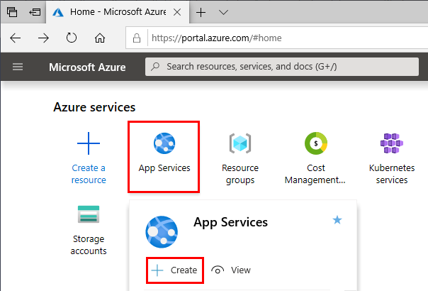

4. On the **Web App** page, on the **Basics** tab, spcify the following settings, and then click **Review + create**.

    | Field | Value |
    |-|-|
    | Subscription | Select your subscription |
    | Resource group | Click **create new**, and create a new resource group named **aspnetlinuxrg** |
    | Name | **linuxbackend\<web-app-suffix\>**, where *\<web-app-suffix\>* is combination of your initials and the current date in numeric format. For example **js01012020**.
    | Publish | **Code** |
    | Runtime stack | **.NET Core 3.0 (Current)** |
    | Operating System | **Linux** |
    | Region | Select your closest region |
    | Linux Plan | Accept the default plan name |
    | Sku and size | Click **Change size**. On the **Spec Picker** page, select the **Dev/Test** tab. Select the **F1** pricing tier if it is available, otherwise select **B1**, and then click **Apply** |

    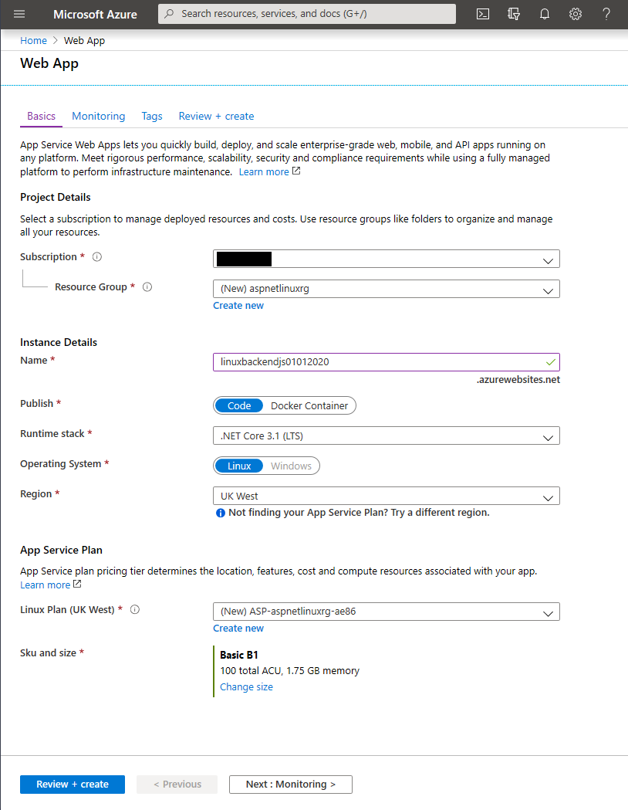

5. On the **Review + create** page, click **Create**

6. When the deployment has completed, click **Go to resource**.

7. On the page for your web app, in the menu pane, under **Deployment**, click **Deployment Center**.

    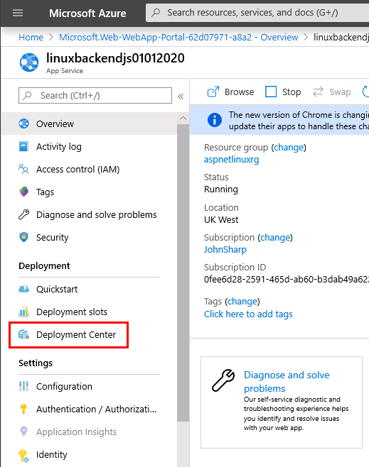

8. On the **Deployment Center** page, click **Local Git**, and then click **Continue**.

    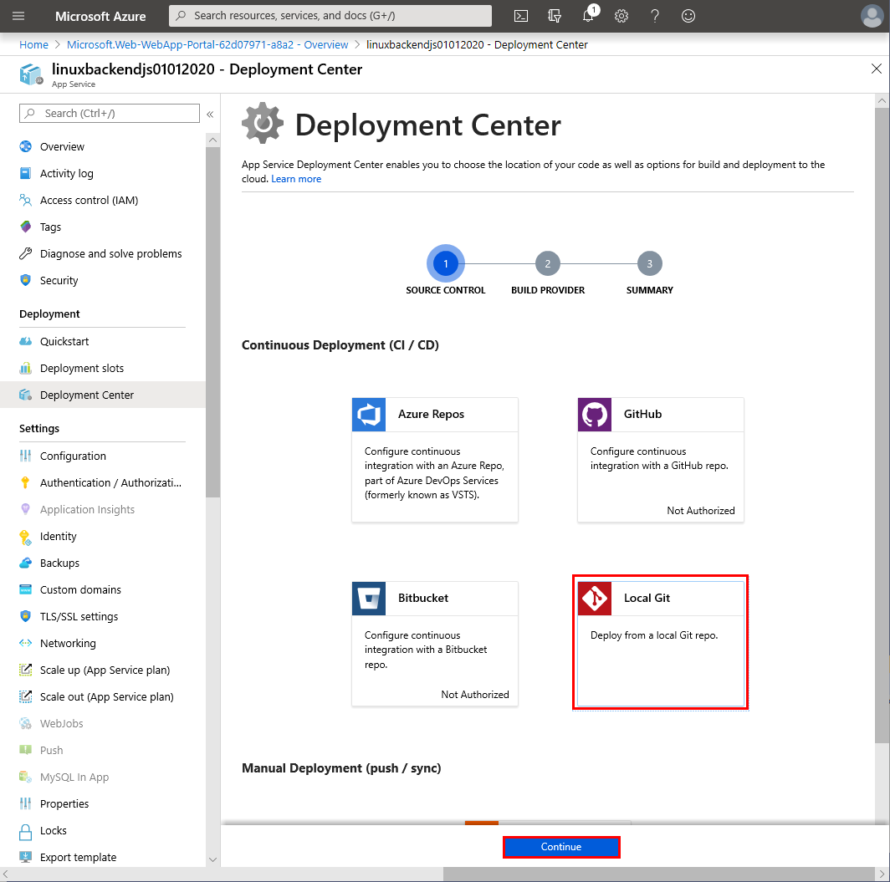

9. On the **Build Provider** page, click **App Service build service**, and then click **Continue**.

    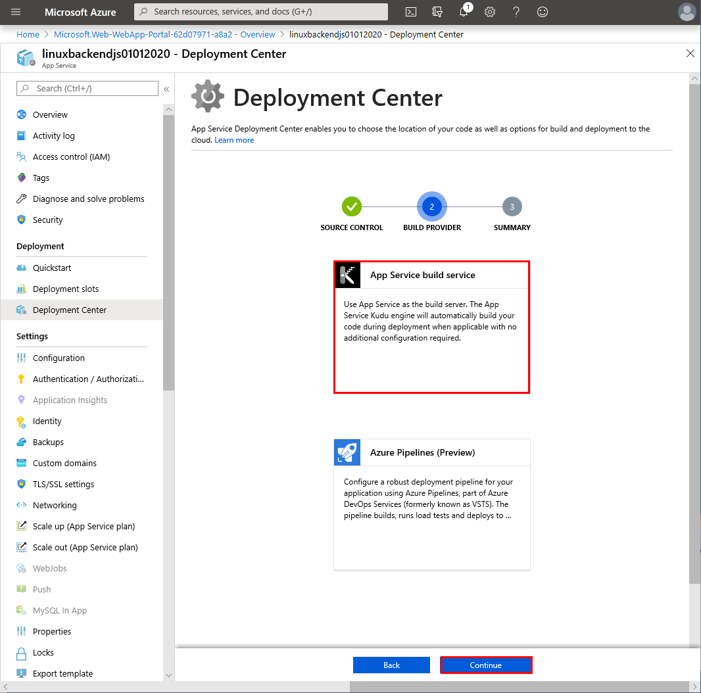

10. On the **Summary** page, click **Finish**.

11. On the **Deployment Center** page, click **Deployment Credentials**.

    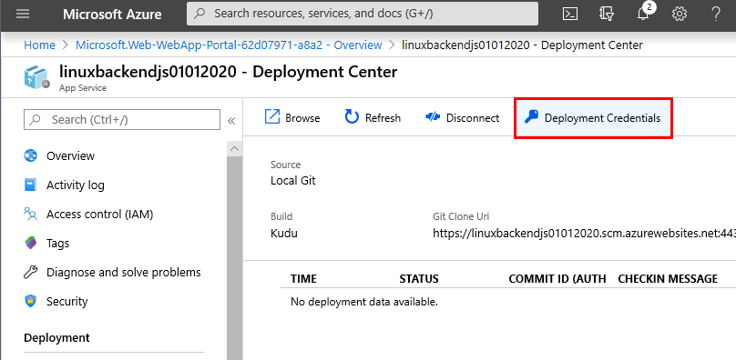

12. In the **Deployment Credentials** pane, make a note of the **Git Clone URL** and **Username**.

    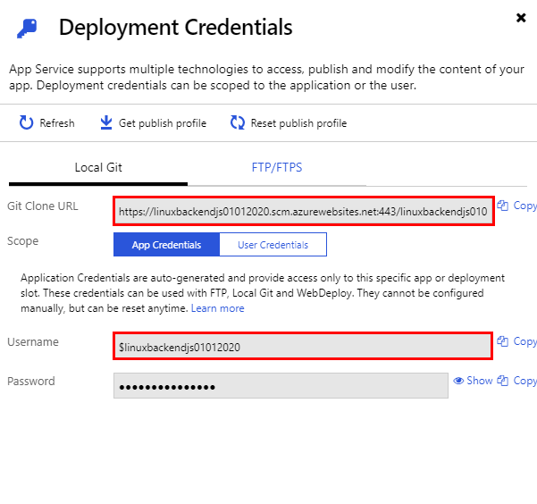

### If you're using the Azure command line

1. Run the command shown below to create a new resource group named **aspnetlinuxrg**. Specify your nearest location, such as **useast** or **westeurope**. You can find a list of locations with the command `az account list-locations`:

    ```console
    az group create --location <location> --name aspnetlinuxrg
    ```

2. Create a new App Service Plan for hosting a Linux App Service, as follows. Use the same location as before. If the **FREE** service plan SKU is not available for your location, set `--sku` to **F1** or **B1**:

    ```console
    az appservice plan create --name backendplan --resource-group aspnetlinuxrg --location <location> --is-linux --sku FREE
    ```

3. Create a new App Service using the app service plan. Replace *\<web-app-suffix\>* with combination of your initials and the current date in numeric format. For example **js01012020**. The `deployment-local-git` flag creates a local Git repository as part of the App Service. Whenever you push changes to this repository, the App Service build processor (*Oryx*), will rebuild and redeploy the code to the App Service:

    ```console
    az webapp create --name linuxbackend<web-app-suffix> --plan backendplan --resource-group aspnetlinuxrg --runtime "dotnetcore|3.0" --deployment-local-git
    ```

## Deploy the BackEnd web API service

For this task, you can either use Visual Studio 2019, or the .NET Core SDK from the command line.

### If you're using Visual Studio 2019

1. In Visual Studio, in the **Solution Explorer** window, in the **Solution Explorer** window, right-click the **ConferencePlanner** solution, and then click **Add Solution to Source Control**. This action creates a new local Git repository for the project, in the solution folder, and adds the files for projects in the solution to the repository.

    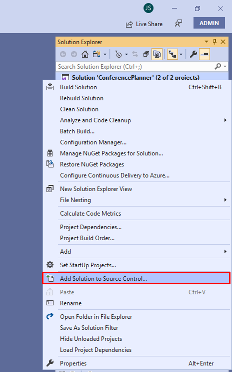

2. On the **View** menu, click **Team Explorer**

    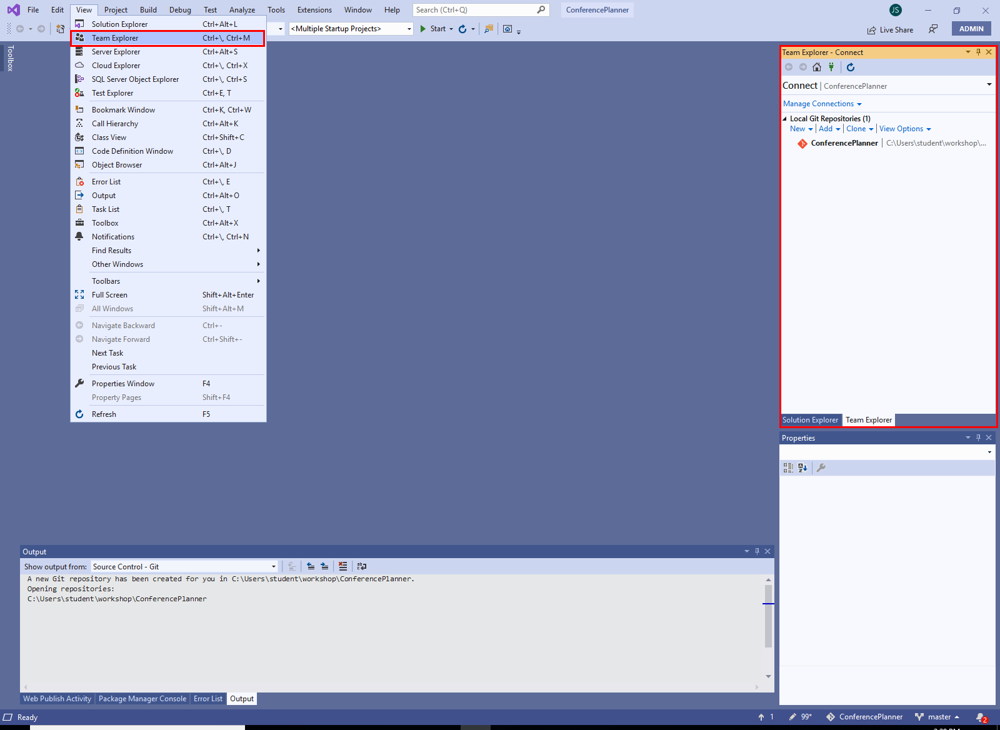

3. In the **Team Explorer** window, click the **Home** button, and then click **Settings**.

    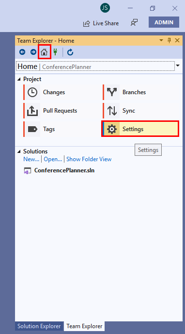

4. In the **Settings** window, click the **Repository Settings** link.

    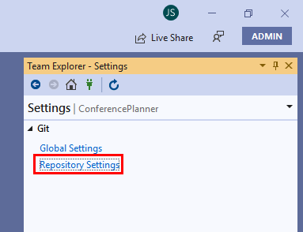

5. In the **Repository Settings** window, in the **Remotes** section, click **Add**.

    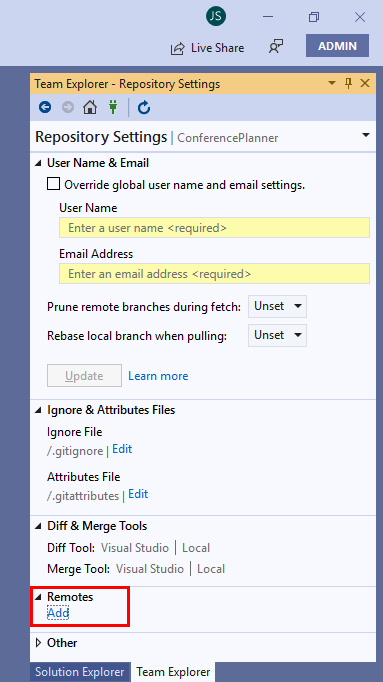

6. In the **Add Remote** dialog box, enter the settings shown in the following table, and then click **Save**

    | FIeld | Value |
    |-|-|
    | Name | **origin** |
    | Fetch | Copy the value of the **Git Clone URL** from the **Deployment Credentials** pane in the Azure portal |
    | Push matches fetch | Selected |

    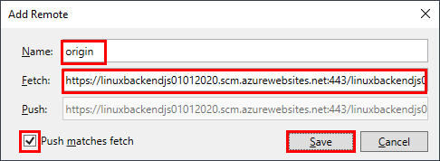

7. In the **Team Explorer** window, click the **Home** button, and then click **Changes**.

    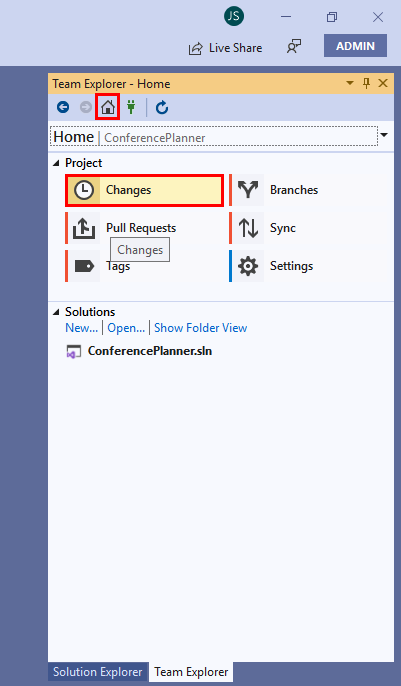

8. In the **Git User Inforation** dialog box, in the **NAme** field, enter the **Username** from the **Deployment Credentials** pane in the Azure portal, enter your email address, clear **Set in global .gitconfig**, and then click **Save**

    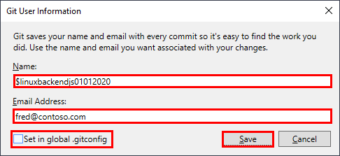

9. In the **Changes** window, scroll down through the **Staged Changes** box to the **FrontEnd** project. RIght-click the **FrontEnd** node, and then click **Unstage**. This action prevents the **FrontEnd** project from being included in the deployment.

    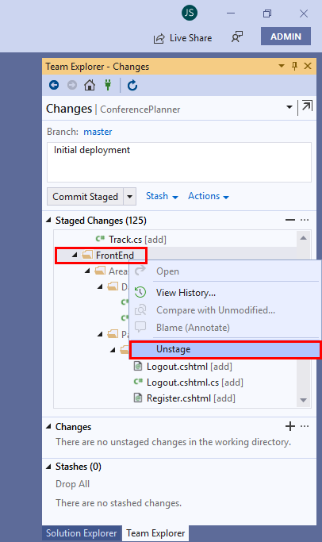

10. In the **Changes** window, enter a commit message of **Initial deployment**. In the **Commit STages** drop-down list, select **Commit Staged and Push**

    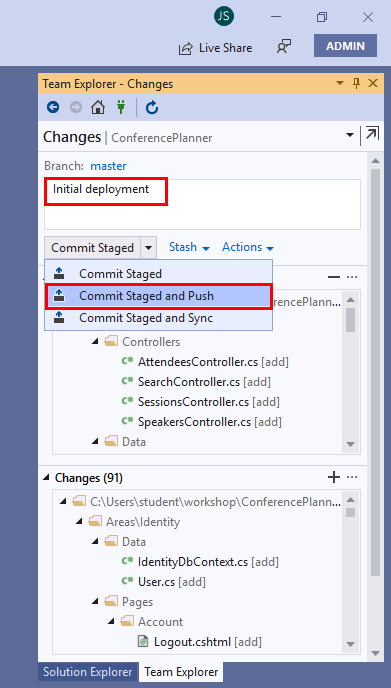

11. In the **Git Credential Manager for Windows** dialog box, specify the user name and password from the **Deployment Credentials** pane in the Azure portal, and then click **OK**.

    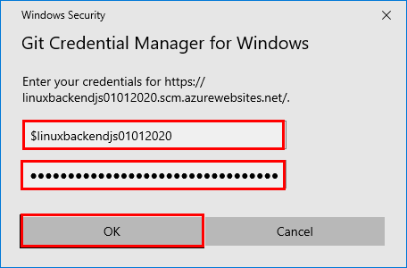

    The changes will be pushed to the repository in the App Service, and the project will rebuilt and deployed in the App Service. When deployment is complete, you should see the message **Successfully pushed branch master to origin** in the **Synchronization** window in Visual Studio.

    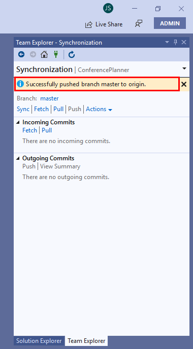

### If you're using the .NET Core CLI

1. Move to the solution folder for the **ConferencePlanner** project.

2. Run the following commands to create a new Git repository for the solution.

    ```console
    git init
    ```

3. Set a global name and email address for identifying commits to the new Git repository. They have no significance outside of this repository. The values specifed in the command below are simply placeholders; you can use your own values if you prefer.

    ```console
    git config --global user.email "me@somewhere.com"
    git config --global user.name "me"
    ```

4. Add the files in the **BackEnd** and **ConferenceDTO** projects to the repository and commit the changes.

    ```console
    git add BackEnd
    git add ConferenceDTO
    git commit -m "Initial deployment"
    ```

5. Run the following command to obtain the URL of the Git repository in the App Service. Make a note of the value returned:

    ```console
    az webapp deployment source show --name linuxbackend<web-app-suffix> --resource-group aspnetlinuxrg --query repoUrl --output tsv
    ```

6. Add the Git repository in the App Service as a remote repository for the local repository you created in step 4. Replace *\<remote-repo-url\>* with the URL you retrieved in step 5.

    ```console
    git remote add azure <remote-repo-url>/linuxbackend<web-app-suffix>.git
    ```

7. Create a set of credentials for pushing changes to the repository in the App Service. Replace *\<username\>* and *\<password\>* with values of your choice. Make sure that the password consists of numbers, upper and lower case letters, and other characters, and is at least 8 characters long.

    ```console
    az webapp deployment user set --user-name <username> --password <password>
    ```

8. Push the changes from the local repository to the App Service. When prompted, enter the user name and password for the repository in the App Service that you created in step 7.

    ```console
    git push azure master
    ```

    You'll see a series of messages as the application is deployed.

## Test the BackEnd web API service

1. Open the web browser if it isn't already open.

2. Move to the swagger endpoint of the web API service, **https://linuxbackend\<*web-app-suffix\>*.azurewebsites.net/swagger**.

3. In the **Sessions** section, click the **POST** button for the **/api/Sessions/upload** operation, and then click **Try it out**.

4. In the **Parameters** section, at the **file** prompt, click **Browse**.

5. In the **Open** dialog box, browse to the folder containing your clone of the GitHub repository, move to the folder **src/BackEnd/Data/Import** in the repository, select the file **NDC_London_2020.json**, and then click **Open**.

6. Back in the web browser, click **Execute**, and wait for the data to be uploaded. Verify that the upload is successful (the server response code should be 200).

    

7. Open the **appsettings.json** file in the root folder of the **FrontEnd** project, and replace the value of the **ServiceUrl** settings with the URL of the **BackEnd** service running as an App Service, **https://linuxbackend\<*web-app-suffix\>*.azurewebsites.net**.

8. Start the **FrontEnd** web application:

   - **If you're using Visual Studio 2019:**

        - In the **Solution Explorer** window, right-click the **FrontEnd** project, click **Debug**, and then click **Start new instance**.
  
   - **If you're using the .NET Core CLI:**

        1. Move to the root folder of the **FrontEnd** project and rebuild the project:

            ```console
            dotnet build
            ```

        2. Start the **FrontEnd** project in a new session:

            ```console
            start dotnet run
            ```

        3. When the application starts, make a note of the URLs for the endpoints on which the app is listening:

            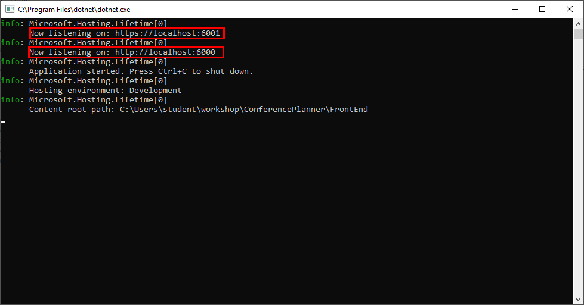

        4. Open a browser window at one of the URLs for the **FrontEnd** Web App.

            ```console
            az webapp browse --name <url> --resource-group aspnetrg
            ```

    When the web API service has been published, a web browser window will open and display the home page of the Conference web app. The web app should display the conference data, retrieved from the web API service running as an App Service.

    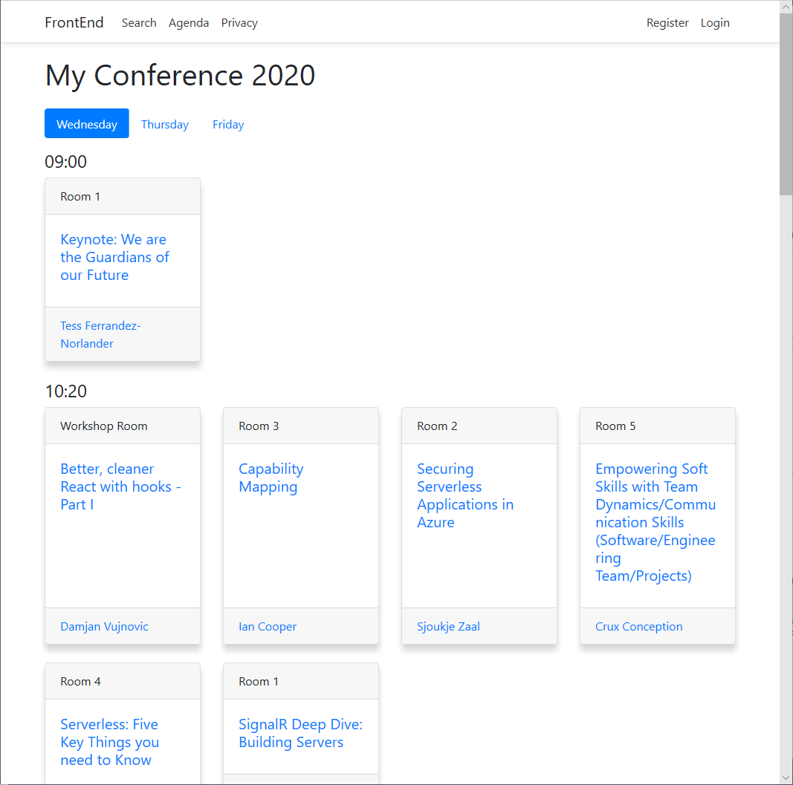

9. Verify that the web application connects successfully to the **BackEnd** web API service, and that you can browse sessions.

# Deploy the BackEnd web API service and FrontEnd web application to Docker

In this exercise, you'll deploy the **BackEnd** web API service and the **FrontEnd** web application to a Docker container, running locally on your computer.

Before starting this exercise, make sure you have Docker installed and running on your computer, and that you have installed the Visual Studio Tools for Docker. For more information and instructions, see the following links:

- [Docker for Windows](https://www.docker.com/docker-windows)
- [Docker for Mac](https://www.docker.com/docker-mac)
- [Visual Studio Tools for Docker with ASP.NET Core](https://docs.microsoft.com/aspnet/core/host-and-deploy/docker/visual-studio-tools-for-docker)

For this exercise, you should start with a copy of the solution in the [Docker folder of the Session 6 save point folder](../save-points/6-Deployment-docker/Docker). In this version of the solution, the **FrontEnd** and **BackEnd** projects are configured to use a local SQL Server database.

## Prepare the BackEnd and FrontEnd projects**

1. Add the NuGet package `Microsoft.AspNetCore.Diagnostics.EntityFrameworkCore`, version `3.1.1` to the **BackEnd** and **FrontEnd** projects.

    - **If you're using Visual Studio 2019:**

        - Use the **Nuget Package Manager**, and follow the instructions described earlier. Make sure you add the package to both projects.

    - **If you're using the .NET Core CLI:**

        1. Move to the **BackEnd** project folder and run the following command:

            ```console
            dotnet add package Microsoft.AspNetCore.Diagnostics.EntityFrameworkCore --version 3.1.1
            ```

        2. Move to the **FrontEnd** project folder and repeat the same command.

2. Open the **Startup.cs** file in the **BackEnd** projecte, and add the `app.UseDatabaseErrorPage();` statement shown below to the **Configure** method, immediately after `UseDeveloperExceptionPage();`:

    ```csharp
    public void Configure(IApplicationBuilder app, IWebHostEnvironment env)
    {
        if (env.IsDevelopment())
        {
            app.UseDeveloperExceptionPage();
            app.UseDatabaseErrorPage();
        }

        ...
    }
    ```

3. Comment out the `app.UseHttpsRedirection();` statement in the **Configure** method:

    ```csharp
    public void Configure(IApplicationBuilder app, IWebHostEnvironment env)
    {
        ...
        // app.UseHttpsRedirection();
        ...
    }
    ```

4. Make the same changes in the **Configure** method in the **Startup.cs** file for the **FrontEnd** project.

## Create Docker scripts for the **BackEnd** project

1. Add Docker support to the **BackEnd** project:

    - **If you're using Visual Studio:**

        1. In the **Solution Explorer** window, right-click the **BackEnd** project, click **Add**, and then click **Docker Support**.

            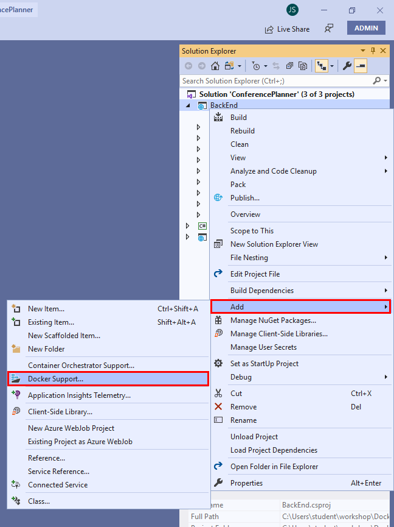

        2. In the **Docker File Options** dialog box, under **Target OS**, click **Linux**, and then click **OK**.

            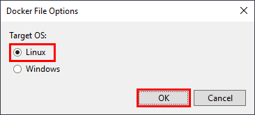

        3. If the **Install Docker Desktop** dialog box shown below appears, click **Yes** to install Docker Desktop and Windows Hyper-V features. Use the default options, and selected Linux containers when prompted. Restart your computer when the installation has completed.

            > **Note:** If you already have Docker Desktop installed on your computer, this dialog box won't appear.

            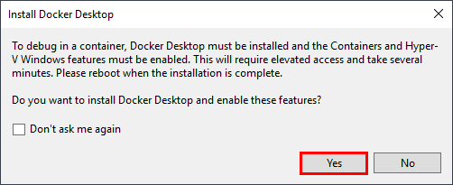

        4. Open the **Dockerfile** file in the root folder of the **BackEnd** project. This file contains a script for creating a Docker image from the project. Examine the file, but don't change anything.

    - **If you're using the .NET Core CLI:**

        1. Verify that you have installed Docker Desktop, as described at the start of this exercise.

        2. In the root folder of the **BackEnd** project, create a file named **Dockerfile**, using a text editor of your choice.

        3. Add the following image build instructions to the file. This script creates a Docker image from the **BackEnd** project:

            ```Dockerfile
            FROM mcr.microsoft.com/dotnet/core/aspnet:3.1-buster-slim AS base
            WORKDIR /app
            EXPOSE 80
            EXPOSE 443

            FROM mcr.microsoft.com/dotnet/core/sdk:3.1-buster AS build
            WORKDIR /src
            COPY ["BackEnd/BackEnd.csproj", "BackEnd/"]
            COPY ["ConferenceDTO/ConferenceDTO.csproj", "ConferenceDTO/"]
            RUN dotnet restore "BackEnd/BackEnd.csproj"
            COPY . .
            WORKDIR "/src/BackEnd"
            RUN dotnet build "BackEnd.csproj" -c Release -o /app/build

            FROM build AS publish
            RUN dotnet publish "BackEnd.csproj" -c Release -o /app/publish

            FROM base AS final
            WORKDIR /app
            COPY --from=publish /app/publish .
            ENTRYPOINT ["dotnet", "BackEnd.dll"]
            ```

2. Add Container Orchestration support to the **BackEnd** project:

    - **If you're using Visual Studio 2019:**

        1. In the **Solution Explorer** window, right click the **BackEnd** project, click **Add**, and then click **Container Orchestration Support**.

            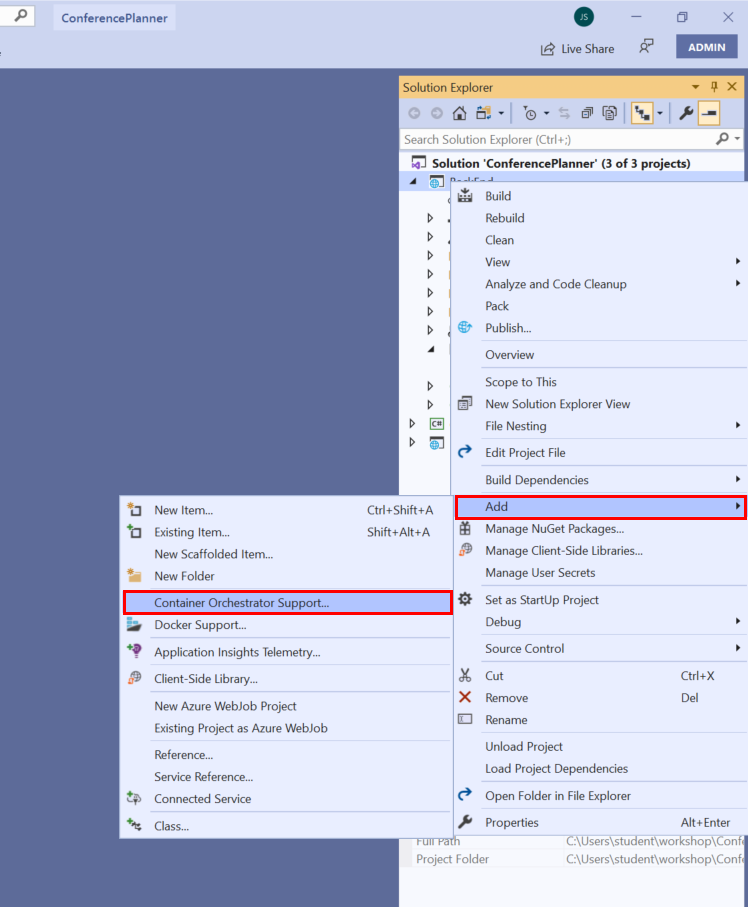

        2. In the **Add Container Orchestration Support** dialog box, select **Docker Compose**, and then click **OK**.

            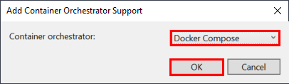

        3. In the **Docker Support Options** dialog box, click **Linux**, and then click **OK**.

            Visual Studio creates a **docker-compose** project and adds it to the solution. The project contains a configuration file named **docker.compose.yml**. This file specifies how Docker organizes and runs the images in the solution.

            > **Note:** Visual Studio will automatically build and deploy the configuration to Docker. You may see a message box asking you to enable sharing for the drive containing the code on your computer with Docker. You should enable sharing, otherwise Docker won't be able to build and run the image.

    - **If you're using the .NET Core CLI:**

        1. Move to the root folder of the **ConferencePlanner** solution.

        2. Create a file named **docker-compose.yml** using a text editor of your choice.

        3. Add the following orchestration configuration to the file:

            ```yaml
            version: '3.4'

            services:
                backend:
                    image: ${DOCKER_REGISTRY-}backend
                    build:
                        context: .
                        dockerfile: BackEnd/Dockerfile
            ```

## Create Docker scripts for the **FrontEnd** project

1. Add Docker support to the **FrontEnd** project:

    - **If you're using Visual Studio:**

        1. In the **Solution Explorer** window, right-click the **FrontEnd** project, click **Add**, and then click **Docker Support**.

        2. In the **Docker File Options** dialog box, under **Target OS**, click **Linux**, and then click **OK**.

        3. Examine the **Dockerfile** file in the root folder of the **FrontEnd** project. This script is similar to that for the **BackEnd** project. Don't change anything.

    - **If you're using the .NET Core CLI:**

        1. In the root folder of the **FrontEnd** project, create a file named **Dockerfile**, using a text editor of your choice.

        2. Add the following image build instructions to the file. This script creates a Docker image from the **FrontEnd** project:

            ```Dockerfile
            FROM mcr.microsoft.com/dotnet/core/aspnet:3.1-buster-slim AS base
            WORKDIR /app
            EXPOSE 80
            EXPOSE 443

            FROM mcr.microsoft.com/dotnet/core/sdk:3.1-buster AS build
            WORKDIR /src
            COPY ["FrontEnd/FrontEnd.csproj", "FrontEnd/"]
            COPY ["ConferenceDTO/ConferenceDTO.csproj", "ConferenceDTO/"]
            RUN dotnet restore "FrontEnd/FrontEnd.csproj"
            COPY . .
            WORKDIR "/src/FrontEnd"
            RUN dotnet build "FrontEnd.csproj" -c Release -o /app/build

            FROM build AS publish
            RUN dotnet publish "FrontEnd.csproj" -c Release -o /app/publish

            FROM base AS final
            WORKDIR /app
            COPY --from=publish /app/publish .
            ENTRYPOINT ["dotnet", "FrontEnd.dll"]
            ```

2. Add Container Orchestration support to the **FrontEnd** project:

    - **If you're using Visual Studio 2019:**

        1. In the **Solution Explorer** window, right click the **FrontEnd** project, click **Add**, and then click **Container Orchestration Support**.

        2. In the **Add Container Orchestration Support** dialog box, select **Docker Compose**, and then click **OK**.

        3. In the **Docker Support Options** dialog box, click **Linux**, and then click **OK**.

            Visual Studio updates **docker.compose.yml** file in the **docker-compose** project with details of the image for the **FrontEnd** project.

    - **If you're using the .NET Core CLI:**

        1. In the root folder of the **ConferencePlanner** solution, edit the **docker-compose.yml**.

        2. Add the **frontend** orchestration configuration shown below to the file, after the **backend** configuration:

            ```yaml
            version: '3.4'

            services:
                backend:
                    ...

                frontend:
                    image: ${DOCKER_REGISTRY-}frontend
                    build:
                        context: .
                        dockerfile: FrontEnd/Dockerfile
            ```

## Add SQL Server to the configuration

1. Edit the **docker-compose.yml** file, and add the **db** configuration shown below, after the **frontend** service.

    ```yaml
    version: '3.4'

        services:
            backend:
                ...

            frontend:
                ...

            db:
                image: "microsoft/mssql-server-linux"
                environment:
                    SA_PASSWORD: "ConferencePlanner!1234"
                    ACCEPT_EULA: "Y
    ```

2. Modify the **backend** configuration and add the **depends_on** entry shown below. The **BackEnd** service shouldn't be able to start until the database container is ready and the database is available.

    ```yaml
    ...
    backend:
        image: backend
        build:
            context: .
            dockerfile: BackEnd/Dockerfile
        depends_on:
           - db
    ...
    ```

3. Add the **links** section shown below to the **frontend** definition. This entry sets up the host name in the Docker networking enabling the **FrontEnd** web application to call the **BackEnd** web API service with the URL **http://backend** inside the Docker environment.

    ```yaml
    ...
    frontend:
        image: frontend
        build:
            context: .
            dockerfile: FrontEnd/Dockerfile
        links:
            - backend
    ...
    ```

4. In the **BackEnd** project, open the **appsettings.json** file, and modify the default connection string as shown below. This string connects to SQL Server running in the Docker container.

    ```json
    ...
    "ConnectionStrings": {
        "DefaultConnection": "Server=db;Initial Catalog=ConferencePlanner;User=sa;Password=ConferencePlanner1234$;MultipleActiveResultSets=true"
    },
    ...
    ```

5. In the **FrontEnd** project, open the **appsettings.json** file, and change the value of the **ServiceUrl** property, as shown below.

    ```json
    ...
    "ServiceUrl": "http://backend/",
    ...
    ```

## Test the solution

# START HERE

- **If you're using Visual Studio 2019:**

  1. On the **Build** menu, click **Reuild Solution**. Verify that the solution builds successfully.  
  
  2. On the **Debug** menu, click **Start Debugging**.

    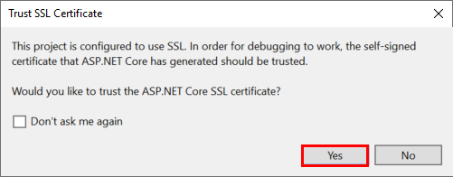
    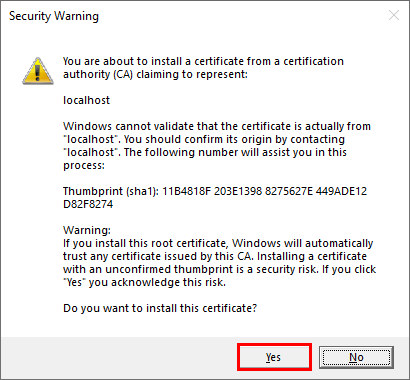

Changes can be made to Razor pages and seen immediately without rebuilds, however and *.cs file changes require rebuilds.

### Using VS Code or other editors

Create and add the following Dockerfile for the BackEnd application.

```Dockerfile
FROM mcr.microsoft.com/dotnet/core/aspnet:3.1-buster-slim AS base
WORKDIR /app
EXPOSE 80
EXPOSE 443

FROM mcr.microsoft.com/dotnet/core/sdk:3.1-buster AS build
WORKDIR /src
COPY ["BackEnd/BackEnd.csproj", "BackEnd/"]
COPY ["ConferenceDTO/ConferenceDTO.csproj", "ConferenceDTO/"]
RUN dotnet restore "BackEnd/BackEnd.csproj"
COPY . .
WORKDIR "/src/BackEnd"
RUN dotnet build "BackEnd.csproj" -c Release -o /app/build

FROM build AS publish
RUN dotnet publish "BackEnd.csproj" -c Release -o /app/publish

FROM base AS final
WORKDIR /app
COPY --from=publish /app/publish .
```

Create and add the following Dockerfile for the FrontEnd application.

```Dockerfile
FROM mcr.microsoft.com/dotnet/core/aspnet:3.1-buster-slim AS base
WORKDIR /app
EXPOSE 80
EXPOSE 443

FROM mcr.microsoft.com/dotnet/core/sdk:3.1-buster AS build
WORKDIR /src
COPY ["BackEnd/BackEnd.csproj", "BackEnd/"]
COPY ["ConferenceDTO/ConferenceDTO.csproj", "ConferenceDTO/"]
RUN dotnet restore "BackEnd/BackEnd.csproj"
COPY . .
WORKDIR "/src/BackEnd"
RUN dotnet build "BackEnd.csproj" -c Release -o /app/build

FROM build AS publish
RUN dotnet publish "BackEnd.csproj" -c Release -o /app/publish

FROM base AS final
WORKDIR /app
COPY --from=publish /app/publish .
```

At the root of the ConferencePlanner solution, add the following **docker-compose.yml** file.

```yaml
version: '3.4'

services:

  frontend:
    image: ${DOCKER_REGISTRY-}frontend
    build:
      context: .
      dockerfile: FrontEnd/Dockerfile

  backend:
    image: ${DOCKER_REGISTRY-}backend
    build:
      context: .
      dockerfile: BackEnd/Dockerfile
    depends_on:
      - db 

  db:
    image: "microsoft/mssql-server-linux"
    environment:
      SA_PASSWORD: "ConferencePlanner1234$$"
      ACCEPT_EULA: "Y"
```
At the root of the ConferencePlanner solution, add the following **docker-compose.override.yml** file.

```yaml
version: '3.4'

services:
  backend:
    environment:
      - ASPNETCORE_ENVIRONMENT=Development
      - ASPNETCORE_URLS=https://+:443;http://+:80
      - ASPNETCORE_HTTPS_PORT=44370
    ports:
      - "63145:80"
      - "44370:443"
    volumes:
      - ${APPDATA}/Microsoft/UserSecrets:/root/.microsoft/usersecrets:ro
      - ${APPDATA}/ASP.NET/Https:/root/.aspnet/https:ro
  frontend:
    environment:
      - ASPNETCORE_ENVIRONMENT=Development
      - ASPNETCORE_URLS=https://+:443;http://+:80
      - ASPNETCORE_HTTPS_PORT=44384
    ports:
      - "56004:80"
      - "44384:443"
    volumes:
      - ${APPDATA}/Microsoft/UserSecrets:/root/.microsoft/usersecrets:ro
      - ${APPDATA}/ASP.NET/Https:/root/.aspnet/https:ro
```

#### SQL Server Configuration

Change the connection string for the database in the BackEnd\appsettings.json file.

```javascript
  "ConnectionStrings": {
    "DefaultConnection": "Server=db;Initial Catalog=ConferencePlanner;User=sa;Password=ConferencePlanner1234$;MultipleActiveResultSets=true"
  }
```

#### Linking / Networking FrontEnd & Backend

Change the value for the **ServiceUrl** in FrontEnd/appsetting.json

```javascript
{
  "ServiceUrl": "http://backend/",
```

Remove or comment out the `app.UseHttpsRedirection();` in BackEnd\Startuo.cs.

#### Building and Running

- Build the Docker images `docker-compose build`
- Run `docker-compose up -d` to start the application
- Run `docker-compose down` to stop the application
- Open the application at <http://localhost:5002>

> **Note:** You'll find the completed code for the exercises in this session in the [Session 6 save point folder](../save-points/6-Deployment-docker).

**Next**: [Session #7 - Additional challenges](7.%20Challenges.md) | **Previous**: [Session #5 - Add user registration and personal agendas](5.%20Add%20personal%20agenda.md).
