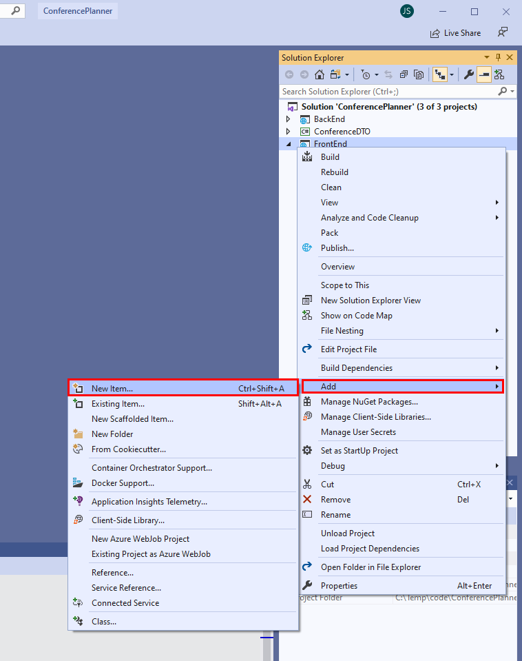

# Use Blazor to optimize the FrontEnd web application

In this session, you'll rework part of the **FrontEnd** web application to use a Blazor component to fetch and display conference session information.

The **Agenda** page for the web application enables the user to switch between the different days of the conference, and display the sessions for that day. When the user clicks a link for the specified day, the web application sends an HTTP GET request to the **BackEnd** web API service to fetch the data. The data is passed back in JSON format. The size of the payload can be significant, and can take a noticeable time.

Blazor uses SignalR for transmitting data between the web server and the client. SignalR can be far more efficient for many types of application, especially those that require real-time or near real-time responses. SignalR uses a more compact payload format, and can push data directly to a client rather than waiting for a client to send a request.

To enable you to focus on Blazor functionality, this exercise uses a simplied version of the **ConferencePlanner** application. This version doesn't include user authentication or support administrative tasks.

## Create the **SessionsListComponent** Blazor component

1. If you haven't already done so, clone the repository for this workshop to a convenient location on your computer with the following command:

    ```console
    git clone https://github.com/dotnet-presentations/aspnetcore-app-workshop
    ```

2. Add the **SessionsListComponent** to the starter solution for this exercise:

    - **If you're using Visual Studio 2019:**

        1. Open the **ConferencePlanner** solution in the **save-points/Blazor/Starter/ConferencePlanner** folder in your local clone of the Git repository.

        2. In the **Solution Explorer** window, right-click the **FrontEnd** project, click **Add**, and then click **New Folder**.

            

        3. Name the new folder **Components**.

        4. In the **Solution Explorer** window, right-click the new **Components** folder, click **Add**, and then click **New Item**.

            

        5. In the **Add New Item - FrontEnd** dialog box, click **Razor component**. Name the component **SessionsListComponent.razor**, and then click **Add**

            

        6. Open the **SessionsListComponent.razor** file, and delete the current contents.

    - **If you're using the .NET Core CLI:**

        1. Move to the **save-points/Blazor/Starter/ConferencePlanner/FrontEnd** folder in your local clone of the Git repository. 

        2. Create a new folder named **Components**.

        3. Move to the **Components** folder, and create a new file named **SessionsListComponent.razor** using an editor of your choice.

3. Add the following directives to the start of the **SessionsListComponent.razor** file:

    ```razor
    @using FrontEnd.Services
    @using ConferenceDTO

    @inject IApiClient _apiClient

    @namespace FrontEnd.Components
    ```

    The component will use types in the **FrontEnd.Services** and **ConferenceDTO** namespaces. It will also use an **IApiClient** object to connect to the **BackEnd** web API service. You'll inject the **IApiClient** oject into the component when the application starts running.

4. Add the following **@code** block to the end of the razor component:

    ```csharp
    @code {

        public IEnumerable<IGrouping<DateTimeOffset?, SessionResponse>> Sessions { get; set; }

        public IEnumerable<(int Offset, DayOfWeek? DayofWeek)> DayOffsets { get; set; }

        public int CurrentDayOffset { get; set; }

        protected List<SessionResponse> sessions;

        protected DateTime? startDate;

        protected virtual Task<List<SessionResponse>> GetSessionsAsync()
        {
            return _apiClient.GetSessionsAsync();
        }

        protected override async Task OnInitializedAsync()
        {
            sessions = await GetSessionsAsync();

            startDate = sessions.Min(s => s.StartTime?.Date);

            DayOffsets = sessions.Select(s => s.StartTime?.Date)
                                 .Distinct()
                                 .OrderBy(d => d)
                                 .Select(day => ((int)Math.Floor((day.Value - startDate)?.TotalDays ?? 0),
                                             day?.DayOfWeek))
                                 .ToList();

            Sessions = sessions.Where(s => s.StartTime?.Date == startDate)
                               .OrderBy(s => s.TrackId)
                               .GroupBy(s => s.StartTime)
                               .OrderBy(g => g.Key);
        }

        public void SetDay(int day = 0)
        {
            var filterDate = startDate?.AddDays(day);

            Sessions = sessions.Where(s => s.StartTime?.Date == filterDate)
                               .OrderBy(s => s.TrackId)
                               .GroupBy(s => s.StartTime)
                               .OrderBy(g => g.Key);
        }
    }
    ```

    This is a modified version of the code in the **IndexModel** model, behind the **Index.cshtml** page. You'll replace the model with this component in a later task.

    The **OnInitializedAsync** method runs when the component is first created. The component uses the **IApiClient** object to retrieve the details of the sessions for the conference, and caches them in the **sessions** collection. The **Sessions** property is populated with the sessions for the first day of the conference from this collection.

    The **SetDay** method takes a day number as a parameter (day 0 is the first day of the conference), and updates the **Sessions** property with the session details that day.

5. Add the following `<style>` block to the component, between the **@namespace** directive and the `@code` block.

    ```html
    ...
    @namespace FrontEnd.Components

    <style>
        .local-button {
            background-color: dodgerblue;
            padding: 15px 32px;
            text-align: center;
            display: inline-block;
            color: white;
            cursor: pointer;
            border-radius: 15px;
            width: 150px;
            outline: none;
        }

        .local-button:hover {
            background-color: bisque;
            color: black;
            width: 150px;
            outline: none;
        }

        .local-button:focus {
            background-color: bisque;
            color: black;
            width: 160px;
            outline: none;
        }
    </style>

    @code {
        ...
    ```

    The **Index** page currently displays the days of the conference as HTML links. The component will use buttons instead. You'll use these styles to change the appearance of the buttons.

6. Between the `<styles>` block and the `@code` block , add the following markup

    ```html
        ...
    </style>
    
    <ul class="nav nav-pills mb-3">
        @if (DayOffsets != null)
        {
            foreach (var day in DayOffsets)
            {
                <li role="presentation" class="nav-item">
                    <button class="local-button" @onclick="@(() => SetDay(day.Offset))">@day.DayofWeek?.ToString()</button>
                </li>
            }
        }
    </ul>

    @code {
        ...
    ```

    This markup iterates through the **DayOffsets** collection created in the `@Code` block. This collection is populated by the **OnInitializedAsync** method, and contains the list of days that the conference spans. The markup displays each day as a button, and sets the `onclick` event handler to call the **SetDay** method in the `@Code` block to update the display.